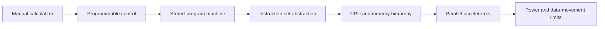

# Origins of Computing

## In One Sentence

A computer is a machine that follows encoded instructions to transform information, one small state change at a time.

## Why This Exists

**Prerequisite:** None. This is the gentlest entry point to the curriculum.

Computing makes repeatable symbolic transformations automatic. The durable arc is **Capability → Complexity → Abstraction → Adoption → New Complexity → Next Abstraction**: electronic switching enabled speed; wiring became complex; instructions abstracted circuits; general-purpose machines spread; software and scaling became complex; languages and operating systems followed.

The historical pressure was not “invent a new term.” It was to remove a concrete limit:

**Before → Problem → Innovation → New abstraction → New problems → Modern connection:** manual arithmetic and fixed-purpose mechanisms were slow and error-prone → programmable control was needed → punched media, Boolean logic, stored programs, and transistors emerged → “a machine executes encoded instructions” → memory walls, heat, and programming complexity appeared → CPUs, GPUs, and TPUs still trade compute, movement, and power.

## Picture This

Imagine a clerk with numbered boxes, a short list of instructions, and a pencil. The clerk reads one instruction, changes a box, and moves to the next instruction. A computer does this electronically at enormous speed. The boxes are state; the list is the program.

The analogy is a starting point, not the mechanism. Now we can name the engineering idea precisely.

## The Real Definition

A computer is a state-transition engine: read encoded state and an instruction, apply logic, write new state, repeat. Performance is bounded not only by arithmetic but by moving bits among storage levels.

- **Representation:** bits encode numbers, text, instructions, and model weights.
- **Logic:** gates compose into arithmetic and control.
- **Stored program:** instructions and data occupy addressable memory.
- **State and I/O:** registers and memory retain state; devices connect the machine to the world.
- **Locality:** nearby, smaller storage is faster and more expensive.

## Mental Model



Narrate the arrows aloud. At each arrow, ask: **what new capability appeared, and what new complexity came with it?**

## How It Actually Works

A clock coordinates register updates. The processor fetches an instruction, decodes its opcode and operands, executes logic, accesses memory if required, and commits results. Modern processors overlap these stages, predict branches, and cache data while preserving the observable instruction-set contract.

The von Neumann abstraction unifies code and data but creates a bandwidth bottleneck. Parallel accelerators address workloads with abundant similar operations, while caches exploit temporal and spatial locality. Neither removes physical constraints: latency, bandwidth, energy, and synchronization determine usable performance.

## Tiny Proof

```python
# A tiny state transition: accumulator machine
program = [("LOAD", 7), ("ADD", 5), ("STORE", 0)]
acc, memory = 0, [0]
for op, value in program:
    if op == "LOAD": acc = value
    elif op == "ADD": acc += value
    elif op == "STORE": memory[value] = acc
print(memory[0])  # 12
```

Before running it, predict the result. Afterward, explain which part of the definition the observation proves—and which parts it does not.

## In Production

A matrix multiplication may require billions of operations, but an accelerator sits idle if weights arrive from memory too slowly. Batching and quantization improve arithmetic intensity and reduce bytes moved, directly reflecting early computing constraints.

Instance selection, GPU utilization, cache behavior, tensor precision, NUMA placement, model batching, storage tiers, and power-limited data centers all expose the physical machine.

## How It Breaks

Assuming FLOPS equals application throughput; ignoring memory bandwidth; overflowing a numeric representation; introducing nondeterminism through parallel execution; optimizing a benchmark that does not match production data movement.

## Debug It

Separate correctness from performance. Inspect representation and overflow, then profile instructions, cache misses, bandwidth, occupancy, and synchronization. Form a roofline-style hypothesis: is the workload compute-bound or movement-bound?

Use the same discipline throughout this curriculum: state the symptom precisely, locate the last proven boundary, form a falsifiable hypothesis, gather the smallest useful evidence, and change one variable.

## Build / Break Exercises

### Guided proof

Run a large array sum twice and compare cold versus warm timings. Vary element width and working-set size. Record where caches stop hiding memory latency and explain the change.

### Build

Implement an 8-bit virtual accumulator with `LOAD`, `ADD`, `SUB`, `JUMP_IF_ZERO`, and `STORE`. Define overflow behavior and test every opcode.

### Break

Create a program that overflows, jumps forever, and reads an invalid address. Add traps and limits that turn each silent failure into explicit evidence.

### No-AI challenge

Draw fetch–decode–execute and a register/cache/RAM/storage hierarchy from memory. Explain one performance consequence of each boundary.

**Success criteria:** Predict before acting, capture the observable result, explain the mechanism that produced it, and state one limit of your explanation.

## Explain It to Anybody

### 1. To a smart non-engineer

A computer repeatedly reads a tiny instruction and changes stored information; modern AI still depends on how quickly the machine can calculate and move that information.

### 2. To a junior engineer

A stored-program machine encodes instructions and data in memory, while the CPU performs state transitions through fetch, decode, and execute; locality and bandwidth shape performance.

### 3. In an interview (60–90 seconds)

Modern systems preserve the stored-program abstraction, but performance depends on the memory hierarchy, parallel execution, and data movement. I reason about a workload by separating arithmetic demand from bandwidth, latency, synchronization, and power constraints.

Do not memorize these scripts. Close the file and rebuild each explanation in your own words.

## Knowledge Check

1. Why did stored programs change machine capability?
2. Why can memory bandwidth dominate arithmetic?
3. Which details does an instruction set hide, and which leak?

### Interview stretch

- Why does a GPU outperform a CPU for some workloads but not all?
- Explain locality to someone diagnosing low accelerator utilization.
- How would you distinguish compute-bound from memory-bound inference?

## Vocabulary

- **Bit:** A binary digit, usually represented as `0` or `1`.
- **Boolean logic:** Rules for combining true/false values with operations such as AND, OR, and NOT.
- **Transistor:** An electronic switch used to build digital logic.
- **Stored program:** Instructions encoded in addressable memory rather than fixed in wiring.
- **Instruction set architecture (ISA):** The machine-instruction contract visible to software.
- **Register:** Small, fast storage directly used by a processor.
- **Cache:** Small, fast storage that keeps likely-to-be-reused data near a processor.
- **Locality:** The tendency to reuse recently accessed or nearby data and instructions.
- **Bandwidth:** The amount of data transferable per unit of time.
- **Latency:** The delay before an operation or transfer completes.
- **Arithmetic intensity:** The amount of computation performed per byte of data moved.

Use each term only after you can explain the underlying idea without it. See the curriculum-wide [Glossary](../GLOSSARY.md) for plain and precise definitions.

## References

- **REQUIRED** — “First Draft of a Report on the EDVAC” — John von Neumann. [Computer History Museum](https://www.computerhistory.org/revolution/birth-of-the-computer/4/88/359). Documents the stored-program architecture that anchors the modern machine model.
- **RECOMMENDED** — “The Computer History Timeline” — Computer History Museum. [Timeline](https://www.computerhistory.org/timeline/). Connects devices and ideas without reducing the history to one invention.
- **DEEP DIVE** — “The Free Lunch Is Over” — Herb Sutter. [Dr. Dobb’s archive](http://www.gotw.ca/publications/concurrency-ddj.htm). Explains why power and concurrency changed software performance assumptions.

## Next

[Why Software Exists](./02-why-software-exists.md) examines the abstraction that made one physical machine serve many purposes.
