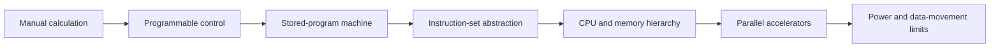

# Origins of Computing

## Why You're Learning This
AI infrastructure is physical computation wearing many abstractions. Understanding how representation, instruction, memory, and I/O emerged helps you reason about throughput, precision, locality, and hardware limits instead of treating accelerators as magic.

## Historical Context
**Before → Problem → Innovation → New abstraction → New problems → Modern connection:** manual arithmetic and fixed-purpose mechanisms were slow and error-prone → programmable control was needed → punched media, Boolean logic, stored programs, and transistors emerged → “a machine executes encoded instructions” → memory walls, heat, and programming complexity appeared → CPUs, GPUs, and TPUs still trade compute, movement, and power.

## Problem This Solves
Computing makes repeatable symbolic transformations automatic. The durable arc is **Capability → Complexity → Abstraction → Adoption → New Complexity → Next Abstraction**: electronic switching enabled speed; wiring became complex; instructions abstracted circuits; general-purpose machines spread; software and scaling became complex; languages and operating systems followed.

## Mental Model
A computer is a state-transition engine: read encoded state and an instruction, apply logic, write new state, repeat. Performance is bounded not only by arithmetic but by moving bits among storage levels.

## Core Concepts
- **Representation:** bits encode numbers, text, instructions, and model weights.
- **Logic:** gates compose into arithmetic and control.
- **Stored program:** instructions and data occupy addressable memory.
- **State and I/O:** registers and memory retain state; devices connect the machine to the world.
- **Locality:** nearby, smaller storage is faster and more expensive.

## How It Actually Works
A clock coordinates register updates. The processor fetches an instruction, decodes its opcode and operands, executes logic, accesses memory if required, and commits results. Modern processors overlap these stages, predict branches, and cache data while preserving the observable instruction-set contract.

## Deep Dive
The von Neumann abstraction unifies code and data but creates a bandwidth bottleneck. Parallel accelerators address workloads with abundant similar operations, while caches exploit temporal and spatial locality. Neither removes physical constraints: latency, bandwidth, energy, and synchronization determine usable performance.

## Visual Model


## Code / Commands
```python
# A tiny state transition: accumulator machine
program = [("LOAD", 7), ("ADD", 5), ("STORE", 0)]
acc, memory = 0, [0]
for op, value in program:
    if op == "LOAD": acc = value
    elif op == "ADD": acc += value
    elif op == "STORE": memory[value] = acc
print(memory[0])  # 12
```

## Practical Example
A matrix multiplication may require billions of operations, but an accelerator sits idle if weights arrive from memory too slowly. Batching and quantization improve arithmetic intensity and reduce bytes moved, directly reflecting early computing constraints.

## Where This Appears in Production
Instance selection, GPU utilization, cache behavior, tensor precision, NUMA placement, model batching, storage tiers, and power-limited data centers all expose the physical machine.

## Common Failure Modes
Assuming FLOPS equals application throughput; ignoring memory bandwidth; overflowing a numeric representation; introducing nondeterminism through parallel execution; optimizing a benchmark that does not match production data movement.

## Debugging Approach
Separate correctness from performance. Inspect representation and overflow, then profile instructions, cache misses, bandwidth, occupancy, and synchronization. Form a roofline-style hypothesis: is the workload compute-bound or movement-bound?

## Hands-On Lab
Run a large array sum twice and compare cold versus warm timings. Vary element width and working-set size. Record where caches stop hiding memory latency and explain the change.

## Build Exercise
Implement an 8-bit virtual accumulator with `LOAD`, `ADD`, `SUB`, `JUMP_IF_ZERO`, and `STORE`. Define overflow behavior and test every opcode.

## Break It Exercise
Create a program that overflows, jumps forever, and reads an invalid address. Add traps and limits that turn each silent failure into explicit evidence.

## No-AI Challenge
Draw fetch–decode–execute and a register/cache/RAM/storage hierarchy from memory. Explain one performance consequence of each boundary.

## Knowledge Check
1. Why did stored programs change machine capability?
2. Why can memory bandwidth dominate arithmetic?
3. Which details does an instruction set hide, and which leak?

## Interview Questions
- Why does a GPU outperform a CPU for some workloads but not all?
- Explain locality to someone diagnosing low accelerator utilization.
- How would you distinguish compute-bound from memory-bound inference?

## Explain It Yourself
Explain the lesson using both causal chains. Begin with manual calculation and end with why an LLM serving engineer must care about HBM bandwidth.

## Key Takeaways
Computers transform encoded state; stored programs separated behavior from wiring; abstractions increase adoption but expose new bottlenecks; data movement and energy remain first-order constraints.

## Vocabulary
Bit, Boolean logic, transistor, stored program, instruction set architecture (ISA), register, cache, locality, bandwidth, latency, arithmetic intensity.

## References
- **[REQUIRED] “First Draft of a Report on the EDVAC” — John von Neumann.** [Stanford-hosted text](https://web.stanford.edu/class/cs101/files/vonNeumannFirstDraft.pdf). Defines the stored-program architecture that anchors the modern machine model.
- **[RECOMMENDED] “The Computer History Timeline” — Computer History Museum.** [Timeline](https://www.computerhistory.org/timeline/). Connects devices and ideas without reducing the history to one invention.
- **[DEEP DIVE] “The Free Lunch Is Over” — Herb Sutter.** [Dr. Dobb’s archive](http://www.gotw.ca/publications/concurrency-ddj.htm). Explains why power and concurrency changed software performance assumptions.

## Next Lesson
[Why Software Exists](./02-why-software-exists.md) examines the abstraction that made one physical machine serve many purposes.
