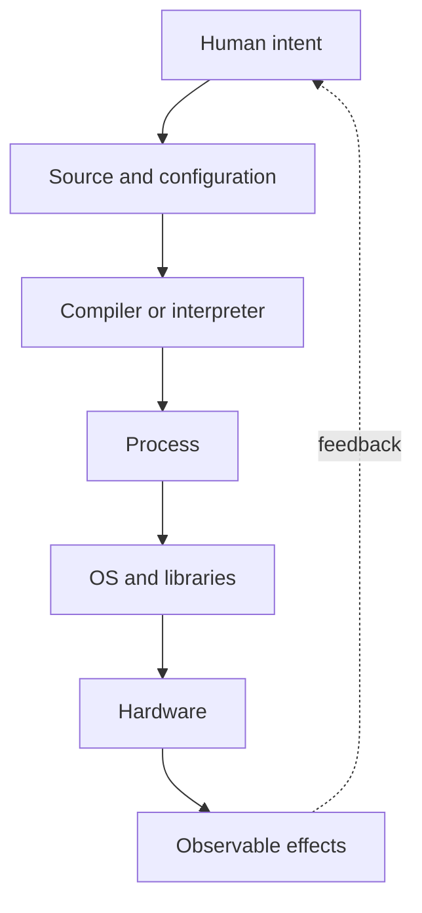

# Why Software Exists

## Why You're Learning This

Platform engineering is the design of reusable software-defined capabilities. To judge an abstraction, you must understand software’s original bargain: trade fixed physical configuration for flexible, repeatable instructions.

## Historical Context

**Before → Problem → Innovation → New abstraction → New problems → Modern connection:** machines were rewired for each task → change was slow and specialized → stored programs made behavior data → software became an independently changeable artifact → defects, maintenance, and coordination exploded → APIs, infrastructure as code, and models remain programmable layers over hardware.

## Problem This Solves

Software separates intent from mechanism so a general machine can perform many jobs. The recurring cycle is **Capability → Complexity → Abstraction → Adoption → New Complexity → Next Abstraction**: programmability enabled reuse, program detail grew, procedures and interfaces hid it, adoption scaled, dependencies multiplied, and modules, services, and platforms followed.

## Mental Model

Software is an executable specification plus state. It translates human intent through layers until hardware can perform deterministic transitions; every translation adds leverage and possible mismatch.

## Core Concepts

- Program versus process; source versus executable.
- Algorithm, data structure, state, and side effect.
- Interface as a contract that permits independent change.
- Reuse through procedures, libraries, services, and platforms.
- Correctness includes behavior, security, performance, and operability.

## How It Actually Works

Humans write source against language and library contracts. Toolchains translate it into machine instructions; an OS creates a process and mediates resources. Inputs and persistent state shape execution, while logs and metrics expose only selected internal events.

## Deep Dive

Software is cheap to copy but expensive to understand and evolve. Brooks’s essential complexity comes from the problem domain; accidental complexity comes from tools and representations. Good abstractions compress repeated decisions without erasing constraints operators must still see.

## Visual Model



## Code / Commands

```text
intent: add two inputs safely
parse(input_a, input_b)
validate(type=integer, range=-2^31..2^31-1)
result = checked_add(input_a, input_b)
emit(result)
```

## Practical Example

Terraform turns infrastructure intent into a plan and API operations. It increases repeatability, but provider behavior, state drift, and eventual consistency leak through the declarative abstraction.

## Where This Appears in Production

Compilers, CI pipelines, APIs, schemas, policy as code, Kubernetes manifests, model graphs, feature pipelines, and agent workflows all encode intent for another execution layer.

## Common Failure Modes

Confusing specification with actual state; vague interfaces; hidden side effects; dependency drift; copying abstractions before understanding the repeated problem; treating code completion as operational completion.

## Debugging Approach

Trace intent through each translation boundary. Compare expected contract, generated artifact, runtime state, and external effect. Identify the first layer where evidence diverges.

## Hands-On Lab

Write one task as manual shell steps, then as an idempotent script. Run each twice, interrupt midway, and compare recoverability and observability.

## Build Exercise

Design a small declarative job format and interpreter supporting input validation, steps, retries, and explicit outputs.

## Break It Exercise

Introduce malformed input, stale state, a non-idempotent retry, and an unavailable dependency. Make failures bounded and diagnosable.

## No-AI Challenge

Choose a daily operation and describe its intent, mechanism, state, side effects, contracts, and one abstraction leak.

## Knowledge Check

1. Why is software more than encoded instructions?
2. What distinguishes essential from accidental complexity?
3. When does reuse become harmful coupling?

## Interview Questions

- Why do declarative systems still need operators who understand imperative execution?
- What makes an interface durable?
- Explain idempotency using a deployment operation.

## Explain It Yourself

Explain why software exists, then use both historical cycles to derive libraries, services, and platforms without naming products first.

## Key Takeaways

Software makes behavior changeable; interfaces enable independent evolution; translation layers create leverage and mismatch; reusable abstractions must preserve critical evidence.

## Vocabulary

Program, process, algorithm, state, side effect, interface, contract, abstraction, idempotency, essential complexity, accidental complexity.

## References

- **[REQUIRED] “No Silver Bullet” — Frederick P. Brooks Jr.** [University of North Carolina](https://www.cs.unc.edu/techreports/86-020.pdf). Distinguishes essential and accidental software complexity.
- **[RECOMMENDED] “Software Engineering” — NATO Science Committee.** [NATO conference report](http://homepages.cs.ncl.ac.uk/brian.randell/NATO/nato1968.PDF). Documents why programming became an engineering coordination problem.
- **[DEEP DIVE] “On the Criteria To Be Used in Decomposing Systems into Modules” — D. L. Parnas.** [ACM DOI](https://doi.org/10.1145/361598.361623). Establishes information hiding as a basis for evolvable software.

## Next Lesson

[Machine Code to Assembly to High-Level Languages](./03-machine-code-assembly-high-level-languages.md) follows the translation layers that made programming scalable.
