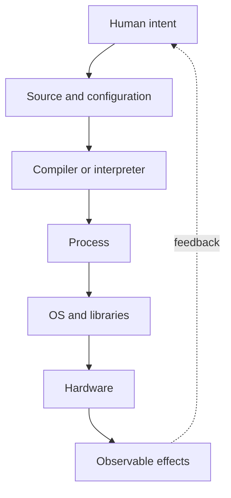

# Why Software Exists

## In One Sentence

Software lets us change what a machine does by changing instructions instead of rebuilding the machine.

## Why This Exists

**Prerequisite:** [Origins of Computing](./01-origins-of-computing.md).

Software separates intent from mechanism so a general machine can perform many jobs. The recurring cycle is **Capability → Complexity → Abstraction → Adoption → New Complexity → Next Abstraction**: programmability enabled reuse, program detail grew, procedures and interfaces hid it, adoption scaled, dependencies multiplied, and modules, services, and platforms followed.

The historical pressure was not “invent a new term.” It was to remove a concrete limit:

**Before → Problem → Innovation → New abstraction → New problems → Modern connection:** machines were rewired for each task → change was slow and specialized → stored programs made behavior data → software became an independently changeable artifact → defects, maintenance, and coordination exploded → APIs, infrastructure as code, and models remain programmable layers over hardware.

## Picture This

A music box can play only the tune pinned into its cylinder. A pianist can play a new tune from a new sheet. Early fixed-purpose machines resembled the music box; software turned the machine into the pianist.

The analogy is a starting point, not the mechanism. Now we can name the engineering idea precisely.

## The Real Definition

Software is an executable specification plus state. It translates human intent through layers until hardware can perform deterministic transitions; every translation adds leverage and possible mismatch.

- Program versus process; source versus executable.
- Algorithm, data structure, state, and side effect.
- Interface as a contract that permits independent change.
- Reuse through procedures, libraries, services, and platforms.
- Correctness includes behavior, security, performance, and operability.

## Mental Model



Narrate the arrows aloud. At each arrow, ask: **what new capability appeared, and what new complexity came with it?**

## How It Actually Works

Humans write source against language and library contracts. Toolchains translate it into machine instructions; an OS creates a process and mediates resources. Inputs and persistent state shape execution, while logs and metrics expose only selected internal events.

Software is cheap to copy but expensive to understand and evolve. Brooks’s essential complexity comes from the problem domain; accidental complexity comes from tools and representations. Good abstractions compress repeated decisions without erasing constraints operators must still see.

## Tiny Proof

```text
intent: add two inputs safely
parse(input_a, input_b)
validate(type=integer, range=-2^31..2^31-1)
result = checked_add(input_a, input_b)
emit(result)
```

Before running it, predict the result. Afterward, explain which part of the definition the observation proves—and which parts it does not.

## In Production

Terraform turns infrastructure intent into a plan and API operations. It increases repeatability, but provider behavior, state drift, and eventual consistency leak through the declarative abstraction.

Compilers, CI pipelines, APIs, schemas, policy as code, Kubernetes manifests, model graphs, feature pipelines, and agent workflows all encode intent for another execution layer.

## How It Breaks

Confusing specification with actual state; vague interfaces; hidden side effects; dependency drift; copying abstractions before understanding the repeated problem; treating code completion as operational completion.

## Debug It

Trace intent through each translation boundary. Compare expected contract, generated artifact, runtime state, and external effect. Identify the first layer where evidence diverges.

Use the same discipline throughout this curriculum: state the symptom precisely, locate the last proven boundary, form a falsifiable hypothesis, gather the smallest useful evidence, and change one variable.

## Build / Break Exercises

### Guided proof

Write one task as manual shell steps, then as an idempotent script. Run each twice, interrupt midway, and compare recoverability and observability.

### Build

Design a small declarative job format and interpreter supporting input validation, steps, retries, and explicit outputs.

### Break

Introduce malformed input, stale state, a non-idempotent retry, and an unavailable dependency. Make failures bounded and diagnosable.

### No-AI challenge

Choose a daily operation and describe its intent, mechanism, state, side effects, contracts, and one abstraction leak.

**Success criteria:** Predict before acting, capture the observable result, explain the mechanism that produced it, and state one limit of your explanation.

## Explain It to Anybody

### 1. To a smart non-engineer

Software is a reusable set of instructions that changes a machine’s job without rebuilding its hardware.

### 2. To a junior engineer

Software represents behavior as data that a programmable machine can load and execute, separating application intent from physical wiring.

### 3. In an interview (60–90 seconds)

Software made general-purpose hardware economically reusable by moving behavior into stored instructions. That separation created portability and scale, while introducing translation, compatibility, correctness, and lifecycle problems.

Do not memorize these scripts. Close the file and rebuild each explanation in your own words.

## Knowledge Check

1. Why is software more than encoded instructions?
2. What distinguishes essential from accidental complexity?
3. When does reuse become harmful coupling?

### Interview stretch

- Why do declarative systems still need operators who understand imperative execution?
- What makes an interface durable?
- Explain idempotency using a deployment operation.

## Vocabulary

- **Program:** Stored instructions and data describing a computation.
- **Process:** One OS-managed running instance of a program.
- **Algorithm:** A finite procedure for transforming input into a result.
- **State:** Information retained at a point in a computation.
- **Side effect:** An observable change outside a function's returned value.
- **Interface:** A defined boundary through which components interact.
- **Contract:** Promised behavior and constraints at an interface.
- **Abstraction:** A contract that exposes useful behavior while hiding selected details.
- **Idempotency:** The property that repeating an operation has the same intended effect as doing it once.
- **Essential complexity:** Difficulty inherent in the problem being solved.
- **Accidental complexity:** Difficulty introduced by tools, representations, or implementation choices.

Use each term only after you can explain the underlying idea without it. See the curriculum-wide [Glossary](../GLOSSARY.md) for plain and precise definitions.

## References

- **REQUIRED** — “No Silver Bullet” — Frederick P. Brooks Jr. [University of North Carolina](https://www.cs.unc.edu/techreports/86-020.pdf). Distinguishes essential and accidental software complexity.
- **RECOMMENDED** — “Software Engineering” — NATO Science Committee. [NATO conference report](http://homepages.cs.ncl.ac.uk/brian.randell/NATO/nato1968.PDF). Documents why programming became an engineering coordination problem.
- **DEEP DIVE** — “On the Criteria To Be Used in Decomposing Systems into Modules” — D. L. Parnas. [ACM DOI](https://doi.org/10.1145/361598.361623). Establishes information hiding as a basis for evolvable software.

## Next

[Machine Code to Assembly to High-Level Languages](./03-machine-code-assembly-high-level-languages.md) follows the translation layers that made programming scalable.
