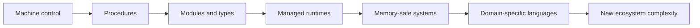

# Evolution of Programming Languages

## In One Sentence

Programming languages evolved to help people express larger ideas safely without managing every machine detail by hand.

## Why This Exists

**Prerequisite:** [Machine Code to Assembly to High-Level Languages](./03-machine-code-assembly-high-level-languages.md).

Languages constrain and communicate valid programs. **Capability → Complexity → Abstraction → Adoption → New Complexity → Next Abstraction:** richer machines enabled larger software; complexity rose; paradigms and type systems organized it; ecosystems formed; dependency and runtime complexity followed; safer types, modules, and domain-specific languages emerged.

The historical pressure was not “invent a new term.” It was to remove a concrete limit:

**Before → Problem → Innovation → New abstraction → New problems → Modern connection:** assembly exposed every machine detail → large programs exceeded human control → procedural, functional, object-oriented, managed, and memory-safe languages packaged reasoning models → programmers worked with values, modules, and types → runtimes, ecosystems, and hidden costs grew → Rust services, Python ML, Go control planes, and SQL each optimize different constraints.

## Picture This

A growing workshop first uses hand signals, then labels, then written procedures, then checklists that prevent dangerous steps. As teams and jobs grow, the language must carry more intent and prevent more mistakes.

The analogy is a starting point, not the mechanism. Now we can name the engineering idea precisely.

## The Real Definition

A language is a set of semantic guarantees plus a cost model and ecosystem. Syntax is its least important property.

Paradigm, type system, scope, module, memory management, concurrency model, runtime, foreign-function interface, DSL, ecosystem.

## Mental Model



Narrate the arrows aloud. At each arrow, ask: **what new capability appeared, and what new complexity came with it?**

## How It Actually Works

Language rules define values, control, effects, and errors. Implementations compile or interpret those rules. Libraries standardize common work; package systems distribute code; runtimes may schedule tasks, collect memory, or optimize execution.

Static types move checks earlier but cannot prove all behavior. Garbage collection removes manual lifetime management while introducing pauses and memory overhead. Ownership types reject classes of aliasing errors but increase explicitness. No mechanism eliminates trade-offs.

## Tiny Proof

```text
# Same intent, different guarantees
dynamic: total = sum(items)          # runtime type checks
typed:   total: Int = items.sum()    # compile-time constraints
query:   SELECT SUM(value) FROM items # data-oriented DSL
```

Before running it, predict the result. Afterward, explain which part of the definition the observation proves—and which parts it does not.

## In Production

Python accelerates model experimentation; native tensor kernels supply speed. This productive boundary also causes packaging, ABI, device, and graph-compilation failures.

Go Kubernetes controllers, Rust infrastructure agents, Java services, Python ML pipelines, TypeScript interfaces, SQL analytics, and CUDA kernels.

## How It Breaks

Choosing by benchmark alone; ignoring hiring and libraries; unsafe FFI boundaries; runtime pauses; implicit coercion; dependency sprawl; assuming a type system proves business correctness.

## Debug It

Classify failure by semantics, implementation, runtime, library, or foreign boundary. Reproduce with pinned versions; inspect types and generated artifacts; profile before rewriting.

Use the same discipline throughout this curriculum: state the symptom precisely, locate the last proven boundary, form a falsifiable hypothesis, gather the smallest useful evidence, and change one variable.

## Build / Break Exercises

### Guided proof

Implement one parser in a dynamically typed and statically typed language. Compare invalid-input handling, test burden, and refactor feedback.

### Build

Design a tiny configuration DSL with explicit types, defaults, validation, and deterministic evaluation.

### Break

Add ambiguous coercion, cyclic imports, an unsafe foreign call, and unbounded allocation. Improve diagnostics without hiding costs.

### No-AI challenge

Create a language-selection matrix for a control plane using safety, latency, concurrency, ecosystem, deployment, and operability.

**Success criteria:** Predict before acting, capture the observable result, explain the mechanism that produced it, and state one limit of your explanation.

## Explain It to Anybody

### 1. To a smart non-engineer

Languages give programmers safer and clearer ways to describe increasingly complicated work.

### 2. To a junior engineer

Programming languages encode abstractions and constraints; their type systems, runtimes, and tooling shift which errors are expressible or detectable.

### 3. In an interview (60–90 seconds)

Language evolution responds to software scale: abstraction improves productivity but adds runtime, tooling, and semantic tradeoffs. I select a language based on workload, safety, ecosystem, operability, and team constraints—not syntax preference.

Do not memorize these scripts. Close the file and rebuild each explanation in your own words.

## Knowledge Check

1. What does a language’s cost model include?
2. Which problems do GC and ownership each solve?
3. Why are DSLs powerful and risky?

### Interview stretch

- Choose a language for a Kubernetes operator and defend the trade-offs.
- What can static typing not guarantee?
- Explain why Python can front high-performance ML.

## Vocabulary

- **Paradigm:** A style for structuring computation, such as functional or object-oriented programming.
- **Type system:** Rules that classify values and constrain permitted operations.
- **Inference:** Deriving information such as types without requiring explicit annotation.
- **Garbage collection:** Automatic reclamation of memory no longer reachable by a program.
- **Ownership:** Rules that assign responsibility for a value's lifetime and access.
- **Runtime:** Machinery that supports a language while a program executes.
- **FFI:** A foreign-function interface for calling code across language boundaries.
- **Module:** A named boundary for organizing code and controlling visibility.
- **DSL:** A domain-specific language designed for a narrow problem area.
- **Coercion:** An implicit conversion from one type or representation to another.
- **Effect:** An observable interaction beyond computing a returned value.

Use each term only after you can explain the underlying idea without it. See the curriculum-wide [Glossary](../GLOSSARY.md) for plain and precise definitions.

## References

- **REQUIRED** — “The Evolution of Lisp” — Guy L. Steele Jr. and Richard P. Gabriel. [ACM HOPL paper](https://www.dreamsongs.com/Files/HOPL2-Uncut.pdf). Connects language features to concrete pressures.
- **RECOMMENDED** — “The Go Programming Language Specification” — Go Project. [Official specification](https://go.dev/ref/spec). Example of a production language’s semantic contract.
- **DEEP DIVE** — “The Rust Reference” — Rust Project. [Official reference](https://doc.rust-lang.org/reference/). Documents a modern memory-safe systems language.

## Next

[Evolution of Operating Systems](./05-evolution-of-operating-systems.md) shows how shared machines gained resource and isolation abstractions.
