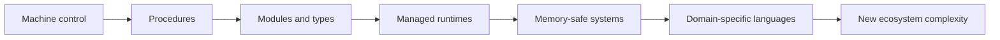

# Evolution of Programming Languages

## Why You're Learning This
Language choice shapes correctness, concurrency, deployment, and team cognition. Staff engineers should evaluate languages by the problems and trade-offs they encode, not fashion.

## Historical Context
**Before → Problem → Innovation → New abstraction → New problems → Modern connection:** assembly exposed every machine detail → large programs exceeded human control → procedural, functional, object-oriented, managed, and memory-safe languages packaged reasoning models → programmers worked with values, modules, and types → runtimes, ecosystems, and hidden costs grew → Rust services, Python ML, Go control planes, and SQL each optimize different constraints.

## Problem This Solves
Languages constrain and communicate valid programs. **Capability → Complexity → Abstraction → Adoption → New Complexity → Next Abstraction:** richer machines enabled larger software; complexity rose; paradigms and type systems organized it; ecosystems formed; dependency and runtime complexity followed; safer types, modules, and domain-specific languages emerged.

## Mental Model
A language is a set of semantic guarantees plus a cost model and ecosystem. Syntax is its least important property.

## Core Concepts
Paradigm, type system, scope, module, memory management, concurrency model, runtime, foreign-function interface, DSL, ecosystem.

## How It Actually Works
Language rules define values, control, effects, and errors. Implementations compile or interpret those rules. Libraries standardize common work; package systems distribute code; runtimes may schedule tasks, collect memory, or optimize execution.

## Deep Dive
Static types move checks earlier but cannot prove all behavior. Garbage collection removes manual lifetime management while introducing pauses and memory overhead. Ownership types reject classes of aliasing errors but increase explicitness. No mechanism eliminates trade-offs.

## Visual Model


## Code / Commands
```text
# Same intent, different guarantees
dynamic: total = sum(items)          # runtime type checks
typed:   total: Int = items.sum()    # compile-time constraints
query:   SELECT SUM(value) FROM items # data-oriented DSL
```

## Practical Example
Python accelerates model experimentation; native tensor kernels supply speed. This productive boundary also causes packaging, ABI, device, and graph-compilation failures.

## Where This Appears in Production
Go Kubernetes controllers, Rust infrastructure agents, Java services, Python ML pipelines, TypeScript interfaces, SQL analytics, and CUDA kernels.

## Common Failure Modes
Choosing by benchmark alone; ignoring hiring and libraries; unsafe FFI boundaries; runtime pauses; implicit coercion; dependency sprawl; assuming a type system proves business correctness.

## Debugging Approach
Classify failure by semantics, implementation, runtime, library, or foreign boundary. Reproduce with pinned versions; inspect types and generated artifacts; profile before rewriting.

## Hands-On Lab
Implement one parser in a dynamically typed and statically typed language. Compare invalid-input handling, test burden, and refactor feedback.

## Build Exercise
Design a tiny configuration DSL with explicit types, defaults, validation, and deterministic evaluation.

## Break It Exercise
Add ambiguous coercion, cyclic imports, an unsafe foreign call, and unbounded allocation. Improve diagnostics without hiding costs.

## No-AI Challenge
Create a language-selection matrix for a control plane using safety, latency, concurrency, ecosystem, deployment, and operability.

## Knowledge Check
1. What does a language’s cost model include?
2. Which problems do GC and ownership each solve?
3. Why are DSLs powerful and risky?

## Interview Questions
- Choose a language for a Kubernetes operator and defend the trade-offs.
- What can static typing not guarantee?
- Explain why Python can front high-performance ML.

## Explain It Yourself
Apply both causal chains from assembly through managed and memory-safe languages, ending with the new complexity of polyglot AI platforms.

## Key Takeaways
Languages package reasoning and guarantees; paradigms answer recurring complexity; runtimes move rather than erase costs; ecosystem fit is architectural.

## Vocabulary
Paradigm, type system, inference, garbage collection, ownership, runtime, FFI, module, DSL, coercion, effect.

## References
- **[REQUIRED] “The Evolution of Lisp” — Guy L. Steele Jr. and Richard P. Gabriel.** [ACM HOPL paper](https://www.dreamsongs.com/Files/HOPL2-Uncut.pdf). Connects language features to concrete pressures.
- **[RECOMMENDED] “The Go Programming Language Specification” — Go Project.** [Official specification](https://go.dev/ref/spec). Example of a production language’s semantic contract.
- **[DEEP DIVE] “The Rust Reference” — Rust Project.** [Official reference](https://doc.rust-lang.org/reference/). Documents a modern memory-safe systems language.

## Next Lesson
[Evolution of Operating Systems](./05-evolution-of-operating-systems.md) shows how shared machines gained resource and isolation abstractions.
