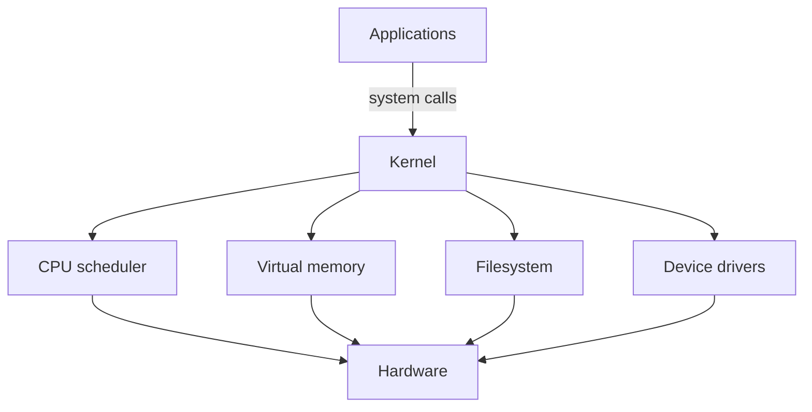

# Evolution of Operating Systems

## Why You're Learning This
Containers, schedulers, files, sockets, and accelerators depend on OS mechanisms. Production diagnosis requires seeing past resource names to processes, memory, devices, and kernel policy.

## Historical Context
**Before → Problem → Innovation → New abstraction → New problems → Modern connection:** operators loaded one job manually → hardware sat idle and programs interfered → batch systems, multiprogramming, time-sharing, virtual memory, and protection arrived → process, file, and user became stable abstractions → contention, security, and kernel complexity followed → Linux hosts multiplex containers and AI workloads today.

## Problem This Solves
An OS safely multiplexes hardware and provides common services. **Capability → Complexity → Abstraction → Adoption → New Complexity → Next Abstraction:** more hardware supported concurrent work; coordination became hard; processes and virtual memory isolated work; multi-user systems spread; distributed operations grew; virtualization and containers followed.

## Mental Model
The kernel is a privileged mediator: it turns finite physical resources into controlled virtual resources and records policy at boundaries.

## Core Concepts
Kernel/user mode, system call, process/thread, scheduler, virtual memory, filesystem, device driver, interrupt, protection, IPC.

## How It Actually Works
Programs enter the kernel through system calls. The scheduler assigns CPU time; page tables translate virtual addresses; filesystems map names to blocks; drivers operate devices; interrupts report asynchronous events. Permissions constrain resource access.

## Deep Dive
Virtual memory gives each process a private address space, not unlimited RAM. Pages can fault, be shared, or be reclaimed. Scheduling optimizes competing goals—latency, fairness, throughput—so overload appears as queues and tail latency before total failure.

## Visual Model


## Code / Commands
```bash
ps -eo pid,ppid,stat,%cpu,%mem,comm
cat /proc/self/status
ulimit -a
strace -f -e trace=file,network true
```

## Practical Example
A pod marked healthy can stall because its process is runnable but receives little CPU, faults pages under pressure, or waits in uninterruptible device I/O.

## Where This Appears in Production
Node sizing, cgroups, file descriptors, OOM kills, page cache, GPU drivers, system calls, volumes, process signals, and security boundaries.

## Common Failure Modes
CPU oversubscription, memory thrashing, descriptor exhaustion, priority inversion, deadlock, filesystem corruption, driver mismatch, and treating load average as CPU utilization.

## Debugging Approach
Identify resource and wait state. Inspect process state, run queues, faults, memory pressure, I/O latency, descriptors, kernel logs, and recent policy changes. Correlate symptoms over time.

## Hands-On Lab
Run CPU-bound and I/O-bound jobs; inspect process states and timing. Constrain memory safely and observe allocation failure or reclaim behavior.

## Build Exercise
Implement a cooperative round-robin scheduler simulation with arrival times, blocking, and per-task metrics.

## Break It Exercise
Create descriptor exhaustion and a CPU hog inside a disposable environment. Add limits and verify the blast radius.

## No-AI Challenge
Draw what happens from a userspace `read()` call to device completion, including protection transitions and waiting.

## Knowledge Check
1. Why are process and virtual memory separate abstractions?
2. What happens on a page fault?
3. Why is scheduling a policy trade-off?

## Interview Questions
- Diagnose high load with low CPU utilization.
- Explain an OOM kill versus an allocation failure.
- What kernel resources do containers share?

## Explain It Yourself
Use both causal cycles to connect single-job machines to container hosts and explain which OS complexities reappear.

## Key Takeaways
The OS mediates and multiplexes; virtual resources remain finite; queues reveal contention; kernel evidence is indispensable when higher abstractions leak.

## Vocabulary
Kernel, syscall, process, thread, context switch, virtual memory, page fault, interrupt, scheduler, IPC, driver.

## References
- **[REQUIRED] “The Compatible Time-Sharing System” — MIT.** [MIT CSAIL](https://multicians.org/thvv/7094.html). Shows why interactive resource sharing emerged.
- **[RECOMMENDED] “Operating Systems: Three Easy Pieces” — Arpaci-Dusseau and Arpaci-Dusseau.** [Official book site](https://pages.cs.wisc.edu/~remzi/OSTEP/). Builds mechanisms around virtualization, concurrency, and persistence.
- **[DEEP DIVE] “Linux Kernel Documentation” — Linux kernel community.** [Official documentation](https://docs.kernel.org/). Canonical source for modern kernel mechanisms.

## Next Lesson
[Unix, C, and Linux](./06-unix-c-linux.md) follows the design lineage behind today’s platform hosts.
