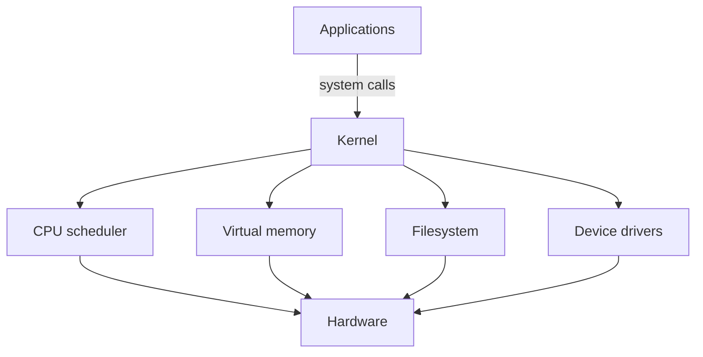

# Evolution of Operating Systems

## In One Sentence

An operating system safely shares one machine among many programs and gives those programs simpler ways to use hardware.

## Why This Exists

**Prerequisite:** [Evolution of Programming Languages](./04-evolution-of-programming-languages.md).

An OS safely multiplexes hardware and provides common services. **Capability → Complexity → Abstraction → Adoption → New Complexity → Next Abstraction:** more hardware supported concurrent work; coordination became hard; processes and virtual memory isolated work; multi-user systems spread; distributed operations grew; virtualization and containers followed.

The historical pressure was not “invent a new term.” It was to remove a concrete limit:

**Before → Problem → Innovation → New abstraction → New problems → Modern connection:** operators loaded one job manually → hardware sat idle and programs interfered → batch systems, multiprogramming, time-sharing, virtual memory, and protection arrived → process, file, and user became stable abstractions → contention, security, and kernel complexity followed → Linux hosts multiplex containers and AI workloads today.

## Picture This

Picture a busy hotel. Guests should not wire their own electricity, take another guest’s room, or operate the boiler. A front desk assigns rooms, controls shared services, and handles requests. Programs are guests; the operating system is the manager.

The analogy is a starting point, not the mechanism. Now we can name the engineering idea precisely.

## The Real Definition

The kernel is a privileged mediator: it turns finite physical resources into controlled virtual resources and records policy at boundaries.

Kernel/user mode, system call, process/thread, scheduler, virtual memory, filesystem, device driver, interrupt, protection, IPC.

## Mental Model



Narrate the arrows aloud. At each arrow, ask: **what new capability appeared, and what new complexity came with it?**

## How It Actually Works

Programs enter the kernel through system calls. The scheduler assigns CPU time; page tables translate virtual addresses; filesystems map names to blocks; drivers operate devices; interrupts report asynchronous events. Permissions constrain resource access.

Virtual memory gives each process a private address space, not unlimited RAM. Pages can fault, be shared, or be reclaimed. Scheduling optimizes competing goals—latency, fairness, throughput—so overload appears as queues and tail latency before total failure.

## Tiny Proof

```bash
ps -eo pid,ppid,stat,%cpu,%mem,comm
cat /proc/self/status
ulimit -a
strace -f -e trace=file,network true
```

Before running it, predict the result. Afterward, explain which part of the definition the observation proves—and which parts it does not.

## In Production

A pod marked healthy can stall because its process is runnable but receives little CPU, faults pages under pressure, or waits in uninterruptible device I/O.

Node sizing, cgroups, file descriptors, OOM kills, page cache, GPU drivers, system calls, volumes, process signals, and security boundaries.

## How It Breaks

CPU oversubscription, memory thrashing, descriptor exhaustion, priority inversion, deadlock, filesystem corruption, driver mismatch, and treating load average as CPU utilization.

## Debug It

Identify resource and wait state. Inspect process state, run queues, faults, memory pressure, I/O latency, descriptors, kernel logs, and recent policy changes. Correlate symptoms over time.

Use the same discipline throughout this curriculum: state the symptom precisely, locate the last proven boundary, form a falsifiable hypothesis, gather the smallest useful evidence, and change one variable.

## Build / Break Exercises

### Guided proof

Run CPU-bound and I/O-bound jobs; inspect process states and timing. Constrain memory safely and observe allocation failure or reclaim behavior.

### Build

Implement a cooperative round-robin scheduler simulation with arrival times, blocking, and per-task metrics.

### Break

Create descriptor exhaustion and a CPU hog inside a disposable environment. Add limits and verify the blast radius.

### No-AI challenge

Draw what happens from a userspace `read()` call to device completion, including protection transitions and waiting.

**Success criteria:** Predict before acting, capture the observable result, explain the mechanism that produced it, and state one limit of your explanation.

## Explain It to Anybody

### 1. To a smart non-engineer

The operating system is the machine’s manager: it shares hardware, protects programs from one another, and provides common services.

### 2. To a junior engineer

An OS kernel multiplexes CPU, memory, storage, and devices while enforcing protection and exposing abstractions such as processes, files, and virtual memory.

### 3. In an interview (60–90 seconds)

Operating systems convert scarce hardware into protected abstractions. The abstraction leaks through scheduling, page faults, syscalls, permissions, and device behavior, so production diagnosis must connect application symptoms to kernel evidence.

Do not memorize these scripts. Close the file and rebuild each explanation in your own words.

## Knowledge Check

1. Why are process and virtual memory separate abstractions?
2. What happens on a page fault?
3. Why is scheduling a policy trade-off?

### Interview stretch

- Diagnose high load with low CPU utilization.
- Explain an OOM kill versus an allocation failure.
- What kernel resources do containers share?

## Vocabulary

- **Kernel:** The privileged OS core that manages protected resources.
- **System call:** A controlled request from user space to the kernel.
- **Process:** An OS-managed execution context and resource container.
- **Thread:** A schedulable execution stream within a process.
- **Context switch:** Saving one execution context and restoring another.
- **Virtual memory:** Process-visible addresses translated to physical or other backing.
- **Page fault:** A CPU exception requesting kernel handling for a memory access.
- **Interrupt:** An event that transfers CPU control to a privileged handler.
- **Scheduler:** The subsystem that chooses which runnable thread gets CPU time.
- **IPC:** Inter-process communication between separate process contexts.
- **Driver:** Software that controls a device through an OS-defined interface.

Use each term only after you can explain the underlying idea without it. See the curriculum-wide [Glossary](../GLOSSARY.md) for plain and precise definitions.

## References

- **REQUIRED** — “The Compatible Time-Sharing System” — MIT. [MIT CSAIL](https://multicians.org/thvv/7094.html). Shows why interactive resource sharing emerged.
- **RECOMMENDED** — “Operating Systems: Three Easy Pieces” — Arpaci-Dusseau and Arpaci-Dusseau. [Official book site](https://pages.cs.wisc.edu/~remzi/OSTEP/). Builds mechanisms around virtualization, concurrency, and persistence.
- **DEEP DIVE** — “Linux Kernel Documentation” — Linux kernel community. [Official documentation](https://docs.kernel.org/). Canonical source for modern kernel mechanisms.

## Next

[Unix, C, and Linux](./06-unix-c-linux.md) follows the design lineage behind today’s platform hosts.
