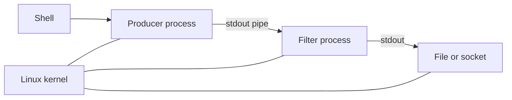

# Unix, C, and Linux

## In One Sentence

Unix, C, and Linux made small composable tools and portable systems software a durable foundation for modern infrastructure.

## Why This Exists

**Prerequisite:** [Evolution of Operating Systems](./05-evolution-of-operating-systems.md).

Unix made systems programmable through uniform interfaces. **Capability → Complexity → Abstraction → Adoption → New Complexity → Next Abstraction:** interactive systems enabled tool chains; integration grew; pipes and files standardized composition; portability drove adoption; fleet operations grew; containers and orchestration followed.

The historical pressure was not “invent a new term.” It was to remove a concrete limit:

**Before → Problem → Innovation → New abstraction → New problems → Modern connection:** large OSes were hardware-specific and monolithic projects → portability and composability were poor → Unix used small tools, files, pipes, and C → a portable OS interface emerged → weak defaults, textual ambiguity, and kernel complexity appeared → Linux became the common cloud and accelerator host.

## Picture This

A workshop is easier to evolve when each tool does one job and tools connect through standard fittings. Unix supplied the fittings and composition style; C made the workshop portable; Linux carried the pattern onto modern hardware.

The analogy is a starting point, not the mechanism. Now we can name the engineering idea precisely.

## The Real Definition

Unix is a graph of processes connected by byte streams and named resources; Linux is a kernel implementing and extending that model.

Everything-is-a-file convention, process tree, file descriptor, pipe, signal, permission, shell, C portability, POSIX, Linux kernel/userspace distinction.

## Mental Model



Narrate the arrows aloud. At each arrow, ask: **what new capability appeared, and what new complexity came with it?**

## How It Actually Works

The shell parses commands, forks processes, wires descriptors, and executes programs. The kernel tracks identities and permissions, moves bytes through descriptors, and delivers signals. C maps efficiently to machine and OS interfaces.

Pipes decouple producers from consumers but carry untyped bytes, so protocols remain necessary. “Mechanism, not policy” encourages flexible primitives, yet secure defaults and fleet-wide consistency must be layered above them.

## Tiny Proof

```bash
printf '%s\n' error ok error | sort | uniq -c
printf 'hello\n' | wc -c
id; umask
printf '%s\n' "$$" "$PPID"
```

Before running it, predict the result. Afterward, explain which part of the definition the observation proves—and which parts it does not.

## In Production

A container entrypoint is still a Linux process. If PID 1 does not reap children or forward signals, deployments hang during termination despite correct orchestration settings.

Images, init processes, CI scripts, SSH, permissions, pipes, `/proc`, signals, service managers, eBPF tools, and GPU driver stacks.

## How It Breaks

Unsafe shell quoting, permission drift, orphaned processes, ignored signals, descriptor leaks, text-protocol ambiguity, ABI incompatibility, and confusing distribution userspace with kernel behavior.

## Debug It

Inspect identity, process ancestry, descriptors, environment, syscalls, signals, mount state, and kernel version. Reduce pipelines one boundary at a time.

Use the same discipline throughout this curriculum: state the symptom precisely, locate the last proven boundary, form a falsifiable hypothesis, gather the smallest useful evidence, and change one variable.

## Build / Break Exercises

### Guided proof

Build a three-command pipeline, redirect stderr separately, send termination signals, and inspect exit statuses and process trees.

### Build

Write a small C or systems-language program that opens a file, forks, connects a pipe, and executes a child command.

### Break

Remove execute permission, close the wrong descriptor, ignore `SIGTERM`, and omit quoting. Explain each observed failure.

### No-AI challenge

Predict descriptor wiring and exit status for a shell pipeline before running it.

**Success criteria:** Predict before acting, capture the observable result, explain the mechanism that produced it, and state one limit of your explanation.

## Explain It to Anybody

### 1. To a smart non-engineer

Modern servers inherit a design where small tools connect through simple interfaces and the operating system can move across hardware.

### 2. To a junior engineer

Unix established composable process and file interfaces; C enabled portable systems implementation; Linux provides a Unix-like kernel used throughout current infrastructure.

### 3. In an interview (60–90 seconds)

Their durability comes from stable interfaces and composition. Linux infrastructure still exposes Unix process, file-descriptor, signal, and permission models, while C ABIs connect runtimes and kernels. Those boundaries are central to debugging.

Do not memorize these scripts. Close the file and rebuild each explanation in your own words.

## Knowledge Check

1. Why did C improve OS portability?
2. What does a pipe abstract and omit?
3. Why is PID 1 special on Linux?

### Interview stretch

- Debug a container that will not terminate.
- Explain file descriptors to an application engineer.
- Which Unix principles scale well, and which need stronger contracts?

## Vocabulary

- **Unix:** The operating-system family and interface tradition built around processes, files, and composition.
- **C:** A compiled systems language closely associated with portable Unix implementation.
- **Linux:** A Unix-like open-source kernel used by most modern server infrastructure.
- **POSIX:** Standards defining portable operating-system interfaces.
- **Shell:** A program that interprets commands and composes processes.
- **Fork:** Creating a new process based on the calling process.
- **Exec:** Replacing a process image with a new program.
- **Pipe:** A kernel buffer connecting one process's output to another's input.
- **File descriptor:** A process-local integer handle for an open kernel object.
- **Signal:** An asynchronous notification delivered to a process or thread.
- **PID 1:** The first process in a Linux PID namespace, with special lifecycle responsibilities.
- **User space:** Unprivileged execution outside the kernel.

Use each term only after you can explain the underlying idea without it. See the curriculum-wide [Glossary](../GLOSSARY.md) for plain and precise definitions.

## References

- **REQUIRED** — “The UNIX Time-Sharing System” — Dennis Ritchie and Ken Thompson. [ACM Digital Library](https://dl.acm.org/doi/10.1145/361011.361061). Primary account of Unix’s goals and design.
- **RECOMMENDED** — “The Development of the C Language” — Dennis Ritchie. [Bell Labs archive](https://www.bell-labs.com/usr/dmr/www/chist.html). Explains the co-evolution of C and Unix.
- **DEEP DIVE** — “The Linux man-pages Project” — Michael Kerrisk and contributors. [Official site](https://www.kernel.org/doc/man-pages/). Canonical userspace interface documentation.

## Next

[Networking and the Internet](./07-networking-and-the-internet.md) extends process communication across unreliable machines and networks.
