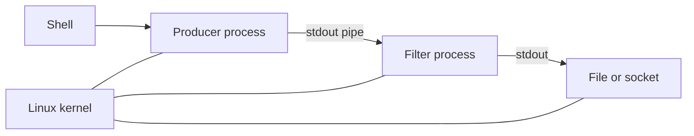

# Unix, C, and Linux

## Why You're Learning This
Most cloud and AI infrastructure inherits Unix interfaces and Linux implementations. Their composition model explains shells, processes, permissions, containers, and operational tooling.

## Historical Context
**Before → Problem → Innovation → New abstraction → New problems → Modern connection:** large OSes were hardware-specific and monolithic projects → portability and composability were poor → Unix used small tools, files, pipes, and C → a portable OS interface emerged → weak defaults, textual ambiguity, and kernel complexity appeared → Linux became the common cloud and accelerator host.

## Problem This Solves
Unix made systems programmable through uniform interfaces. **Capability → Complexity → Abstraction → Adoption → New Complexity → Next Abstraction:** interactive systems enabled tool chains; integration grew; pipes and files standardized composition; portability drove adoption; fleet operations grew; containers and orchestration followed.

## Mental Model
Unix is a graph of processes connected by byte streams and named resources; Linux is a kernel implementing and extending that model.

## Core Concepts
Everything-is-a-file convention, process tree, file descriptor, pipe, signal, permission, shell, C portability, POSIX, Linux kernel/userspace distinction.

## How It Actually Works
The shell parses commands, forks processes, wires descriptors, and executes programs. The kernel tracks identities and permissions, moves bytes through descriptors, and delivers signals. C maps efficiently to machine and OS interfaces.

## Deep Dive
Pipes decouple producers from consumers but carry untyped bytes, so protocols remain necessary. “Mechanism, not policy” encourages flexible primitives, yet secure defaults and fleet-wide consistency must be layered above them.

## Visual Model


## Code / Commands
```bash
printf '%s\n' error ok error | sort | uniq -c
printf 'hello\n' | wc -c
id; umask
printf '%s\n' "$$" "$PPID"
```

## Practical Example
A container entrypoint is still a Linux process. If PID 1 does not reap children or forward signals, deployments hang during termination despite correct orchestration settings.

## Where This Appears in Production
Images, init processes, CI scripts, SSH, permissions, pipes, `/proc`, signals, service managers, eBPF tools, and GPU driver stacks.

## Common Failure Modes
Unsafe shell quoting, permission drift, orphaned processes, ignored signals, descriptor leaks, text-protocol ambiguity, ABI incompatibility, and confusing distribution userspace with kernel behavior.

## Debugging Approach
Inspect identity, process ancestry, descriptors, environment, syscalls, signals, mount state, and kernel version. Reduce pipelines one boundary at a time.

## Hands-On Lab
Build a three-command pipeline, redirect stderr separately, send termination signals, and inspect exit statuses and process trees.

## Build Exercise
Write a small C or systems-language program that opens a file, forks, connects a pipe, and executes a child command.

## Break It Exercise
Remove execute permission, close the wrong descriptor, ignore `SIGTERM`, and omit quoting. Explain each observed failure.

## No-AI Challenge
Predict descriptor wiring and exit status for a shell pipeline before running it.

## Knowledge Check
1. Why did C improve OS portability?
2. What does a pipe abstract and omit?
3. Why is PID 1 special on Linux?

## Interview Questions
- Debug a container that will not terminate.
- Explain file descriptors to an application engineer.
- Which Unix principles scale well, and which need stronger contracts?

## Explain It Yourself
Trace both historical cycles from hardware-specific systems to Linux-based Kubernetes nodes, including the new complexity at each adoption step.

## Key Takeaways
Unix standardized composable primitives; C enabled portability; Linux operationalized the lineage at scale; byte streams and process semantics still leak.

## Vocabulary
Unix, C, Linux, POSIX, shell, fork, exec, pipe, file descriptor, signal, PID 1, userspace.

## References
- **[REQUIRED] “The UNIX Time-Sharing System” — Dennis Ritchie and Ken Thompson.** [Bell System Technical Journal](https://www.bell-labs.com/usr/dmr/www/cacm.pdf). Primary account of Unix’s goals and design.
- **[RECOMMENDED] “The Development of the C Language” — Dennis Ritchie.** [Bell Labs archive](https://www.bell-labs.com/usr/dmr/www/chist.html). Explains the co-evolution of C and Unix.
- **[DEEP DIVE] “The Linux man-pages Project” — Michael Kerrisk and contributors.** [Official site](https://www.kernel.org/doc/man-pages/). Canonical userspace interface documentation.

## Next Lesson
[Networking and the Internet](./07-networking-and-the-internet.md) extends process communication across unreliable machines and networks.
