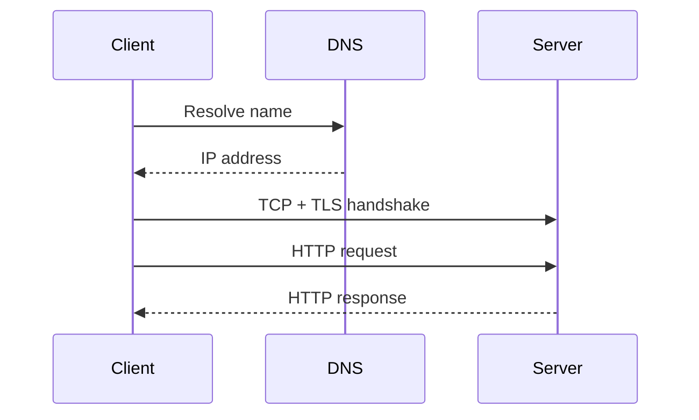

# Networking and the Internet

## In One Sentence

Networks let independent computers exchange messages even when they differ internally or the path between them is unreliable.

## Why This Exists

**Prerequisite:** [Unix, C, and Linux](./06-unix-c-linux.md).

Networking moves data among independently operated systems. **Capability → Complexity → Abstraction → Adoption → New Complexity → Next Abstraction:** links enabled packets; topology grew; internetworking hid media; global adoption caused routing and trust complexity; DNS, TLS, CDNs, and service discovery added layers.

The historical pressure was not “invent a new term.” It was to remove a concrete limit:

**Before → Problem → Innovation → New abstraction → New problems → Modern connection:** isolated computers shared data physically → heterogeneous networks needed resilient interconnection → packet switching, TCP/IP, DNS, and HTTP emerged → endpoints communicated through layered protocols → congestion, attacks, and global coordination followed → service meshes and model APIs still ride these contracts.

## Picture This

Postal systems work because senders use agreed address and envelope formats while many carriers choose the route. The sender need not know every truck and sorting center, but delay, loss, and wrong addresses still matter.

The analogy is a starting point, not the mechanism. Now we can name the engineering idea precisely.

## The Real Definition

Each layer wraps a payload with enough information to provide a narrower service; no layer guarantees more than its contract.

Packet switching, frame, IP, route, TCP, UDP, port, DNS, HTTP, TLS, latency, bandwidth, loss, congestion.

## Mental Model



Narrate the arrows aloud. At each arrow, ask: **what new capability appeared, and what new complexity came with it?**

## How It Actually Works

DNS resolves names; routing selects next hops; IP provides best-effort datagrams; TCP establishes ordered reliable byte streams using acknowledgments and congestion control; TLS authenticates and encrypts; HTTP defines application semantics.

TCP reliability is end-to-end, not instantaneous: retransmission raises tail latency. Throughput depends on bandwidth-delay product and congestion windows. Application retries can amplify load unless bounded and idempotent.

## Tiny Proof

```bash
ip route
getent hosts example.com
curl -v --connect-timeout 3 https://example.com/
ss -tan
```

Before running it, predict the result. Afterward, explain which part of the definition the observation proves—and which parts it does not.

## In Production

A model request times out although the server is healthy because DNS is stale, a connection queue is full, or packet loss triggers retransmissions. “Network error” is not a diagnosis.

Load balancers, VPCs, ingress, service discovery, gRPC, TLS, CDNs, cross-region replication, NCCL collectives, and egress policy.

## How It Breaks

DNS caching, MTU mismatch, asymmetric routing, exhausted ports, handshake failure, retry storms, head-of-line blocking, and missing timeout budgets.

## Debug It

Start with scope and timeline; test name resolution, route, reachability, transport handshake, TLS, then application response. Compare both endpoints and capture packets when necessary.

Use the same discipline throughout this curriculum: state the symptom precisely, locate the last proven boundary, form a falsifiable hypothesis, gather the smallest useful evidence, and change one variable.

## Build / Break Exercises

### Guided proof

Resolve a host, inspect route and TLS handshake, measure timing with `curl`, and explain each phase without using “the network” as one box.

### Build

Implement a length-prefixed TCP echo protocol with deadlines, request IDs, and bounded messages.

### Break

Inject latency, loss, truncated frames, and duplicate requests. Add timeouts and idempotency.

### No-AI challenge

Draw all steps from entering a URL to receiving bytes, including caches and failure boundaries.

**Success criteria:** Predict before acting, capture the observable result, explain the mechanism that produced it, and state one limit of your explanation.

## Explain It to Anybody

### 1. To a smart non-engineer

Computers communicate by sending addressed messages in agreed formats across paths that may fail.

### 2. To a junior engineer

The Internet is a layered packet network whose protocols separate application meaning, transport behavior, routing, and link delivery.

### 3. In an interview (60–90 seconds)

Layering permits independently built networks and applications to interoperate, but delay, loss, reordering, naming, congestion, and trust remain. I debug from name resolution through route, transport, encryption, and application protocol.

Do not memorize these scripts. Close the file and rebuild each explanation in your own words.

## Knowledge Check

1. Why is IP best effort?
2. What does TCP guarantee—and not guarantee?
3. Why can retries worsen failure?

### Interview stretch

- Debug intermittent cross-region timeouts.
- Explain DNS TTL trade-offs.
- Compare TCP and UDP for model traffic.

## Vocabulary

- **Packet:** A bounded unit of data sent through a packet network.
- **IP:** The Internet Protocol for addressed best-effort packet delivery.
- **Route:** A decision or path for forwarding traffic toward a destination.
- **TCP:** A reliable ordered byte-stream transport over IP.
- **UDP:** A message-oriented transport with minimal delivery guarantees.
- **DNS:** The distributed naming system that maps names to records.
- **HTTP:** An application protocol for requests, responses, and resource semantics.
- **TLS:** A protocol providing authenticated encrypted transport.
- **RTT:** Round-trip time for a message to reach a peer and a response to return.
- **MTU:** Maximum transmission unit carried in one link-layer frame without fragmentation.
- **Congestion window:** A sender-side limit on unacknowledged TCP data based on network conditions.
- **Bandwidth-delay product:** The data needed in flight to fill a path of given bandwidth and RTT.

Use each term only after you can explain the underlying idea without it. See the curriculum-wide [Glossary](../GLOSSARY.md) for plain and precise definitions.

## References

- **REQUIRED** — “A Protocol for Packet Network Intercommunication” — Vint Cerf and Bob Kahn. [IEEE DOI](https://doi.org/10.1109/TCOM.1974.1092259). Establishes internetworking principles.
- **RECOMMENDED** — “Internet Protocol” — IETF, RFC 791. [RFC Editor](https://www.rfc-editor.org/rfc/rfc791). Canonical IP specification and best-effort model.
- **DEEP DIVE** — “TCP Congestion Control” — IETF, RFC 5681. [RFC Editor](https://www.rfc-editor.org/rfc/rfc5681). Defines core congestion behavior behind production throughput.

## Next

[Databases](./08-databases.md) examines durable shared state above files and networks.
