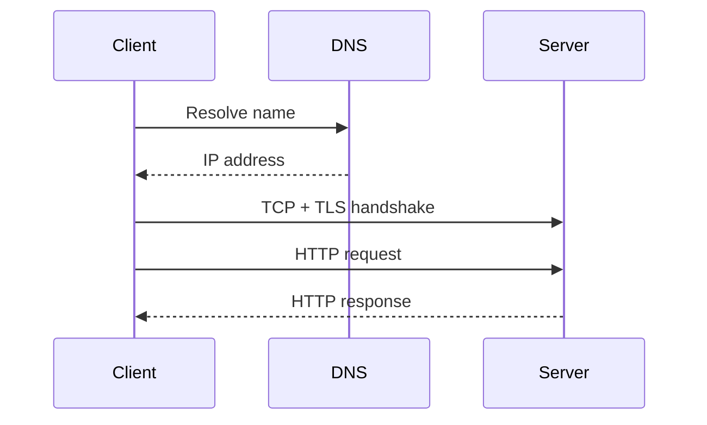

# Networking and the Internet

## Why You're Learning This
Every distributed and AI platform depends on packet delivery, naming, routing, congestion control, and application protocols. Network abstractions fail partially and must be debugged by layer.

## Historical Context
**Before → Problem → Innovation → New abstraction → New problems → Modern connection:** isolated computers shared data physically → heterogeneous networks needed resilient interconnection → packet switching, TCP/IP, DNS, and HTTP emerged → endpoints communicated through layered protocols → congestion, attacks, and global coordination followed → service meshes and model APIs still ride these contracts.

## Problem This Solves
Networking moves data among independently operated systems. **Capability → Complexity → Abstraction → Adoption → New Complexity → Next Abstraction:** links enabled packets; topology grew; internetworking hid media; global adoption caused routing and trust complexity; DNS, TLS, CDNs, and service discovery added layers.

## Mental Model
Each layer wraps a payload with enough information to provide a narrower service; no layer guarantees more than its contract.

## Core Concepts
Packet switching, frame, IP, route, TCP, UDP, port, DNS, HTTP, TLS, latency, bandwidth, loss, congestion.

## How It Actually Works
DNS resolves names; routing selects next hops; IP provides best-effort datagrams; TCP establishes ordered reliable byte streams using acknowledgments and congestion control; TLS authenticates and encrypts; HTTP defines application semantics.

## Deep Dive
TCP reliability is end-to-end, not instantaneous: retransmission raises tail latency. Throughput depends on bandwidth-delay product and congestion windows. Application retries can amplify load unless bounded and idempotent.

## Visual Model


## Code / Commands
```bash
ip route
getent hosts example.com
curl -v --connect-timeout 3 https://example.com/
ss -tan
```

## Practical Example
A model request times out although the server is healthy because DNS is stale, a connection queue is full, or packet loss triggers retransmissions. “Network error” is not a diagnosis.

## Where This Appears in Production
Load balancers, VPCs, ingress, service discovery, gRPC, TLS, CDNs, cross-region replication, NCCL collectives, and egress policy.

## Common Failure Modes
DNS caching, MTU mismatch, asymmetric routing, exhausted ports, handshake failure, retry storms, head-of-line blocking, and missing timeout budgets.

## Debugging Approach
Start with scope and timeline; test name resolution, route, reachability, transport handshake, TLS, then application response. Compare both endpoints and capture packets when necessary.

## Hands-On Lab
Resolve a host, inspect route and TLS handshake, measure timing with `curl`, and explain each phase without using “the network” as one box.

## Build Exercise
Implement a length-prefixed TCP echo protocol with deadlines, request IDs, and bounded messages.

## Break It Exercise
Inject latency, loss, truncated frames, and duplicate requests. Add timeouts and idempotency.

## No-AI Challenge
Draw all steps from entering a URL to receiving bytes, including caches and failure boundaries.

## Knowledge Check
1. Why is IP best effort?
2. What does TCP guarantee—and not guarantee?
3. Why can retries worsen failure?

## Interview Questions
- Debug intermittent cross-region timeouts.
- Explain DNS TTL trade-offs.
- Compare TCP and UDP for model traffic.

## Explain It Yourself
Use both required causal chains to connect isolated computers to encrypted global APIs and their new operational complexity.

## Key Takeaways
Networks are layered and partially reliable; latency is cumulative; retransmission and retries alter load; debug one contract at a time.

## Vocabulary
Packet, IP, route, TCP, UDP, DNS, HTTP, TLS, RTT, MTU, congestion window, bandwidth-delay product.

## References
- **[REQUIRED] “A Protocol for Packet Network Intercommunication” — Vint Cerf and Bob Kahn.** [IEEE DOI](https://doi.org/10.1109/TCOM.1974.1092259). Establishes internetworking principles.
- **[RECOMMENDED] “Internet Protocol” — IETF, RFC 791.** [RFC Editor](https://www.rfc-editor.org/rfc/rfc791). Canonical IP specification and best-effort model.
- **[DEEP DIVE] “TCP Congestion Control” — IETF, RFC 5681.** [RFC Editor](https://www.rfc-editor.org/rfc/rfc5681). Defines core congestion behavior behind production throughput.

## Next Lesson
[Databases](./08-databases.md) examines durable shared state above files and networks.
