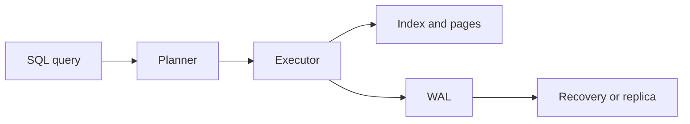

# Databases

## In One Sentence

A database keeps shared information organized and recoverable while many users read and change it.

## Why This Exists

**Prerequisite:** [Networking and the Internet](./07-networking-and-the-internet.md).

Databases provide durable, concurrent, queryable state. **Capability → Complexity → Abstraction → Adoption → New Complexity → Next Abstraction:** storage enabled records; relationships grew; schemas and SQL abstracted access; adoption centralized truth; scale and availability pressures grew; replication, sharding, and specialized stores followed.

The historical pressure was not “invent a new term.” It was to remove a concrete limit:

**Before → Problem → Innovation → New abstraction → New problems → Modern connection:** applications managed raw files → duplication and concurrent updates corrupted meaning → relational models, transactions, indexes, and query languages emerged → data became declarative tables with integrity rules → scaling and impedance costs appeared → distributed SQL, object stores, and vector systems specialize the model.

## Picture This

A shared notebook works until many people edit it, pages tear, and nobody knows which copy is current. A database is a disciplined records office: it indexes, coordinates changes, and preserves agreed facts after failures.

The analogy is a starting point, not the mechanism. Now we can name the engineering idea precisely.

## The Real Definition

A database is a state machine plus durable log, concurrency policy, access paths, and recovery machinery—not merely files with an API.

Schema, relation, key, index, query plan, transaction, ACID, isolation, write-ahead log (WAL), MVCC, replication.

## Mental Model



Narrate the arrows aloud. At each arrow, ask: **what new capability appeared, and what new complexity came with it?**

## How It Actually Works

Queries are parsed and planned; indexes narrow access; transactions coordinate visible versions; WAL records changes before data pages; checkpoints bound recovery; constraints reject invalid states.

Isolation levels trade concurrency for anomalies. MVCC lets readers observe snapshots while writers create versions, but vacuuming and long transactions become operational concerns. An index accelerates reads by adding write and storage cost.

## Tiny Proof

```sql
BEGIN;
SELECT status FROM model_versions WHERE id = 42 FOR UPDATE;
UPDATE model_versions SET status = 'deployed' WHERE id = 42;
COMMIT;
EXPLAIN ANALYZE SELECT * FROM model_versions WHERE id = 42;
```

Before running it, predict the result. Afterward, explain which part of the definition the observation proves—and which parts it does not.

## In Production

A deployment controller must atomically move one model version to active. Without a uniqueness constraint and transaction, concurrent reconcilers can publish two “active” versions.

Control planes, feature stores, experiment tracking, vector search, billing, queues, secrets metadata, model registries, and audit logs.

## How It Breaks

Missing indexes, lock contention, lost updates, long transactions, replica lag, schema drift, unbounded queries, connection exhaustion, and assuming backups are recoverable.

## Debug It

Identify query, transaction, and expected invariant. Inspect plan, locks, wait events, cardinality estimates, WAL/replication lag, constraints, and recovery point.

Use the same discipline throughout this curriculum: state the symptom precisely, locate the last proven boundary, form a falsifiable hypothesis, gather the smallest useful evidence, and change one variable.

## Build / Break Exercises

### Guided proof

Create a PostgreSQL table with constraints and an index; compare plans before and after indexing and observe concurrent transaction behavior.

### Build

Design a model registry schema with immutable versions, one active deployment per environment, lineage, and idempotent updates.

### Break

Cause a uniqueness violation, deadlock, slow scan, and stale replica read. Capture evidence and define recovery.

### No-AI challenge

Write an invariant and transaction that prevents two active production models.

**Success criteria:** Predict before acting, capture the observable result, explain the mechanism that produced it, and state one limit of your explanation.

## Explain It to Anybody

### 1. To a smart non-engineer

A database is a careful shared record keeper that helps many users find and change information without losing it.

### 2. To a junior engineer

A database management system organizes persistent data and mediates queries, concurrency, integrity, recovery, and physical storage.

### 3. In an interview (60–90 seconds)

Databases trade among latency, throughput, consistency, durability, and availability. I connect logical operations to indexes, plans, locks or MVCC, logs, replication, and recovery evidence before diagnosing an application symptom.

Do not memorize these scripts. Close the file and rebuild each explanation in your own words.

## Knowledge Check

1. Why does WAL precede page updates?
2. What does an index cost?
3. How can isolation permit anomalies?

### Interview stretch

- Debug a query that became slow after data growth.
- Choose consistency for feature serving.
- Explain MVCC and vacuum operationally.

## Vocabulary

- **Relation:** A set of tuples sharing named attributes in the relational model.
- **Schema:** The defined structure, types, and constraints of stored data.
- **Index:** An auxiliary data structure that speeds selected lookups at write and storage cost.
- **Transaction:** A logical unit of database work with defined completion guarantees.
- **ACID:** Atomicity, consistency, isolation, and durability properties associated with transactions.
- **Isolation:** Rules governing how concurrent transactions observe one another.
- **MVCC:** Multi-version concurrency control using multiple row versions to coordinate readers and writers.
- **WAL:** A write-ahead log recorded before related data pages for durability and recovery.
- **Checkpoint:** A recovery point that limits how much logged history must be replayed.
- **Replication:** Maintaining copies of data on multiple nodes.
- **Query plan:** The physical operations selected to execute a query.

Use each term only after you can explain the underlying idea without it. See the curriculum-wide [Glossary](../GLOSSARY.md) for plain and precise definitions.

## References

- **REQUIRED** — “A Relational Model of Data for Large Shared Data Banks” — E. F. Codd. [ACM DOI](https://doi.org/10.1145/362384.362685). Introduces data independence through the relational model.
- **RECOMMENDED** — “PostgreSQL: Concurrency Control” — PostgreSQL Global Development Group. [Official docs](https://www.postgresql.org/docs/current/mvcc.html). Canonical practical treatment of MVCC and isolation.
- **DEEP DIVE** — “ARIES” — C. Mohan et al. [IBM Research](https://research.ibm.com/publications/aries-a-transaction-recovery-method-supporting-fine-granularity-locking-and-partial-rollbacks-using-write-ahead-logging). Foundational recovery design using WAL.

## Next

[Distributed Systems](./09-distributed-systems.md) asks what changes when state and computation cross machine boundaries.
