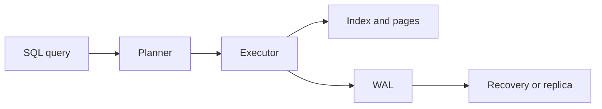

# Databases

## Why You're Learning This
AI platforms depend on metadata, features, artifacts, vectors, lineage, and control-plane state. Database guarantees determine what “correct” means under concurrency and failure.

## Historical Context
**Before → Problem → Innovation → New abstraction → New problems → Modern connection:** applications managed raw files → duplication and concurrent updates corrupted meaning → relational models, transactions, indexes, and query languages emerged → data became declarative tables with integrity rules → scaling and impedance costs appeared → distributed SQL, object stores, and vector systems specialize the model.

## Problem This Solves
Databases provide durable, concurrent, queryable state. **Capability → Complexity → Abstraction → Adoption → New Complexity → Next Abstraction:** storage enabled records; relationships grew; schemas and SQL abstracted access; adoption centralized truth; scale and availability pressures grew; replication, sharding, and specialized stores followed.

## Mental Model
A database is a state machine plus durable log, concurrency policy, access paths, and recovery machinery—not merely files with an API.

## Core Concepts
Schema, relation, key, index, query plan, transaction, ACID, isolation, write-ahead log (WAL), MVCC, replication.

## How It Actually Works
Queries are parsed and planned; indexes narrow access; transactions coordinate visible versions; WAL records changes before data pages; checkpoints bound recovery; constraints reject invalid states.

## Deep Dive
Isolation levels trade concurrency for anomalies. MVCC lets readers observe snapshots while writers create versions, but vacuuming and long transactions become operational concerns. An index accelerates reads by adding write and storage cost.

## Visual Model


## Code / Commands
```sql
BEGIN;
SELECT status FROM model_versions WHERE id = 42 FOR UPDATE;
UPDATE model_versions SET status = 'deployed' WHERE id = 42;
COMMIT;
EXPLAIN ANALYZE SELECT * FROM model_versions WHERE id = 42;
```

## Practical Example
A deployment controller must atomically move one model version to active. Without a uniqueness constraint and transaction, concurrent reconcilers can publish two “active” versions.

## Where This Appears in Production
Control planes, feature stores, experiment tracking, vector search, billing, queues, secrets metadata, model registries, and audit logs.

## Common Failure Modes
Missing indexes, lock contention, lost updates, long transactions, replica lag, schema drift, unbounded queries, connection exhaustion, and assuming backups are recoverable.

## Debugging Approach
Identify query, transaction, and expected invariant. Inspect plan, locks, wait events, cardinality estimates, WAL/replication lag, constraints, and recovery point.

## Hands-On Lab
Create a PostgreSQL table with constraints and an index; compare plans before and after indexing and observe concurrent transaction behavior.

## Build Exercise
Design a model registry schema with immutable versions, one active deployment per environment, lineage, and idempotent updates.

## Break It Exercise
Cause a uniqueness violation, deadlock, slow scan, and stale replica read. Capture evidence and define recovery.

## No-AI Challenge
Write an invariant and transaction that prevents two active production models.

## Knowledge Check
1. Why does WAL precede page updates?
2. What does an index cost?
3. How can isolation permit anomalies?

## Interview Questions
- Debug a query that became slow after data growth.
- Choose consistency for feature serving.
- Explain MVCC and vacuum operationally.

## Explain It Yourself
Apply both historical cycles from files to replicated specialized stores, naming each new abstraction and complexity.

## Key Takeaways
Databases enforce shared-state contracts; transactions protect invariants; access paths are workload-specific; recovery must be tested.

## Vocabulary
Relation, schema, index, transaction, ACID, isolation, MVCC, WAL, checkpoint, replication, query plan.

## References
- **[REQUIRED] “A Relational Model of Data for Large Shared Data Banks” — E. F. Codd.** [ACM DOI](https://doi.org/10.1145/362384.362685). Introduces data independence through the relational model.
- **[RECOMMENDED] “PostgreSQL: Concurrency Control” — PostgreSQL Global Development Group.** [Official docs](https://www.postgresql.org/docs/current/mvcc.html). Canonical practical treatment of MVCC and isolation.
- **[DEEP DIVE] “ARIES” — C. Mohan et al.** [IBM Research](https://research.ibm.com/publications/aries-a-transaction-recovery-method-supporting-fine-granularity-locking-and-partial-rollbacks-using-write-ahead-logging). Foundational recovery design using WAL.

## Next Lesson
[Distributed Systems](./09-distributed-systems.md) asks what changes when state and computation cross machine boundaries.
