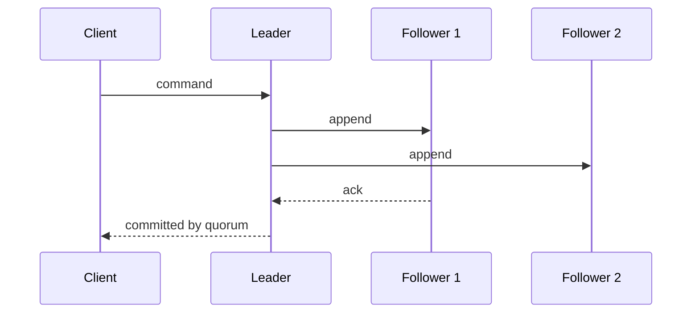

# Distributed Systems

## Why You're Learning This
Cloud, Kubernetes, data pipelines, and model serving are distributed systems. Their defining challenge is uncertainty: delay and failure are difficult to distinguish.

## Historical Context
**Before → Problem → Innovation → New abstraction → New problems → Modern connection:** one machine held state and failure → capacity and availability demanded multiple machines → replication, logical clocks, consensus, and distributed transactions emerged → clusters acted like services → partial failure and coordination cost dominated → globally replicated AI platforms inherit these limits.

## Problem This Solves
Distribution pools capacity and survives component loss. **Capability → Complexity → Abstraction → Adoption → New Complexity → Next Abstraction:** networks connected machines; coordination became complex; protocols exposed shared services; adoption created fleets; partitions and scale grew; consensus systems and managed control planes followed.

## Mental Model
Each node has incomplete, delayed knowledge. Correctness comes from explicit assumptions about timing, failures, and consistency.

## Core Concepts
Partial failure, replication, partition, consistency, availability, quorum, logical clock, leader election, consensus, idempotency.

## How It Actually Works
Nodes exchange messages; replicated logs establish ordered decisions; quorums ensure intersecting observations; timeouts trigger suspicions, not proof; retries and deduplication handle uncertain outcomes.

## Deep Dive
CAP concerns behavior during a partition, not a universal two-of-three menu. Consensus chooses one ordered history despite failures under stated assumptions. Linearizability is a real-time consistency property; it differs from transaction isolation.

## Visual Model


## Code / Commands
```text
handle(request):
  if dedupe_store.contains(request.id): return saved_result
  result = apply(request)
  atomically_save(request.id, result)
  return result
```

## Practical Example
A client times out after a deployment request commits. Retrying without an idempotency key can create duplicate work; retrying with one safely retrieves the committed result.

## Where This Appears in Production
etcd, distributed databases, object stores, schedulers, queues, feature pipelines, collective training, caches, and regional failover.

## Common Failure Modes
Split brain, stale reads, retry storms, clock assumptions, thundering herds, duplicate effects, quorum loss, unbounded queues, and coordinated failover overload.

## Debugging Approach
Build a timeline per node using request IDs and logical events. Check membership, latency, loss, leader terms, quorum, queue depth, and retry policy. State the consistency invariant.

## Hands-On Lab
Simulate three replicas, delayed messages, and one failure. Compare read-one/write-one with majority quorum behavior.

## Build Exercise
Implement a replicated-log simulator with terms, leader election, commit index, and deterministic tests.

## Break It Exercise
Partition the leader, duplicate messages, reorder delivery, and skew clocks. Verify safety separately from liveness.

## No-AI Challenge
Explain why a timeout cannot prove failure and design an exactly-once user experience from at-least-once delivery primitives.

## Knowledge Check
1. Why are timeouts suspicions?
2. How do quorums intersect?
3. What does consensus guarantee?

## Interview Questions
- Design idempotent deployment submission.
- Explain CAP without the “pick two” myth.
- Diagnose a healthy cluster that cannot make progress.

## Explain It Yourself
Use both causal sequences from one machine to consensus-backed services, emphasizing new uncertainty rather than product names.

## Key Takeaways
Distribution adds partial failure; retries require identity; consensus orders decisions; consistency and availability claims require explicit models.

## Vocabulary
Partition, quorum, replication, consensus, linearizability, logical clock, split brain, idempotency, safety, liveness.

## References
- **[REQUIRED] “Time, Clocks, and the Ordering of Events in a Distributed System” — Leslie Lamport.** [Microsoft Research](https://www.microsoft.com/en-us/research/publication/time-clocks-ordering-events-distributed-system/). Establishes causal ordering without global time.
- **[RECOMMENDED] “In Search of an Understandable Consensus Algorithm (Raft)” — Ongaro and Ousterhout.** [Official Raft paper](https://raft.github.io/raft.pdf). Accessible consensus decomposition.
- **[DEEP DIVE] “Brewer’s Conjecture and the Feasibility of Consistent, Available, Partition-Tolerant Web Services” — Gilbert and Lynch.** [MIT PDF](https://groups.csail.mit.edu/tds/papers/Gilbert/Brewer2.pdf). Formalizes CAP’s actual scope.

## Next Lesson
[Virtualization and Cloud](./10-virtualization-and-cloud.md) turns distributed hardware into rentable resource abstractions.
