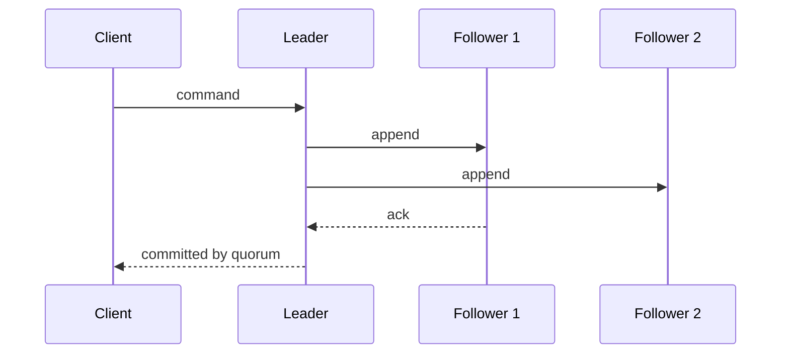

# Distributed Systems

## In One Sentence

A distributed system coordinates work across computers that can be slow, disconnected, or wrong independently.

## Why This Exists

**Prerequisite:** [Databases](./08-databases.md).

Distribution pools capacity and survives component loss. **Capability → Complexity → Abstraction → Adoption → New Complexity → Next Abstraction:** networks connected machines; coordination became complex; protocols exposed shared services; adoption created fleets; partitions and scale grew; consensus systems and managed control planes followed.

The historical pressure was not “invent a new term.” It was to remove a concrete limit:

**Before → Problem → Innovation → New abstraction → New problems → Modern connection:** one machine held state and failure → capacity and availability demanded multiple machines → replication, logical clocks, consensus, and distributed transactions emerged → clusters acted like services → partial failure and coordination cost dominated → globally replicated AI platforms inherit these limits.

## Picture This

Coordinating several kitchens by phone is harder than working in one kitchen. Calls arrive late, one kitchen may go silent, and nobody sees the whole room. More kitchens add capacity—and uncertainty.

The analogy is a starting point, not the mechanism. Now we can name the engineering idea precisely.

## The Real Definition

Each node has incomplete, delayed knowledge. Correctness comes from explicit assumptions about timing, failures, and consistency.

Partial failure, replication, partition, consistency, availability, quorum, logical clock, leader election, consensus, idempotency.

## Mental Model



Narrate the arrows aloud. At each arrow, ask: **what new capability appeared, and what new complexity came with it?**

## How It Actually Works

Nodes exchange messages; replicated logs establish ordered decisions; quorums ensure intersecting observations; timeouts trigger suspicions, not proof; retries and deduplication handle uncertain outcomes.

CAP concerns behavior during a partition, not a universal two-of-three menu. Consensus chooses one ordered history despite failures under stated assumptions. Linearizability is a real-time consistency property; it differs from transaction isolation.

## Tiny Proof

```text
handle(request):
  if dedupe_store.contains(request.id): return saved_result
  result = apply(request)
  atomically_save(request.id, result)
  return result
```

Before running it, predict the result. Afterward, explain which part of the definition the observation proves—and which parts it does not.

## In Production

A client times out after a deployment request commits. Retrying without an idempotency key can create duplicate work; retrying with one safely retrieves the committed result.

etcd, distributed databases, object stores, schedulers, queues, feature pipelines, collective training, caches, and regional failover.

## How It Breaks

Split brain, stale reads, retry storms, clock assumptions, thundering herds, duplicate effects, quorum loss, unbounded queues, and coordinated failover overload.

## Debug It

Build a timeline per node using request IDs and logical events. Check membership, latency, loss, leader terms, quorum, queue depth, and retry policy. State the consistency invariant.

Use the same discipline throughout this curriculum: state the symptom precisely, locate the last proven boundary, form a falsifiable hypothesis, gather the smallest useful evidence, and change one variable.

## Build / Break Exercises

### Guided proof

Simulate three replicas, delayed messages, and one failure. Compare read-one/write-one with majority quorum behavior.

### Build

Implement a replicated-log simulator with terms, leader election, commit index, and deterministic tests.

### Break

Partition the leader, duplicate messages, reorder delivery, and skew clocks. Verify safety separately from liveness.

### No-AI challenge

Explain why a timeout cannot prove failure and design an exactly-once user experience from at-least-once delivery primitives.

**Success criteria:** Predict before acting, capture the observable result, explain the mechanism that produced it, and state one limit of your explanation.

## Explain It to Anybody

### 1. To a smart non-engineer

Several computers can do more together, but they cannot always know whether another computer is slow, disconnected, or dead.

### 2. To a junior engineer

A distributed system coordinates components through messages under independent failure, variable delay, and incomplete knowledge.

### 3. In an interview (60–90 seconds)

Partial failure and uncertain time invalidate single-machine assumptions. Designs need explicit consistency, ordering, retry, idempotency, backpressure, quorum, and recovery models, with evidence that distinguishes delay from failure.

Do not memorize these scripts. Close the file and rebuild each explanation in your own words.

## Knowledge Check

1. Why are timeouts suspicions?
2. How do quorums intersect?
3. What does consensus guarantee?

### Interview stretch

- Design idempotent deployment submission.
- Explain CAP without the “pick two” myth.
- Diagnose a healthy cluster that cannot make progress.

## Vocabulary

- **Partition:** A communication failure that separates components that may otherwise remain alive.
- **Quorum:** A threshold of participants whose overlap supports a coordination guarantee.
- **Replication:** Keeping multiple copies of state for availability, locality, or durability.
- **Consensus:** Agreement on a sequence or value despite failure within stated assumptions.
- **Linearizability:** The appearance that operations occur atomically in one real-time-consistent order.
- **Logical clock:** A counter-based model of causal or event ordering without synchronized wall time.
- **Split brain:** Multiple components independently acting as the authoritative leader.
- **Idempotency:** Safe repetition without multiplying the intended effect.
- **Safety:** A property stating that something bad never happens.
- **Liveness:** A property stating that useful progress eventually happens.

Use each term only after you can explain the underlying idea without it. See the curriculum-wide [Glossary](../GLOSSARY.md) for plain and precise definitions.

## References

- **REQUIRED** — “Time, Clocks, and the Ordering of Events in a Distributed System” — Leslie Lamport. [Microsoft Research](https://www.microsoft.com/en-us/research/publication/time-clocks-ordering-events-distributed-system/). Establishes causal ordering without global time.
- **RECOMMENDED** — “In Search of an Understandable Consensus Algorithm (Raft)” — Ongaro and Ousterhout. [Official Raft paper](https://raft.github.io/raft.pdf). Accessible consensus decomposition.
- **DEEP DIVE** — “Brewer’s Conjecture and the Feasibility of Consistent, Available, Partition-Tolerant Web Services” — Gilbert and Lynch. [MIT PDF](https://groups.csail.mit.edu/tds/papers/Gilbert/Brewer2.pdf). Formalizes CAP’s actual scope.

## Next

[Virtualization and Cloud](./10-virtualization-and-cloud.md) turns distributed hardware into rentable resource abstractions.
