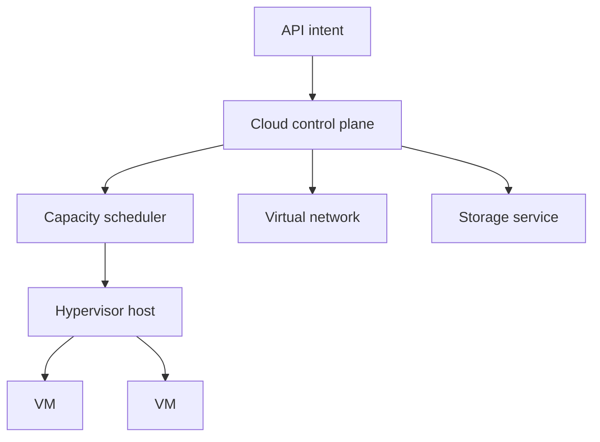

# Virtualization and Cloud

## In One Sentence

Virtualization turns physical computers into isolated logical machines, and cloud platforms make those machines available through APIs.

## Why This Exists

**Prerequisite:** [Distributed Systems](./09-distributed-systems.md).

Virtualization isolates workloads; cloud operationalizes pooled resources. **Capability → Complexity → Abstraction → Adoption → New Complexity → Next Abstraction:** powerful servers enabled sharing; allocation grew hard; VMs standardized units; cloud adoption scaled fleets; API and governance complexity grew; containers and platforms followed.

The historical pressure was not “invent a new term.” It was to remove a concrete limit:

**Before → Problem → Innovation → New abstraction → New problems → Modern connection:** servers were dedicated and slowly provisioned → utilization was low and change required hardware work → hypervisors virtualized machines and cloud exposed resources by API → infrastructure became on-demand services → cost, tenancy, sprawl, and provider coupling emerged → GPU fleets and managed AI services extend the model.

## Picture This

An office building divides one physical structure into lockable suites with metered utilities. Virtualization creates the suites; cloud APIs let tenants request, resize, and release them without negotiating each physical change.

The analogy is a starting point, not the mechanism. Now we can name the engineering idea precisely.

## The Real Definition

Cloud is a distributed control plane that reconciles declared resource records with leased physical capacity; “elastic” means automation around finite pools.

Hypervisor, VM, image, virtual network, block/object storage, region/zone, elasticity, tenancy, control plane, shared responsibility.

## Mental Model



Narrate the arrows aloud. At each arrow, ask: **what new capability appeared, and what new complexity came with it?**

## How It Actually Works

A hypervisor mediates CPU, memory, and devices; cloud control planes authenticate API calls, persist desired resources, schedule capacity, configure networking/storage, and report lifecycle state asynchronously.

Hardware-assisted virtualization reduces trap overhead, but noisy neighbors and device topology remain. Availability zones limit correlated failures; they do not eliminate them. Object storage trades filesystem semantics for scalable API-managed durability.

## Tiny Proof

```text
POST /instances {image, cpu, memory, zone, idempotency_key}
202 Accepted {operation_id}
GET /operations/{id} -> pending | succeeded | failed
```

Before running it, predict the result. Afterward, explain which part of the definition the observation proves—and which parts it does not.

## In Production

Requesting eight GPUs may fail despite regional quota because the selected zone lacks one contiguous topology. Capacity, quota, and allocatability are distinct.

Autoscaling, spot capacity, IAM, VPCs, managed databases, object stores, GPU instances, zones, infrastructure as code, and chargeback.

## How It Breaks

Quota/capacity confusion, single-zone design, permissive IAM, orphaned resources, metadata exposure, cost runaway, asynchronous API races, and untested restore.

## Debug It

Separate desired record, control-plane operation, and data-plane resource. Inspect operation IDs, events, quota, zone capacity, identity decisions, dependencies, and billing dimensions.

Use the same discipline throughout this curriculum: state the symptom precisely, locate the last proven boundary, form a falsifiable hypothesis, gather the smallest useful evidence, and change one variable.

## Build / Break Exercises

### Guided proof

Model a VM lifecycle from requested to terminated and list compensating actions for failure at each transition.

### Build

Write a mock cloud allocator with zones, finite CPU/GPU pools, idempotent requests, and asynchronous status.

### Break

Exhaust quota, remove zonal capacity, repeat requests, and fail network setup. Prevent leaked allocations.

### No-AI challenge

Design a two-zone service and identify which failures still correlate.

**Success criteria:** Predict before acting, capture the observable result, explain the mechanism that produced it, and state one limit of your explanation.

## Explain It to Anybody

### 1. To a smart non-engineer

Software can divide physical computers into isolated machines, and cloud services let people request those machines on demand.

### 2. To a junior engineer

A hypervisor mediates virtual hardware for guest systems; cloud control planes expose pooled compute, storage, and networking through APIs and measured service contracts.

### 3. In an interview (60–90 seconds)

Virtualization decouples workloads from hosts; cloud adds programmable allocation and managed services. The tradeoff is another control plane, noisy-neighbor risk, quotas, provider contracts, and cost that must be designed and observed.

Do not memorize these scripts. Close the file and rebuild each explanation in your own words.

## Knowledge Check

1. What differs between virtualization and cloud?
2. Why are cloud creates asynchronous?
3. What does shared responsibility imply?

### Interview stretch

- Diagnose pending GPU instances.
- Compare block and object storage.
- Explain zonal resilience without claiming zero downtime.

## Vocabulary

- **Hypervisor:** Software or firmware that runs and isolates virtual machines.
- **Virtual machine (VM):** A logical machine with virtual hardware and its own guest OS.
- **Image:** A reusable template for a machine or workload filesystem and configuration.
- **Tenancy:** The way resources and boundaries are shared among customers or workloads.
- **Region:** A cloud provider's geographic service area.
- **Availability zone:** An isolated infrastructure location within a region.
- **Elasticity:** Adjusting allocated capacity as demand changes.
- **Quota:** An enforced limit on resource consumption or creation.
- **Control plane:** APIs and decision systems that manage desired infrastructure state.
- **Data plane:** Resources that handle the workload's actual traffic or computation.
- **IAM:** Identity and access management for authenticating principals and authorizing actions.

Use each term only after you can explain the underlying idea without it. See the curriculum-wide [Glossary](../GLOSSARY.md) for plain and precise definitions.

## References

- **REQUIRED** — “Amazon EC2” — Amazon Web Services. [Official EC2 documentation](https://docs.aws.amazon.com/ec2/). Canonical description of production VM resource abstractions.
- **RECOMMENDED** — “The NIST Definition of Cloud Computing” — Mell and Grance, NIST. [NIST SP 800-145](https://doi.org/10.6028/NIST.SP.800-145). Defines cloud characteristics and service models precisely.
- **DEEP DIVE** — “Formal Requirements for Virtualizable Third Generation Architectures” — Popek and Goldberg. [ACM DOI](https://doi.org/10.1145/361011.361073). Establishes foundations of machine virtualization.

## Next

[DevOps](./11-devops.md) examines the organizational and delivery response to programmable infrastructure.
