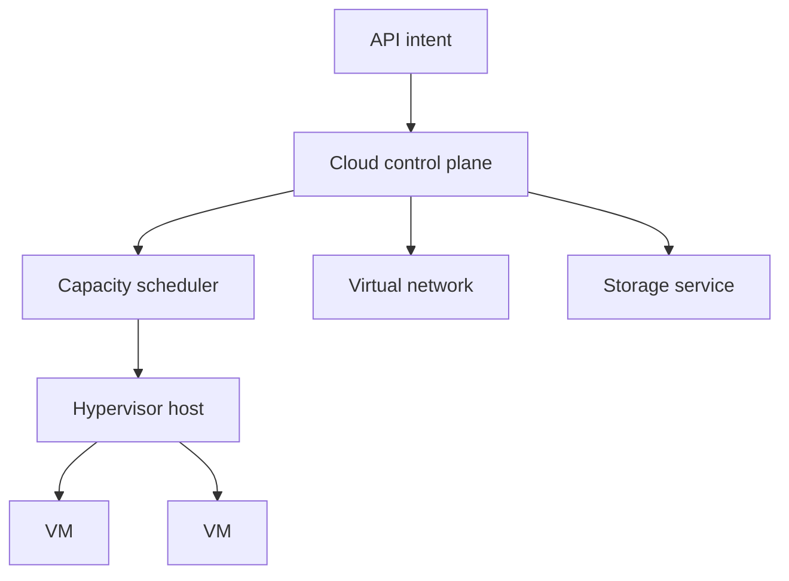

# Virtualization and Cloud

## Why You're Learning This
AI platforms consume virtual machines, networks, storage, identity, and accelerators through cloud APIs. You must know what isolation and elasticity mean beneath those APIs.

## Historical Context
**Before → Problem → Innovation → New abstraction → New problems → Modern connection:** servers were dedicated and slowly provisioned → utilization was low and change required hardware work → hypervisors virtualized machines and cloud exposed resources by API → infrastructure became on-demand services → cost, tenancy, sprawl, and provider coupling emerged → GPU fleets and managed AI services extend the model.

## Problem This Solves
Virtualization isolates workloads; cloud operationalizes pooled resources. **Capability → Complexity → Abstraction → Adoption → New Complexity → Next Abstraction:** powerful servers enabled sharing; allocation grew hard; VMs standardized units; cloud adoption scaled fleets; API and governance complexity grew; containers and platforms followed.

## Mental Model
Cloud is a distributed control plane that reconciles declared resource records with leased physical capacity; “elastic” means automation around finite pools.

## Core Concepts
Hypervisor, VM, image, virtual network, block/object storage, region/zone, elasticity, tenancy, control plane, shared responsibility.

## How It Actually Works
A hypervisor mediates CPU, memory, and devices; cloud control planes authenticate API calls, persist desired resources, schedule capacity, configure networking/storage, and report lifecycle state asynchronously.

## Deep Dive
Hardware-assisted virtualization reduces trap overhead, but noisy neighbors and device topology remain. Availability zones limit correlated failures; they do not eliminate them. Object storage trades filesystem semantics for scalable API-managed durability.

## Visual Model


## Code / Commands
```text
POST /instances {image, cpu, memory, zone, idempotency_key}
202 Accepted {operation_id}
GET /operations/{id} -> pending | succeeded | failed
```

## Practical Example
Requesting eight GPUs may fail despite regional quota because the selected zone lacks one contiguous topology. Capacity, quota, and allocatability are distinct.

## Where This Appears in Production
Autoscaling, spot capacity, IAM, VPCs, managed databases, object stores, GPU instances, zones, infrastructure as code, and chargeback.

## Common Failure Modes
Quota/capacity confusion, single-zone design, permissive IAM, orphaned resources, metadata exposure, cost runaway, asynchronous API races, and untested restore.

## Debugging Approach
Separate desired record, control-plane operation, and data-plane resource. Inspect operation IDs, events, quota, zone capacity, identity decisions, dependencies, and billing dimensions.

## Hands-On Lab
Model a VM lifecycle from requested to terminated and list compensating actions for failure at each transition.

## Build Exercise
Write a mock cloud allocator with zones, finite CPU/GPU pools, idempotent requests, and asynchronous status.

## Break It Exercise
Exhaust quota, remove zonal capacity, repeat requests, and fail network setup. Prevent leaked allocations.

## No-AI Challenge
Design a two-zone service and identify which failures still correlate.

## Knowledge Check
1. What differs between virtualization and cloud?
2. Why are cloud creates asynchronous?
3. What does shared responsibility imply?

## Interview Questions
- Diagnose pending GPU instances.
- Compare block and object storage.
- Explain zonal resilience without claiming zero downtime.

## Explain It Yourself
Use both historical cycles to connect dedicated servers to API-driven GPU fleets and explain the governance complexity created.

## Key Takeaways
Virtualization isolates; cloud pools and automates; APIs represent eventual operations; physical capacity and failure domains still matter.

## Vocabulary
Hypervisor, VM, image, tenancy, region, availability zone, elasticity, quota, control plane, data plane, IAM.

## References
- **[REQUIRED] “Amazon EC2” — Amazon Web Services.** [Official EC2 documentation](https://docs.aws.amazon.com/ec2/). Canonical description of production VM resource abstractions.
- **[RECOMMENDED] “The NIST Definition of Cloud Computing” — Mell and Grance, NIST.** [NIST SP 800-145](https://doi.org/10.6028/NIST.SP.800-145). Defines cloud characteristics and service models precisely.
- **[DEEP DIVE] “Formal Requirements for Virtualizable Third Generation Architectures” — Popek and Goldberg.** [ACM DOI](https://doi.org/10.1145/361011.361073). Establishes foundations of machine virtualization.

## Next Lesson
[DevOps](./11-devops.md) examines the organizational and delivery response to programmable infrastructure.
