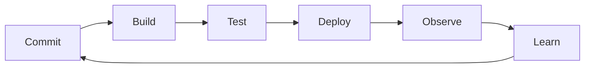

# DevOps

## In One Sentence

DevOps shortens the path from code change to production learning by joining delivery and operational responsibility.

## Why This Exists

**Prerequisite:** [Virtualization and Cloud](./10-virtualization-and-cloud.md).

DevOps shortens feedback while preserving reliability. **Capability → Complexity → Abstraction → Adoption → New Complexity → Next Abstraction:** automation enabled frequent change; coordination grew; pipelines standardized flow; adoption multiplied tooling; teams faced overload; internal platforms followed.

The historical pressure was not “invent a new term.” It was to remove a concrete limit:

**Before → Problem → Innovation → New abstraction → New problems → Modern connection:** development handed releases to operations → slow batches and conflicting incentives produced fragile change → agile operations, CI/CD, infrastructure as code, and shared ownership emerged → delivery became a continuous system → pipeline sprawl and cognitive load followed → platform engineering productizes safe paths.

## Picture This

If builders throw a finished machine over a wall to mechanics, feedback arrives late and blame travels faster than learning. Put design, delivery, and operation in one feedback loop and each change teaches the next.

The analogy is a starting point, not the mechanism. Now we can name the engineering idea precisely.

## The Real Definition

Delivery is a sociotechnical feedback loop: code, evidence, deployment, production learning, and improved design.

Flow, feedback, shared ownership, CI, continuous delivery, deployment, infrastructure as code, small batches, blameless learning, DORA metrics.

## Mental Model



Narrate the arrows aloud. At each arrow, ask: **what new capability appeared, and what new complexity came with it?**

## How It Actually Works

Versioned changes trigger repeatable build and test stages; immutable artifacts move through policy gates; progressive deployment limits exposure; telemetry informs rollback and future work.

Deployment frequency and stability are not inherent opposites: small batches reduce change risk and diagnosis scope. Automation without operability merely accelerates bad states; organizational boundaries shape architecture and queues.

## Tiny Proof

```yaml
pipeline:
  - build: reproducible-artifact
  - test: unit-integration-security
  - deploy: canary-5-percent
  - verify: slo-and-business-signals
  - promote_or_rollback: automatic
```

Before running it, predict the result. Afterward, explain which part of the definition the observation proves—and which parts it does not.

## In Production

A model release couples code, weights, tokenizer, runtime, and evaluation evidence. A versioned release bundle and canary feedback make rollback coherent.

CI/CD, GitOps, artifact registries, policy gates, runbooks, incident review, feature flags, progressive delivery, and model release workflows.

## How It Breaks

Cargo-cult automation, long-lived branches, mutable artifacts, flaky gates, manual drift, vanity metrics, unsafe secrets, and measuring deployment without user outcome.

## Debug It

Trace artifact identity and evidence through every stage. Inspect queue time, failure rate, environment differences, rollout events, and production signals; repair the feedback loop, not only the failed job.

Use the same discipline throughout this curriculum: state the symptom precisely, locate the last proven boundary, form a falsifiable hypothesis, gather the smallest useful evidence, and change one variable.

## Build / Break Exercises

### Guided proof

Map one change from commit to production and identify every handoff, wait, mutation, and missing feedback signal.

### Build

Design a pipeline that signs an immutable model-serving bundle, evaluates it, canaries it, and automatically rolls back on an SLO breach.

### Break

Introduce a flaky test, mutable tag, leaked secret, and broken rollback. Add controls that expose each failure.

### No-AI challenge

Propose three changes that reduce batch size without weakening verification.

**Success criteria:** Predict before acting, capture the observable result, explain the mechanism that produced it, and state one limit of your explanation.

## Explain It to Anybody

### 1. To a smart non-engineer

Teams improve delivery when the people changing software also learn quickly from running it.

### 2. To a junior engineer

DevOps is a sociotechnical approach that joins development and operations through automation, fast feedback, shared ownership, and small safe changes.

### 3. In an interview (60–90 seconds)

The goal is flow and learning, not a job title or toolchain. I evaluate lead time, deployment frequency, recovery, change failure, ownership, and feedback quality while preserving security and reliability controls.

Do not memorize these scripts. Close the file and rebuild each explanation in your own words.

## Knowledge Check

1. Why can speed improve stability?
2. What makes an artifact promotable?
3. Why is DevOps sociotechnical?

### Interview stretch

- Improve a slow, unreliable release process.
- Which delivery metrics can be gamed?
- Design rollback for model and schema changes.

## Vocabulary

- **CI:** Continuous integration of small changes with automated verification.
- **Continuous delivery:** Keeping software releasable through an automated, controlled delivery path.
- **Deployment:** Installing and activating a software version in an environment.
- **Lead time:** Time from a change beginning to producing value in production.
- **Change failure rate:** Proportion of changes that cause degraded service or remediation.
- **MTTR:** Mean time to restore service after failure.
- **IaC:** Infrastructure as code: versioned, reviewable definitions of infrastructure state.
- **Canary:** A limited rollout used to evaluate a change before broad exposure.
- **Immutable artifact:** A built output promoted unchanged across environments.
- **Feedback loop:** A cycle in which observed outcomes inform the next action.

Use each term only after you can explain the underlying idea without it. See the curriculum-wide [Glossary](../GLOSSARY.md) for plain and precise definitions.

## References

- **REQUIRED** — “Accelerate” research program — DORA/Google Cloud. [Official DORA research](https://dora.dev/research/). Provides evidence linking delivery capabilities and outcomes.
- **RECOMMENDED** — “Continuous Delivery” — Jez Humble and David Farley. [Official book site](https://continuousdelivery.com/). Defines deployment-pipeline principles.
- **DEEP DIVE** — “DevOps: A Software Architect’s Perspective” — Bass, Weber, and Zhu. [SEI page](https://www.sei.cmu.edu/library/devops-a-software-architects-perspective/). Connects architecture and operational collaboration.

## Next

[Containers](./12-containers.md) studies the packaging and isolation unit that standardized delivery.
