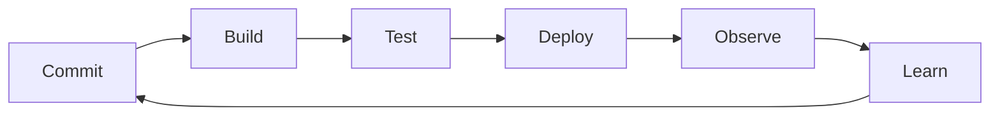

# DevOps

## Why You're Learning This
AI platforms fail when delivery and operations are separated from design. DevOps supplies feedback, ownership, and automation principles—not a job title or toolchain.

## Historical Context
**Before → Problem → Innovation → New abstraction → New problems → Modern connection:** development handed releases to operations → slow batches and conflicting incentives produced fragile change → agile operations, CI/CD, infrastructure as code, and shared ownership emerged → delivery became a continuous system → pipeline sprawl and cognitive load followed → platform engineering productizes safe paths.

## Problem This Solves
DevOps shortens feedback while preserving reliability. **Capability → Complexity → Abstraction → Adoption → New Complexity → Next Abstraction:** automation enabled frequent change; coordination grew; pipelines standardized flow; adoption multiplied tooling; teams faced overload; internal platforms followed.

## Mental Model
Delivery is a sociotechnical feedback loop: code, evidence, deployment, production learning, and improved design.

## Core Concepts
Flow, feedback, shared ownership, CI, continuous delivery, deployment, infrastructure as code, small batches, blameless learning, DORA metrics.

## How It Actually Works
Versioned changes trigger repeatable build and test stages; immutable artifacts move through policy gates; progressive deployment limits exposure; telemetry informs rollback and future work.

## Deep Dive
Deployment frequency and stability are not inherent opposites: small batches reduce change risk and diagnosis scope. Automation without operability merely accelerates bad states; organizational boundaries shape architecture and queues.

## Visual Model


## Code / Commands
```yaml
pipeline:
  - build: reproducible-artifact
  - test: unit-integration-security
  - deploy: canary-5-percent
  - verify: slo-and-business-signals
  - promote_or_rollback: automatic
```

## Practical Example
A model release couples code, weights, tokenizer, runtime, and evaluation evidence. A versioned release bundle and canary feedback make rollback coherent.

## Where This Appears in Production
CI/CD, GitOps, artifact registries, policy gates, runbooks, incident review, feature flags, progressive delivery, and model release workflows.

## Common Failure Modes
Cargo-cult automation, long-lived branches, mutable artifacts, flaky gates, manual drift, vanity metrics, unsafe secrets, and measuring deployment without user outcome.

## Debugging Approach
Trace artifact identity and evidence through every stage. Inspect queue time, failure rate, environment differences, rollout events, and production signals; repair the feedback loop, not only the failed job.

## Hands-On Lab
Map one change from commit to production and identify every handoff, wait, mutation, and missing feedback signal.

## Build Exercise
Design a pipeline that signs an immutable model-serving bundle, evaluates it, canaries it, and automatically rolls back on an SLO breach.

## Break It Exercise
Introduce a flaky test, mutable tag, leaked secret, and broken rollback. Add controls that expose each failure.

## No-AI Challenge
Propose three changes that reduce batch size without weakening verification.

## Knowledge Check
1. Why can speed improve stability?
2. What makes an artifact promotable?
3. Why is DevOps sociotechnical?

## Interview Questions
- Improve a slow, unreliable release process.
- Which delivery metrics can be gamed?
- Design rollback for model and schema changes.

## Explain It Yourself
Use both historical cycles from handoffs to platform-enabled delivery, explaining why automation alone is insufficient.

## Key Takeaways
DevOps optimizes feedback and ownership; small changes reduce risk; immutable artifacts preserve identity; platforms emerge from repeated delivery complexity.

## Vocabulary
CI, continuous delivery, deployment, lead time, change failure rate, MTTR, IaC, canary, immutable artifact, feedback loop.

## References
- **[REQUIRED] “Accelerate” research program — DORA/Google Cloud.** [Official DORA research](https://dora.dev/research/). Provides evidence linking delivery capabilities and outcomes.
- **[RECOMMENDED] “Continuous Delivery” — Jez Humble and David Farley.** [Official book site](https://continuousdelivery.com/). Defines deployment-pipeline principles.
- **[DEEP DIVE] “DevOps: A Software Architect’s Perspective” — Bass, Weber, and Zhu.** [SEI page](https://www.sei.cmu.edu/library/devops-a-software-architects-perspective/). Connects architecture and operational collaboration.

## Next Lesson
[Containers](./12-containers.md) studies the packaging and isolation unit that standardized delivery.
