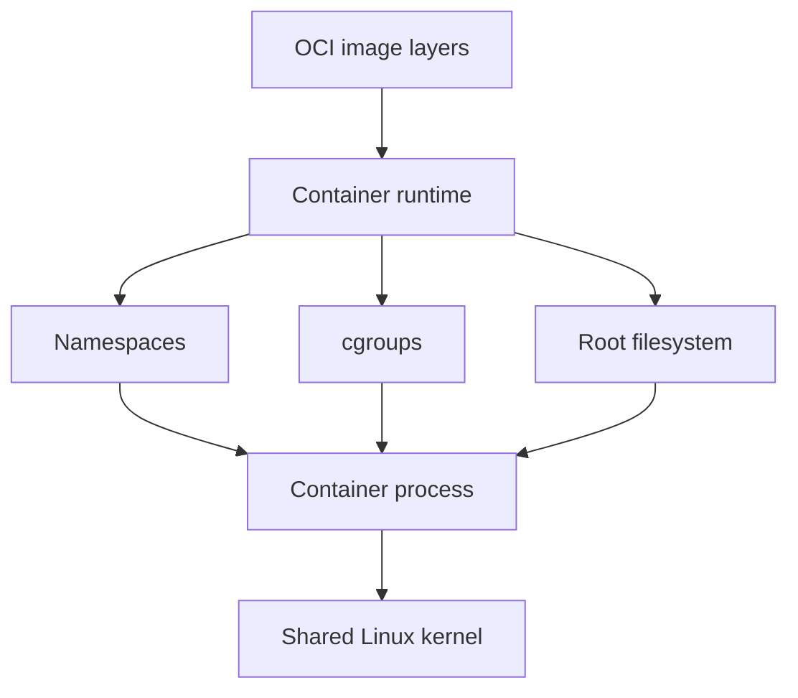

# Containers

## In One Sentence

A container packages a program with its environment while isolating its processes on a shared operating-system kernel.

## Why This Exists

**Prerequisite:** [DevOps](./11-devops.md).

Containers make process environments reproducible and resource-controlled. **Capability → Complexity → Abstraction → Adoption → New Complexity → Next Abstraction:** Linux isolation primitives enabled packaging; setup complexity grew; images standardized it; adoption multiplied containers; placement and lifecycle became hard; Kubernetes followed.

The historical pressure was not “invent a new term.” It was to remove a concrete limit:

**Before → Problem → Innovation → New abstraction → New problems → Modern connection:** applications depended on mutable hosts → environment drift made releases unreliable → chroot, namespaces, cgroups, layered images, and standardized runtimes converged → the container became a portable process bundle → image supply chains, orchestration, and shared-kernel risks emerged → AI workloads now package runtimes and device libraries this way.

## Picture This

Shipping is reliable when goods fit standard containers with known dimensions. Software containers similarly bundle an application environment behind a standard image and runtime contract, though they still share the host beneath them.

The analogy is a starting point, not the mechanism. Now we can name the engineering idea precisely.

## The Real Definition

A container is a Linux process with restricted views, resource controls, and a prepared root filesystem—not a miniature VM.

Image, layer, registry, runtime, namespace, cgroup, root filesystem, capability, digest, OCI, PID 1.

## Mental Model



Narrate the arrows aloud. At each arrow, ask: **what new capability appeared, and what new complexity came with it?**

## How It Actually Works

A runtime unpacks image layers, constructs mounts, creates namespaces and cgroups, applies credentials/capabilities, then starts the configured process. Registries distribute content-addressed manifests and blobs.

Namespaces isolate views; cgroups account and limit resources. Images are immutable content, but writable container layers are ephemeral. Shared kernels reduce overhead while making kernel and privilege boundaries security-critical.

## Tiny Proof

On Linux, inspect the isolation and resource-control identities of the process running this command:

```bash
python3 - <<'PY'
from pathlib import Path

for name in ("pid", "mnt", "net", "uts", "user"):
    print(f"{name:>4} namespace -> {Path(f'/proc/self/ns/{name}').readlink()}")

print("cgroup membership:")
print(Path("/proc/self/cgroup").read_text().strip())
PY
```

Predict whether every namespace line will have the same identifier. The output proves that an ordinary Linux process belongs to kernel namespaces and a cgroup hierarchy—the primitives a container runtime configures. It does **not** prove that this process is strongly isolated, resource-limited, or launched from a container image. Those claims require comparing processes across configured boundaries.

## In Production

A CUDA-enabled image is portable only across hosts with compatible kernel drivers and device runtime integration; the image cannot package its own host kernel.

CI runners, sidecars, model servers, batch jobs, functions, build systems, registries, admission policy, and software bills of materials.

## How It Breaks

Running as root, mutable tags, oversized images, stale packages, leaked build secrets, missing signals, writable assumptions, cgroup OOM, and architecture mismatch.

## Debug It

Identify image digest, entrypoint, user, mounts, namespaces, limits, exit code, and host kernel/device compatibility. Reproduce using the exact digest.

Use the same discipline throughout this curriculum: state the symptom precisely, locate the last proven boundary, form a falsifiable hypothesis, gather the smallest useful evidence, and change one variable.

## Build / Break Exercises

### Guided proof

Build a minimal image, inspect layers and process identity, run read-only with resource limits, and observe termination behavior.

### Build

Create a non-root, multi-stage model API image with health checks, pinned dependencies, and an SBOM.

### Break

Use a mutable tag, write to rootfs, omit signal handling, and exceed memory. Make each failure explicit.

### No-AI challenge

List every host resource a container still shares or depends on.

**Success criteria:** Predict before acting, capture the observable result, explain the mechanism that produced it, and state one limit of your explanation.

## Explain It to Anybody

### 1. To a smart non-engineer

A container carries an application’s files and settings in a standard package while keeping its processes separated on a shared machine.

### 2. To a junior engineer

A Linux container is an isolated process group launched from an image using namespaces, cgroups, filesystem mounts, capabilities, and runtime conventions.

### 3. In an interview (60–90 seconds)

Containers standardize packaging and constrain processes but do not provide a guest kernel. I debug image, configuration, namespace, resource-control, runtime, and host layers separately and account for the shared-kernel security boundary.

Do not memorize these scripts. Close the file and rebuild each explanation in your own words.

## Knowledge Check

1. How do namespaces differ from cgroups?
2. Why are digests stronger than tags?
3. Why is container isolation unlike VM isolation?

### Interview stretch

- Debug a container killed with exit code 137.
- Secure a model-serving image.
- Explain host-driver/container-toolkit compatibility.

## Vocabulary

- **Container:** An isolated process group launched with a packaged filesystem and configuration.
- **Image:** An immutable content-addressed template for a container filesystem and metadata.
- **Layer:** A reusable filesystem change set within an image.
- **Digest:** A cryptographic content identifier.
- **Registry:** A service for storing and distributing container images.
- **Namespace:** A Linux mechanism that gives processes isolated views of selected resources.
- **Cgroup:** A Linux mechanism for grouping, accounting for, and limiting resource use.
- **OCI:** Open Container Initiative specifications for images, runtimes, and distribution.
- **Runtime:** Software that creates and manages containers from runtime specifications.
- **Capability:** A separable unit of Linux privilege.
- **Rootfs:** The root filesystem presented to a container process.
- **SBOM:** A software bill of materials listing artifact components.

Use each term only after you can explain the underlying idea without it. See the curriculum-wide [Glossary](../GLOSSARY.md) for plain and precise definitions.

## References

- **REQUIRED** — “OCI Runtime Specification” — Open Container Initiative. [Official specification](https://github.com/opencontainers/runtime-spec). Defines portable container execution.
- **RECOMMENDED** — “Docker Engine Security” — Docker. [Official docs](https://docs.docker.com/engine/security/). Explains daemon, namespaces, capabilities, and attack boundaries.
- **DEEP DIVE** — “Control Group v2” — Linux kernel community. [Kernel documentation](https://docs.kernel.org/admin-guide/cgroup-v2.html). Canonical resource-control semantics.

## Next

[Kubernetes](./13-kubernetes.md) addresses scheduling and reconciling containerized workloads across a fleet.
