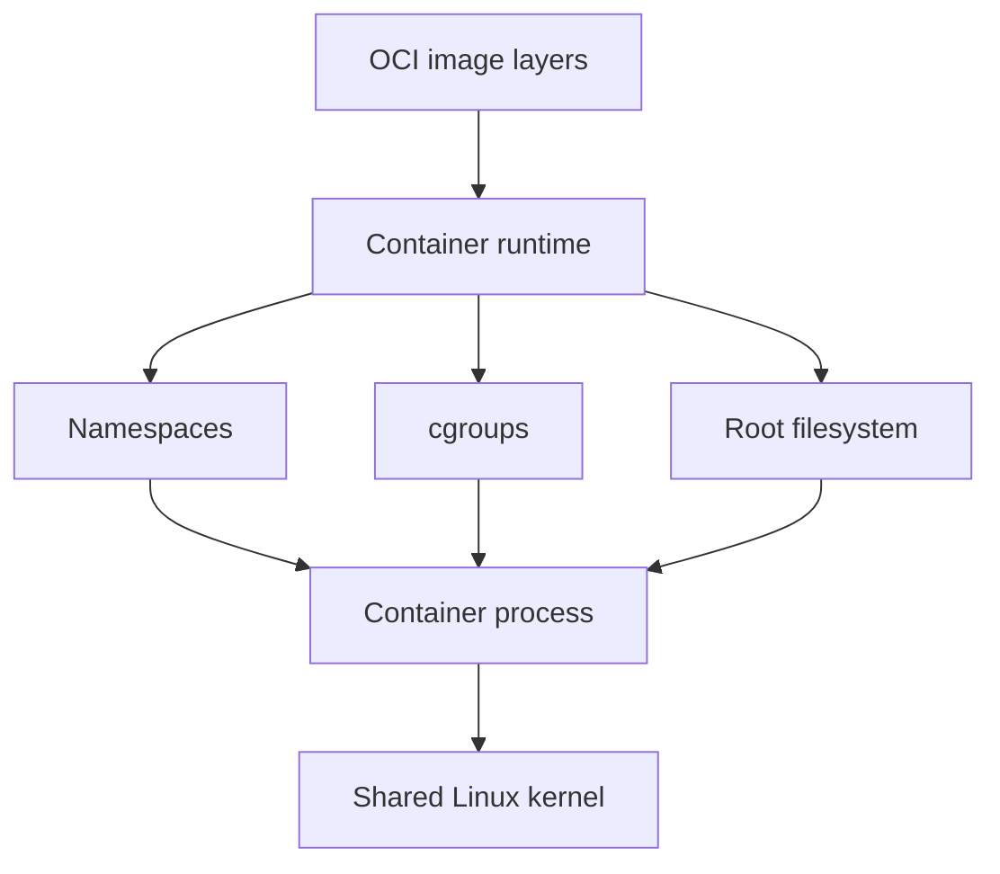

# Containers

## Why You're Learning This
Containers package most platform control planes and model servers. Their isolation, image, and lifecycle semantics explain both portability and recurring security failures.

## Historical Context
**Before → Problem → Innovation → New abstraction → New problems → Modern connection:** applications depended on mutable hosts → environment drift made releases unreliable → chroot, namespaces, cgroups, layered images, and standardized runtimes converged → the container became a portable process bundle → image supply chains, orchestration, and shared-kernel risks emerged → AI workloads now package runtimes and device libraries this way.

## Problem This Solves
Containers make process environments reproducible and resource-controlled. **Capability → Complexity → Abstraction → Adoption → New Complexity → Next Abstraction:** Linux isolation primitives enabled packaging; setup complexity grew; images standardized it; adoption multiplied containers; placement and lifecycle became hard; Kubernetes followed.

## Mental Model
A container is a Linux process with restricted views, resource controls, and a prepared root filesystem—not a miniature VM.

## Core Concepts
Image, layer, registry, runtime, namespace, cgroup, root filesystem, capability, digest, OCI, PID 1.

## How It Actually Works
A runtime unpacks image layers, constructs mounts, creates namespaces and cgroups, applies credentials/capabilities, then starts the configured process. Registries distribute content-addressed manifests and blobs.

## Deep Dive
Namespaces isolate views; cgroups account and limit resources. Images are immutable content, but writable container layers are ephemeral. Shared kernels reduce overhead while making kernel and privilege boundaries security-critical.

## Visual Model


## Code / Commands
```bash
docker build -t lesson:local .
docker inspect lesson:local
docker run --rm --memory=256m --cpus=0.5 --read-only lesson:local
docker image inspect --format '{{.RepoDigests}}' lesson:local
```

## Practical Example
A CUDA-enabled image is portable only across hosts with compatible kernel drivers and device runtime integration; the image cannot package its own host kernel.

## Where This Appears in Production
CI runners, sidecars, model servers, batch jobs, functions, build systems, registries, admission policy, and software bills of materials.

## Common Failure Modes
Running as root, mutable tags, oversized images, stale packages, leaked build secrets, missing signals, writable assumptions, cgroup OOM, and architecture mismatch.

## Debugging Approach
Identify image digest, entrypoint, user, mounts, namespaces, limits, exit code, and host kernel/device compatibility. Reproduce using the exact digest.

## Hands-On Lab
Build a minimal image, inspect layers and process identity, run read-only with resource limits, and observe termination behavior.

## Build Exercise
Create a non-root, multi-stage model API image with health checks, pinned dependencies, and an SBOM.

## Break It Exercise
Use a mutable tag, write to rootfs, omit signal handling, and exceed memory. Make each failure explicit.

## No-AI Challenge
List every host resource a container still shares or depends on.

## Knowledge Check
1. How do namespaces differ from cgroups?
2. Why are digests stronger than tags?
3. Why is container isolation unlike VM isolation?

## Interview Questions
- Debug a container killed with exit code 137.
- Secure a model-serving image.
- Explain host-driver/container-toolkit compatibility.

## Explain It Yourself
Apply both historical sequences from mutable servers to OCI images and derive the need for orchestration.

## Key Takeaways
Containers package processes; Linux primitives enforce views and limits; images improve reproducibility; shared kernels and supply chains remain exposed.

## Vocabulary
Container, image, layer, digest, registry, namespace, cgroup, OCI, runtime, capability, rootfs, SBOM.

## References
- **[REQUIRED] “OCI Runtime Specification” — Open Container Initiative.** [Official specification](https://github.com/opencontainers/runtime-spec). Defines portable container execution.
- **[RECOMMENDED] “Docker Engine Security” — Docker.** [Official docs](https://docs.docker.com/engine/security/). Explains daemon, namespaces, capabilities, and attack boundaries.
- **[DEEP DIVE] “Control Group v2” — Linux kernel community.** [Kernel documentation](https://docs.kernel.org/admin-guide/cgroup-v2.html). Canonical resource-control semantics.

## Next Lesson
[Kubernetes](./13-kubernetes.md) addresses scheduling and reconciling containerized workloads across a fleet.
