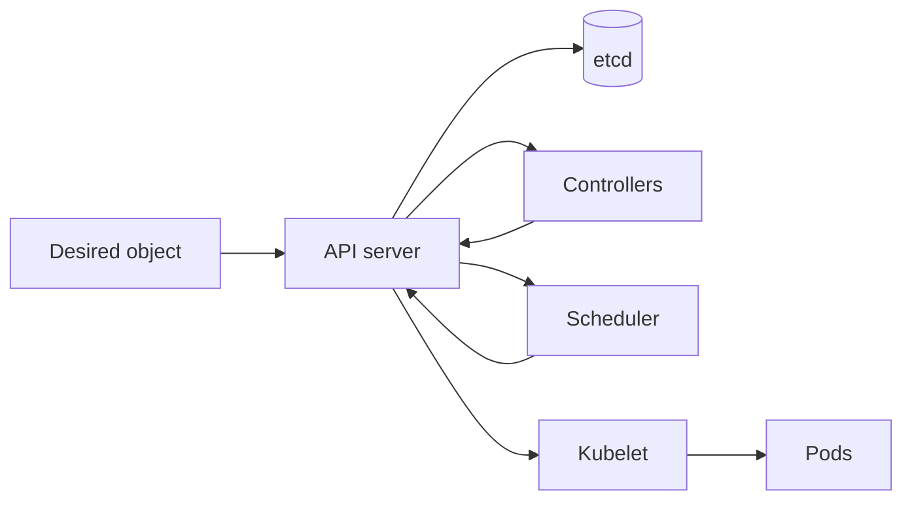

# Kubernetes

## In One Sentence

Kubernetes continually works to make a cluster match the workload state you declared.

## Why This Exists

**Prerequisite:** [Containers](./12-containers.md).

Kubernetes continuously coordinates workloads and resources. **Capability → Complexity → Abstraction → Adoption → New Complexity → Next Abstraction:** containers enabled portable units; fleet lifecycle grew hard; declarative objects and controllers hid loops; adoption created ecosystems; user cognitive load grew; platform APIs followed.

The historical pressure was not “invent a new term.” It was to remove a concrete limit:

**Before → Problem → Innovation → New abstraction → New problems → Modern connection:** fleets ran containers through scripts and bespoke schedulers → placement, restart, rollout, and discovery did not scale → cluster schedulers and reconciliation systems culminated in Kubernetes → desired-state APIs became an extensible platform substrate → YAML, controllers, tenancy, and operational complexity grew → GPU operators and AI controllers build on it.

## Picture This

A thermostat does not merely set the heater once; it measures the room and repeatedly corrects the difference from the desired temperature. Kubernetes does that kind of correction for workloads across machines.

The analogy is a starting point, not the mechanism. Now we can name the engineering idea precisely.

## The Real Definition

Kubernetes is a distributed database of desired and observed state plus independent controllers that repeatedly reduce the difference.

API object, etcd, controller, reconciliation, scheduler, kubelet, Pod, Deployment, Service, namespace, admission, CRD.

## Mental Model



Narrate the arrows aloud. At each arrow, ask: **what new capability appeared, and what new complexity came with it?**

## How It Actually Works

Clients submit objects to the API server; admission validates/mutates; etcd persists state; controllers create dependent objects; the scheduler binds Pods to nodes; kubelets start containers and report status.

Reconciliation is level-based and must be idempotent. Scheduling filters infeasible nodes then scores feasible ones. Readiness controls traffic, while liveness triggers restart; confusing them creates outages.

## Tiny Proof

This tiny controller makes reconciliation visible without requiring a Kubernetes cluster:

```python
desired = 3
actual = {"pod-a"}

def reconcile():
    while len(actual) < desired:
        actual.add(f"pod-{len(actual) + 1}")
    while len(actual) > desired:
        actual.pop()

reconcile()
print(sorted(actual))

actual.remove("pod-a")  # a running instance disappears
reconcile()
print(sorted(actual))   # the controller restores the count
```

Run it with Python 3 after predicting both lines. It proves the central control-loop idea: compare desired with observed state and act until they agree. It does not model asynchronous APIs, unique Pod identities, scheduling, failures, or safe deletion; Kubernetes adds those distributed-system mechanisms around the loop.

## In Production

A GPU Pod remains Pending because requests, labels, taints, topology, and available devices yield no feasible node—not because the scheduler is idle.

Model serving, training jobs, operators, autoscaling, service discovery, rollout, GPU device plugins, secrets, policy, and multi-tenancy.

## How It Breaks

Pending Pods, crash loops, bad probes, quota exhaustion, image pull failure, eviction, finalizer deadlock, webhook outage, and controller hot loops.

## Debug It

Start from object status and events. Trace owner references and controller conditions; check scheduling predicates, node state, kubelet/runtime logs, networking, storage, and application evidence.

Use the same discipline throughout this curriculum: state the symptom precisely, locate the last proven boundary, form a falsifiable hypothesis, gather the smallest useful evidence, and change one variable.

## Build / Break Exercises

### Guided proof

Deploy a service, inspect generated ReplicaSet and Pods, change replicas, delete a Pod, and observe reconciliation restoring desired state.

### Build

Write pseudocode for a controller reconciling a `ModelDeployment` with status conditions and idempotent cleanup.

### Break

Use an impossible node selector, failing readiness probe, and blocking finalizer. Diagnose from API evidence only.

### No-AI challenge

Draw the complete path from `kubectl apply` to a running container and traffic-ready endpoint.

**Success criteria:** Predict before acting, capture the observable result, explain the mechanism that produced it, and state one limit of your explanation.

## Explain It to Anybody

### 1. To a smart non-engineer

You describe how your applications should look, and Kubernetes keeps checking and correcting the cluster toward that description.

### 2. To a junior engineer

Kubernetes is an API-driven distributed control plane whose controllers reconcile declared desired state with observed cluster state.

### 3. In an interview (60–90 seconds)

Reconciliation makes change repeatable and extensible but introduces eventual convergence and many asynchronous boundaries. I trace an object from API admission and stored intent through controller decisions, scheduling, node runtime, networking, and status.

Do not memorize these scripts. Close the file and rebuild each explanation in your own words.

## Knowledge Check

1. Why are controllers level-based?
2. What does the scheduler decide?
3. How do readiness and liveness differ?

### Interview stretch

- Debug a Pending GPU Pod.
- Design an idempotent operator.
- Explain why etcd health affects the control plane.

## Vocabulary

- **Reconciliation:** Repeatedly driving observed state toward desired state.
- **API server:** The authenticated Kubernetes API boundary for cluster state and operations.
- **etcd:** The consistent key-value store used for Kubernetes control-plane state.
- **Controller:** A control loop that reconciles resources.
- **Scheduler:** The component that assigns unscheduled Pods to nodes.
- **Kubelet:** The node agent that manages declared Pod execution.
- **Pod:** Kubernetes' smallest deployable workload unit, containing one or more containers.
- **Deployment:** A controller-managed declaration for replicated stateless Pods and rollouts.
- **Service:** A stable network identity and endpoint selection abstraction.
- **CRD:** A custom resource definition extending the Kubernetes API.
- **Finalizer:** A key that delays resource deletion until cleanup completes.
- **Admission:** Request-time validation or mutation before API objects are persisted.

Use each term only after you can explain the underlying idea without it. See the curriculum-wide [Glossary](../GLOSSARY.md) for plain and precise definitions.

## References

- **REQUIRED** — “Kubernetes Components” — Kubernetes project. [Official docs](https://kubernetes.io/docs/concepts/overview/components/). Canonical architecture overview.
- **RECOMMENDED** — “Kubernetes API Concepts” — Kubernetes project. [Official docs](https://kubernetes.io/docs/reference/using-api/api-concepts/). Defines desired state, resource versions, and API behavior.
- **DEEP DIVE** — “Large-scale cluster management at Google with Borg” — Verma et al. [Google Research](https://research.google/pubs/large-scale-cluster-management-at-google-with-borg/). Explains scheduling lineage and production pressures.

## Next

[SRE and Observability](./14-sre-and-observability.md) adds reliability objectives and evidence to operated systems.
