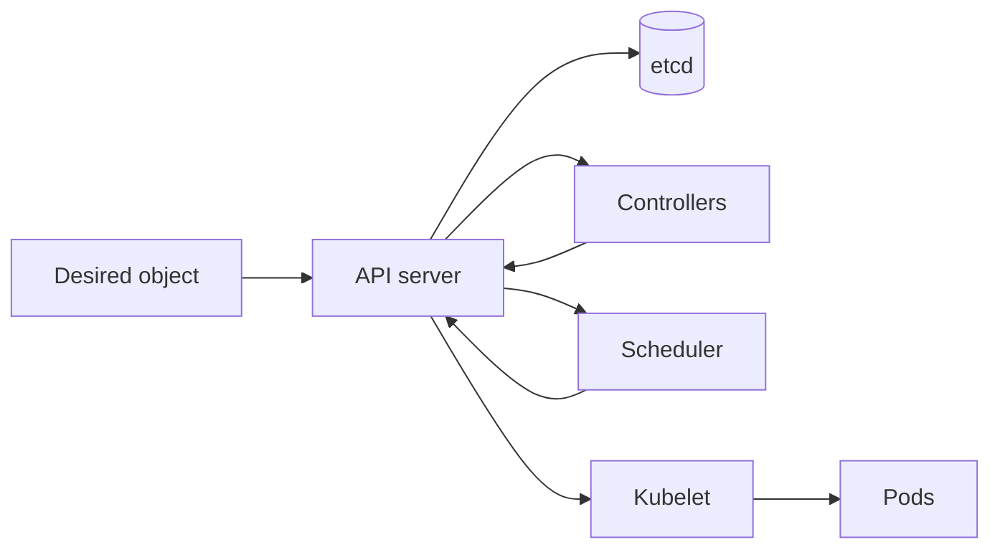

# Kubernetes

## Why You're Learning This
Kubernetes is a dominant substrate for AI platforms. Its declarative control model matters more than memorizing objects.

## Historical Context
**Before → Problem → Innovation → New abstraction → New problems → Modern connection:** fleets ran containers through scripts and bespoke schedulers → placement, restart, rollout, and discovery did not scale → cluster schedulers and reconciliation systems culminated in Kubernetes → desired-state APIs became an extensible platform substrate → YAML, controllers, tenancy, and operational complexity grew → GPU operators and AI controllers build on it.

## Problem This Solves
Kubernetes continuously coordinates workloads and resources. **Capability → Complexity → Abstraction → Adoption → New Complexity → Next Abstraction:** containers enabled portable units; fleet lifecycle grew hard; declarative objects and controllers hid loops; adoption created ecosystems; user cognitive load grew; platform APIs followed.

## Mental Model
Kubernetes is a distributed database of desired and observed state plus independent controllers that repeatedly reduce the difference.

## Core Concepts
API object, etcd, controller, reconciliation, scheduler, kubelet, Pod, Deployment, Service, namespace, admission, CRD.

## How It Actually Works
Clients submit objects to the API server; admission validates/mutates; etcd persists state; controllers create dependent objects; the scheduler binds Pods to nodes; kubelets start containers and report status.

## Deep Dive
Reconciliation is level-based and must be idempotent. Scheduling filters infeasible nodes then scores feasible ones. Readiness controls traffic, while liveness triggers restart; confusing them creates outages.

## Visual Model


## Code / Commands
```bash
kubectl apply -f deployment.yaml
kubectl get pods -o wide
kubectl describe pod POD
kubectl get events --sort-by=.metadata.creationTimestamp
kubectl logs POD --previous
```

## Practical Example
A GPU Pod remains Pending because requests, labels, taints, topology, and available devices yield no feasible node—not because the scheduler is idle.

## Where This Appears in Production
Model serving, training jobs, operators, autoscaling, service discovery, rollout, GPU device plugins, secrets, policy, and multi-tenancy.

## Common Failure Modes
Pending Pods, crash loops, bad probes, quota exhaustion, image pull failure, eviction, finalizer deadlock, webhook outage, and controller hot loops.

## Debugging Approach
Start from object status and events. Trace owner references and controller conditions; check scheduling predicates, node state, kubelet/runtime logs, networking, storage, and application evidence.

## Hands-On Lab
Deploy a service, inspect generated ReplicaSet and Pods, change replicas, delete a Pod, and observe reconciliation restoring desired state.

## Build Exercise
Write pseudocode for a controller reconciling a `ModelDeployment` with status conditions and idempotent cleanup.

## Break It Exercise
Use an impossible node selector, failing readiness probe, and blocking finalizer. Diagnose from API evidence only.

## No-AI Challenge
Draw the complete path from `kubectl apply` to a running container and traffic-ready endpoint.

## Knowledge Check
1. Why are controllers level-based?
2. What does the scheduler decide?
3. How do readiness and liveness differ?

## Interview Questions
- Debug a Pending GPU Pod.
- Design an idempotent operator.
- Explain why etcd health affects the control plane.

## Explain It Yourself
Use both causal chains from container scripts to extensible reconciliation and derive platform engineering’s role.

## Key Takeaways
Kubernetes reconciles state; objects are contracts; events and conditions are primary evidence; extensibility creates both leverage and complexity.

## Vocabulary
Reconciliation, API server, etcd, controller, scheduler, kubelet, Pod, Deployment, Service, CRD, finalizer, admission.

## References
- **[REQUIRED] “Kubernetes Components” — Kubernetes project.** [Official docs](https://kubernetes.io/docs/concepts/overview/components/). Canonical architecture overview.
- **[RECOMMENDED] “Kubernetes API Concepts” — Kubernetes project.** [Official docs](https://kubernetes.io/docs/reference/using-api/api-concepts/). Defines desired state, resource versions, and API behavior.
- **[DEEP DIVE] “Large-scale cluster management at Google with Borg” — Verma et al.** [Google Research](https://research.google/pubs/large-scale-cluster-management-at-google-with-borg/). Explains scheduling lineage and production pressures.

## Next Lesson
[SRE and Observability](./14-sre-and-observability.md) adds reliability objectives and evidence to operated systems.
