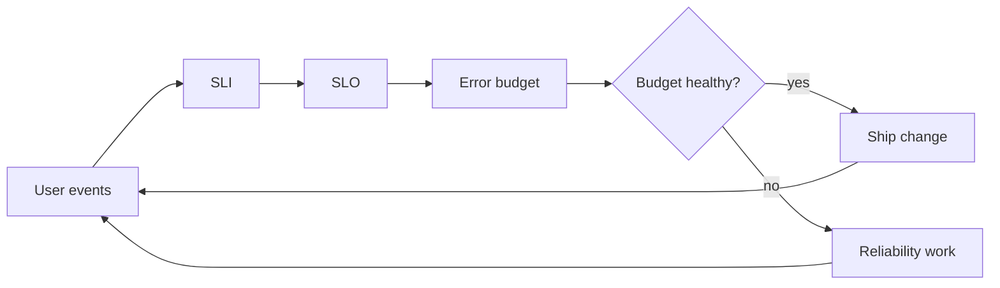

# SRE and Observability

## Why You're Learning This

Platforms create value only when dependable. SRE provides decision rules for reliability; observability provides evidence for understanding unfamiliar failures.

## Historical Context

**Before → Problem → Innovation → New abstraction → New problems → Modern connection:** operations relied on host checks and heroic response → distributed services made failure continuous and opaque → SLOs, error budgets, automation, metrics, logs, and traces emerged → reliability became measurable engineering work → telemetry cost and alert fatigue grew → AI systems add quality, drift, and accelerator signals.

## Problem This Solves

SRE balances reliability with change; observability supports inference from outputs. **Capability → Complexity → Abstraction → Adoption → New Complexity → Next Abstraction:** services scaled; failure modes multiplied; SLOs and structured telemetry focused work; adoption generated data; cardinality and noise grew; telemetry platforms and automated analysis followed.

## Mental Model

An SLO is a product reliability contract measured by SLIs; an error budget is the allowed unreliability that governs risk.

## Core Concepts

SLI, SLO, SLA, error budget, toil, alert, symptom, metric, log, trace, cardinality, saturation.

## How It Actually Works

Events become telemetry; queries calculate good events over valid events; burn-rate alerts detect rapid budget consumption; traces connect request spans; incident response stabilizes service and preserves evidence.

## Deep Dive

Percentile latency is not additive, and averages hide tails. Multi-window burn alerts balance speed and noise. Observability requires useful internal state exposure, not simply possessing three telemetry types.

## Visual Model



## Code / Commands

```promql
sum(rate(http_requests_total{code=~"2.."}[5m]))
/
sum(rate(http_requests_total[5m]))
```

## Practical Example

A model endpoint can meet HTTP availability while returning low-quality answers. Its service contract needs latency and availability SLIs plus evaluated response-quality signals.

## Where This Appears in Production

Dashboards, paging, distributed tracing, incident command, postmortems, capacity planning, model-quality monitoring, GPU saturation, and release gates.

## Common Failure Modes

Paging on causes, 100% targets, high-cardinality labels, missing correlation IDs, averages only, telemetry loss, dashboard sprawl, and blame-driven reviews.

## Debugging Approach

Begin with user impact and SLO window. Correlate change, traffic, dependency, saturation, and error signals; follow traces; test hypotheses; preserve a timeline.

## Hands-On Lab

Define availability and latency SLIs for an inference API, calculate budget for a target, and design fast/slow burn alerts.

## Build Exercise

Instrument a request path with structured logs, one bounded-cardinality metric, and trace context; create an SLO dashboard.

## Break It Exercise

Add label explosion, telemetry delay, and a dependency slowdown. Detect which conclusions become unsafe.

## No-AI Challenge

Write an SLO and paging policy that a product owner and on-call engineer can both apply.

## Knowledge Check

1. Why avoid 100% SLOs?
2. What does burn rate express?
3. How is observability different from monitoring?

## Interview Questions

- Design SLOs for model serving.
- Reduce noisy alerts.
- Diagnose rising p99 with stable averages.

## Explain It Yourself

Apply both causal chains from host checks to quality-aware AI reliability and explain telemetry’s new complexity.

## Key Takeaways

Reliability is a product decision; SLOs focus engineering; error budgets govern risk; telemetry must support hypotheses, not merely collection.

## Vocabulary

SLI, SLO, SLA, error budget, burn rate, toil, observability, trace, span, cardinality, saturation.

## References

- **[REQUIRED] “Site Reliability Engineering” — Google.** [Official free book](https://sre.google/sre-book/table-of-contents/). Defines SRE principles and practice.
- **[RECOMMENDED] “The Site Reliability Workbook” — Google.** [Official free book](https://sre.google/workbook/table-of-contents/). Practical SLO and alerting guidance.
- **[DEEP DIVE] “Distributed Tracing in Practice” foundations via Dapper — Sigelman et al., Google.** [Research paper](https://research.google/pubs/dapper-a-large-scale-distributed-systems-tracing-infrastructure/). Explains scalable request tracing.

## Next Lesson

[Platform Engineering](./15-platform-engineering.md) turns repeated operational capabilities into an internal product.
