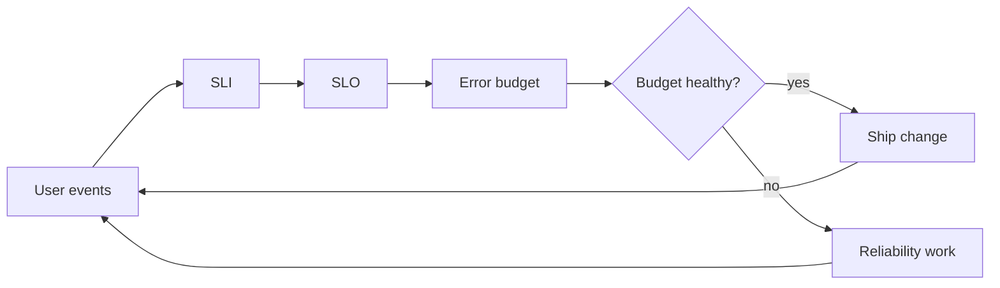

# SRE and Observability

## In One Sentence

SRE makes reliability an explicit engineering goal, while observability provides the evidence needed to understand system behavior.

## Why This Exists

**Prerequisite:** [Kubernetes](./13-kubernetes.md).

SRE balances reliability with change; observability supports inference from outputs. **Capability → Complexity → Abstraction → Adoption → New Complexity → Next Abstraction:** services scaled; failure modes multiplied; SLOs and structured telemetry focused work; adoption generated data; cardinality and noise grew; telemetry platforms and automated analysis followed.

The historical pressure was not “invent a new term.” It was to remove a concrete limit:

**Before → Problem → Innovation → New abstraction → New problems → Modern connection:** operations relied on host checks and heroic response → distributed services made failure continuous and opaque → SLOs, error budgets, automation, metrics, logs, and traces emerged → reliability became measurable engineering work → telemetry cost and alert fatigue grew → AI systems add quality, drift, and accelerator signals.

## Picture This

Running a service is like flying by instruments. Reliability defines what a safe flight means; telemetry tells you altitude, direction, and engine state. More gauges are not useful unless they answer operational questions.

The analogy is a starting point, not the mechanism. Now we can name the engineering idea precisely.

## The Real Definition

An SLO is a product reliability contract measured by SLIs; an error budget is the allowed unreliability that governs risk.

SLI, SLO, SLA, error budget, toil, alert, symptom, metric, log, trace, cardinality, saturation.

## Mental Model



Narrate the arrows aloud. At each arrow, ask: **what new capability appeared, and what new complexity came with it?**

## How It Actually Works

Events become telemetry; queries calculate good events over valid events; burn-rate alerts detect rapid budget consumption; traces connect request spans; incident response stabilizes service and preserves evidence.

Percentile latency is not additive, and averages hide tails. Multi-window burn alerts balance speed and noise. Observability requires useful internal state exposure, not simply possessing three telemetry types.

## Tiny Proof

```promql
sum(rate(http_requests_total{code=~"2.."}[5m]))
/
sum(rate(http_requests_total[5m]))
```

Before running it, predict the result. Afterward, explain which part of the definition the observation proves—and which parts it does not.

## In Production

A model endpoint can meet HTTP availability while returning low-quality answers. Its service contract needs latency and availability SLIs plus evaluated response-quality signals.

Dashboards, paging, distributed tracing, incident command, postmortems, capacity planning, model-quality monitoring, GPU saturation, and release gates.

## How It Breaks

Paging on causes, 100% targets, high-cardinality labels, missing correlation IDs, averages only, telemetry loss, dashboard sprawl, and blame-driven reviews.

## Debug It

Begin with user impact and SLO window. Correlate change, traffic, dependency, saturation, and error signals; follow traces; test hypotheses; preserve a timeline.

Use the same discipline throughout this curriculum: state the symptom precisely, locate the last proven boundary, form a falsifiable hypothesis, gather the smallest useful evidence, and change one variable.

## Build / Break Exercises

### Guided proof

Define availability and latency SLIs for an inference API, calculate budget for a target, and design fast/slow burn alerts.

### Build

Instrument a request path with structured logs, one bounded-cardinality metric, and trace context; create an SLO dashboard.

### Break

Add label explosion, telemetry delay, and a dependency slowdown. Detect which conclusions become unsafe.

### No-AI challenge

Write an SLO and paging policy that a product owner and on-call engineer can both apply.

**Success criteria:** Predict before acting, capture the observable result, explain the mechanism that produced it, and state one limit of your explanation.

## Explain It to Anybody

### 1. To a smart non-engineer

Reliability says what users must be able to trust; observability gives engineers evidence when reality differs.

### 2. To a junior engineer

SRE applies software engineering to operations using SLOs and error budgets; observability enables investigation from telemetry and system design.

### 3. In an interview (60–90 seconds)

SLOs turn reliability into a measurable product decision, and telemetry supports diagnosis. I begin with user impact, inspect correlated evidence, manage budget and toil, and avoid substituting dashboard volume for understanding.

Do not memorize these scripts. Close the file and rebuild each explanation in your own words.

## Knowledge Check

1. Why avoid 100% SLOs?
2. What does burn rate express?
3. How is observability different from monitoring?

### Interview stretch

- Design SLOs for model serving.
- Reduce noisy alerts.
- Diagnose rising p99 with stable averages.

## Vocabulary

- **SLI:** A quantitative measure of service behavior relevant to users.
- **SLO:** A target for an SLI over a defined window.
- **SLA:** A service commitment with business or contractual consequences.
- **Error budget:** The tolerated amount of behavior outside an SLO target.
- **Burn rate:** The speed at which a service consumes its error budget.
- **Toil:** Manual, repetitive, automatable operational work that scales with service growth.
- **Observability:** The ability to investigate internal behavior from system evidence.
- **Trace:** A representation of one request or workflow across components.
- **Span:** A timed operation within a trace.
- **Cardinality:** The number of distinct values in a telemetry dimension.
- **Saturation:** The degree to which a constrained resource is fully demanded.

Use each term only after you can explain the underlying idea without it. See the curriculum-wide [Glossary](../GLOSSARY.md) for plain and precise definitions.

## References

- **REQUIRED** — “Site Reliability Engineering” — Google. [Official free book](https://sre.google/sre-book/table-of-contents/). Defines SRE principles and practice.
- **RECOMMENDED** — “The Site Reliability Workbook” — Google. [Official free book](https://sre.google/workbook/table-of-contents/). Practical SLO and alerting guidance.
- **DEEP DIVE** — “Distributed Tracing in Practice” foundations via Dapper — Sigelman et al., Google. [Research paper](https://research.google/pubs/dapper-a-large-scale-distributed-systems-tracing-infrastructure/). Explains scalable request tracing.

## Next

[Platform Engineering](./15-platform-engineering.md) turns repeated operational capabilities into an internal product.
