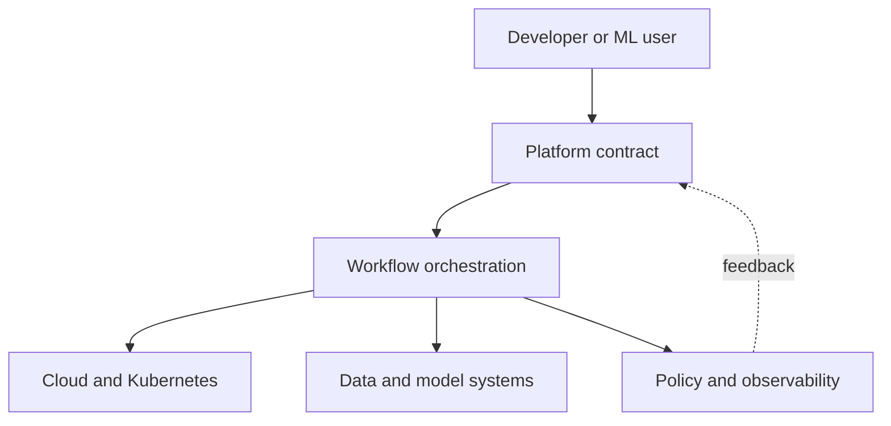

# Platform Engineering

## Why You're Learning This
AI Platform Engineers build products for developers and ML practitioners. The objective is safe autonomy through useful interfaces, not centralized ticket processing.

## Historical Context
**Before → Problem → Innovation → New abstraction → New problems → Modern connection:** every team assembled infrastructure and delivery independently → duplicated cognitive load and inconsistent controls slowed flow → internal developer platforms, paved roads, and product management emerged → common capabilities became self-service contracts → platform sprawl and over-abstraction appeared → AI platforms extend these contracts to data, models, GPUs, and evaluation.

## Problem This Solves
Platforms reduce repeated cognitive load while enforcing organizational constraints. **Capability → Complexity → Abstraction → Adoption → New Complexity → Next Abstraction:** cloud-native tools enabled autonomy; toolchains proliferated; platforms composed workflows; adoption improved consistency; platform APIs grew complex; domain-oriented and AI platforms followed.

## Mental Model
A platform is an internal product: users choose a supported path that composes underlying capabilities and exposes escape hatches and evidence.

## Core Concepts
Internal developer platform (IDP), platform as product, self-service, paved road, golden path, cognitive load, contract, capability, portal, adoption.

## How It Actually Works
Product discovery identifies repeated jobs; platform APIs and templates encode defaults; control planes orchestrate providers; policy checks constraints; telemetry measures user outcomes and platform health.

## Deep Dive
The best interface may be API, CLI, repository template, or workflow—not necessarily a portal. Successful platforms reduce time-to-value and operating risk while keeping ownership with teams. Forced adoption can hide poor product fit.

## Visual Model


## Code / Commands
```yaml
apiVersion: platform.example/v1
kind: ModelService
spec:
  model: fraud-v17
  latencySLO: 200ms
  scale: {min: 2, max: 20}
  dataClass: restricted
```

## Practical Example
A `ModelService` API can select runtime, GPU profile, rollout policy, telemetry, and access controls while preserving the model team’s ownership of quality.

## Where This Appears in Production
Service catalogs, templates, CI building blocks, developer portals, environment APIs, policy, secrets, model registries, GPU workspaces, and scorecards.

## Common Failure Modes
Building before discovery, portal-first thinking, mandatory golden paths, leaky ownership, excessive abstraction, no versioning, hidden cost, and measuring resources instead of user outcomes.

## Debugging Approach
Trace user intent through contract, orchestration, provider, and status. Distinguish platform defect from dependency failure; preserve correlation IDs and actionable conditions.

## Hands-On Lab
Interview a hypothetical model team, map its deployment journey, identify repeated decisions, and choose one high-leverage capability.

## Build Exercise
Specify a versioned self-service model endpoint API with defaults, validation, cost visibility, status conditions, and escape hatch.

## Break It Exercise
Change a provider API, exceed GPU quota, violate policy, and submit an old schema. Ensure contract behavior remains understandable.

## No-AI Challenge
Define three platform success metrics tied to user outcomes, not platform activity.

## Knowledge Check
1. Why treat a platform as a product?
2. What belongs in a golden path?
3. When should an escape hatch exist?

## Interview Questions
- Design an AI platform MVP.
- Drive adoption without mandates.
- Decide whether to abstract Kubernetes.

## Explain It Yourself
Use both historical sequences from team-owned scripts to domain platforms, including over-abstraction as new complexity.

## Key Takeaways
Platforms productize shared capabilities; interfaces encode decisions; adoption is earned through outcomes; abstractions need evidence and escape hatches.

## Vocabulary
Platform, IDP, self-service, paved road, golden path, cognitive load, contract, capability, portal, product discovery.

## References
- **[REQUIRED] “Platform Engineering Maturity Model” — CNCF Platforms Working Group.** [CNCF whitepaper](https://tag-app-delivery.cncf.io/whitepapers/platforms/). Defines platform capabilities and maturity.
- **[RECOMMENDED] “What is Platform Engineering?” — Martin Fowler site, Evan Bottcher.** [Article](https://martinfowler.com/articles/talk-about-platforms.html). Frames platforms as products and service layers.
- **[DEEP DIVE] “Team Topologies” — Skelton and Pais.** [Official site](https://teamtopologies.com/key-concepts). Connects platform teams to cognitive load and interaction modes.

## Next Lesson
[Machine Learning](./16-machine-learning.md) introduces systems that learn behavior from data rather than explicit rules.
