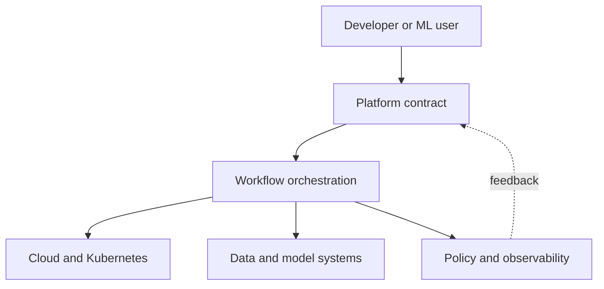

# Platform Engineering

## In One Sentence

Platform engineering turns repeated infrastructure work into a reliable product that developers can use safely without becoming infrastructure experts.

## Why This Exists

**Prerequisite:** [SRE and Observability](./14-sre-and-observability.md).

Platforms reduce repeated cognitive load while enforcing organizational constraints. **Capability → Complexity → Abstraction → Adoption → New Complexity → Next Abstraction:** cloud-native tools enabled autonomy; toolchains proliferated; platforms composed workflows; adoption improved consistency; platform APIs grew complex; domain-oriented and AI platforms followed.

The historical pressure was not “invent a new term.” It was to remove a concrete limit:

**Before → Problem → Innovation → New abstraction → New problems → Modern connection:** every team assembled infrastructure and delivery independently → duplicated cognitive load and inconsistent controls slowed flow → internal developer platforms, paved roads, and product management emerged → common capabilities became self-service contracts → platform sprawl and over-abstraction appeared → AI platforms extend these contracts to data, models, GPUs, and evaluation.

## Picture This

A city does not ask every homeowner to build roads, water lines, and electrical substations. A platform supplies safe shared infrastructure and clear connection points so teams can focus on the homes they are building.

The analogy is a starting point, not the mechanism. Now we can name the engineering idea precisely.

## The Real Definition

A platform is an internal product: users choose a supported path that composes underlying capabilities and exposes escape hatches and evidence.

Internal developer platform (IDP), platform as product, self-service, paved road, golden path, cognitive load, contract, capability, portal, adoption.

## Mental Model



Narrate the arrows aloud. At each arrow, ask: **what new capability appeared, and what new complexity came with it?**

## How It Actually Works

Product discovery identifies repeated jobs; platform APIs and templates encode defaults; control planes orchestrate providers; policy checks constraints; telemetry measures user outcomes and platform health.

The best interface may be API, CLI, repository template, or workflow—not necessarily a portal. Successful platforms reduce time-to-value and operating risk while keeping ownership with teams. Forced adoption can hide poor product fit.

## Tiny Proof

```yaml
apiVersion: platform.example/v1
kind: ModelService
spec:
  model: fraud-v17
  latencySLO: 200ms
  scale: { min: 2, max: 20 }
  dataClass: restricted
```

Before running it, predict the result. Afterward, explain which part of the definition the observation proves—and which parts it does not.

## In Production

A `ModelService` API can select runtime, GPU profile, rollout policy, telemetry, and access controls while preserving the model team’s ownership of quality.

Service catalogs, templates, CI building blocks, developer portals, environment APIs, policy, secrets, model registries, GPU workspaces, and scorecards.

## How It Breaks

Building before discovery, portal-first thinking, mandatory golden paths, leaky ownership, excessive abstraction, no versioning, hidden cost, and measuring resources instead of user outcomes.

## Debug It

Trace user intent through contract, orchestration, provider, and status. Distinguish platform defect from dependency failure; preserve correlation IDs and actionable conditions.

Use the same discipline throughout this curriculum: state the symptom precisely, locate the last proven boundary, form a falsifiable hypothesis, gather the smallest useful evidence, and change one variable.

## Build / Break Exercises

### Guided proof

Interview a hypothetical model team, map its deployment journey, identify repeated decisions, and choose one high-leverage capability.

### Build

Specify a versioned self-service model endpoint API with defaults, validation, cost visibility, status conditions, and escape hatch.

### Break

Change a provider API, exceed GPU quota, violate policy, and submit an old schema. Ensure contract behavior remains understandable.

### No-AI challenge

Define three platform success metrics tied to user outcomes, not platform activity.

**Success criteria:** Predict before acting, capture the observable result, explain the mechanism that produced it, and state one limit of your explanation.

## Explain It to Anybody

### 1. To a smart non-engineer

A platform gives developers a safe, supported shortcut through work every team would otherwise repeat.

### 2. To a junior engineer

Platform engineering treats shared internal capabilities as products, delivered through reliable self-service contracts and measured by user outcomes.

### 3. In an interview (60–90 seconds)

A platform should reduce cognitive load without hiding ownership or blocking exceptions. I start with user research, define paved-road contracts and escape hatches, then measure adoption, reliability, lead time, and support burden.

Do not memorize these scripts. Close the file and rebuild each explanation in your own words.

## Knowledge Check

1. Why treat a platform as a product?
2. What belongs in a golden path?
3. When should an escape hatch exist?

### Interview stretch

- Design an AI platform MVP.
- Drive adoption without mandates.
- Decide whether to abstract Kubernetes.

## Vocabulary

- **Platform:** A managed set of capabilities and contracts used to build or operate products.
- **IDP:** An internal developer platform offering self-service capabilities to engineering users.
- **Self-service:** A supported operation users can complete without manual provider intervention.
- **Paved road:** A supported, opinionated path that makes common work safer and easier.
- **Golden path:** A recommended end-to-end route for a well-understood use case.
- **Cognitive load:** The mental effort required to understand and perform work.
- **Contract:** A documented promise, constraint, and ownership boundary.
- **Capability:** A useful outcome a platform enables for its users.
- **Portal:** A user interface that may expose platform capabilities but is not itself the platform.
- **Product discovery:** Learning user problems and validating which outcomes are worth building.

Use each term only after you can explain the underlying idea without it. See the curriculum-wide [Glossary](../GLOSSARY.md) for plain and precise definitions.

## References

- **REQUIRED** — “Platform Engineering Maturity Model” — CNCF Platforms Working Group. [CNCF whitepaper](https://tag-app-delivery.cncf.io/whitepapers/platforms/). Defines platform capabilities and maturity.
- **RECOMMENDED** — “What is Platform Engineering?” — Martin Fowler site, Evan Bottcher. [Article](https://martinfowler.com/articles/talk-about-platforms.html). Frames platforms as products and service layers.
- **DEEP DIVE** — “Team Topologies” — Skelton and Pais. [Official site](https://teamtopologies.com/key-concepts). Connects platform teams to cognitive load and interaction modes.

## Next

[Machine Learning](./16-machine-learning.md) introduces systems that learn behavior from data rather than explicit rules.
