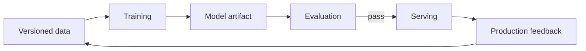

# Machine Learning

## Why You're Learning This
AI platforms operationalize statistical learning. Engineers must understand data, objectives, generalization, and lifecycle failure to build correct infrastructure.

## Historical Context
**Before → Problem → Innovation → New abstraction → New problems → Modern connection:** software encoded rules explicitly → perception and prediction resisted complete rules → statistical learning, neural networks, backpropagation, and scalable compute learned functions from examples → models became executable learned artifacts → bias, drift, reproducibility, and opacity emerged → platforms manage data-to-deployment lifecycles.

## Problem This Solves
ML approximates useful behavior when explicit programming is impractical. **Capability → Complexity → Abstraction → Adoption → New Complexity → Next Abstraction:** digital data and compute enabled training; feature/rule complexity grew; learned models abstracted patterns; adoption scaled decisions; lifecycle risk grew; MLOps and AI platforms followed.

## Mental Model
Training searches parameter space to minimize an objective on sampled data; evaluation estimates whether the learned function generalizes to the operating distribution.

## Core Concepts
Dataset, feature, label, parameter, loss, optimizer, gradient, training, validation, inference, generalization, overfitting, drift.

## How It Actually Works
Examples flow through a parameterized model; loss measures error; backpropagation computes gradients; an optimizer updates parameters over batches; held-out evaluation selects checkpoints; serving applies frozen parameters to new inputs.

## Deep Dive
The objective is a proxy for desired behavior, and the dataset is a sample of reality. Leakage creates unrealistically strong evaluation; distribution shift invalidates assumptions. Reproducibility requires versioning code, data, configuration, and environment.

## Visual Model


## Code / Commands
```python
for x, y in batches:
    prediction = model(x)
    loss = criterion(prediction, y)
    loss.backward()
    optimizer.step()
    optimizer.zero_grad()
```

## Practical Example
A fraud model’s offline accuracy rises because future chargeback information leaked into features. Production performance collapses because that feature is unavailable at decision time.

## Where This Appears in Production
Feature pipelines, training clusters, experiment tracking, model registries, batch inference, online serving, evaluation gates, drift monitoring, and retraining.

## Common Failure Modes
Leakage, skew, imbalance, overfitting, unreproducible runs, bad objectives, stale features, silent NaNs, biased sampling, and training-serving mismatch.

## Debugging Approach
Validate data and splits first; establish a simple baseline; inspect loss and gradients; reproduce a checkpoint; slice evaluation; compare training and serving transformations.

## Hands-On Lab
Train a small classifier, compare train/validation metrics, intentionally leak a label-derived feature, and document the misleading result.

## Build Exercise
Design a reproducible training manifest containing data, code, environment, hyperparameters, seed, metrics, and artifact identity.

## Break It Exercise
Shift input distribution, corrupt labels, create imbalance, and introduce NaNs. Add detection at the earliest boundary.

## No-AI Challenge
Explain why high test accuracy can coexist with harmful production behavior.

## Knowledge Check
1. What does loss optimize?
2. Why is held-out evaluation necessary?
3. What is training-serving skew?

## Interview Questions
- Design reproducible training.
- Diagnose good offline and poor online metrics.
- Separate model, data, and infrastructure failures.

## Explain It Yourself
Use both causal chains from explicit rules to lifecycle-managed learned systems, naming every new complexity.

## Key Takeaways
Models learn proxies from samples; generalization is the goal; data and evaluation are system components; reproducibility requires whole-lineage identity.

## Vocabulary
Feature, label, parameter, loss, gradient, optimizer, epoch, checkpoint, generalization, overfitting, leakage, drift.

## References
- **[REQUIRED] “A Few Useful Things to Know about Machine Learning” — Pedro Domingos.** [University of Washington PDF](https://homes.cs.washington.edu/~pedrod/papers/cacm12.pdf). Connects algorithmic learning to practical failure modes.
- **[RECOMMENDED] “Learning representations by back-propagating errors” — Rumelhart, Hinton, and Williams.** [Nature](https://doi.org/10.1038/323533a0). Seminal account of backpropagation for neural networks.
- **[DEEP DIVE] “Hidden Technical Debt in Machine Learning Systems” — Sculley et al.** [Google Research](https://research.google/pubs/hidden-technical-debt-in-machine-learning-systems/). Explains production ML’s systems complexity.

## Next Lesson
[Transformers and LLMs](./17-transformers-and-llms.md) examines the architecture that made general sequence models scalable.
