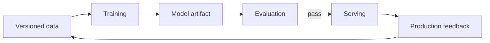

# Machine Learning

## In One Sentence

Machine learning builds behavior from patterns in examples instead of requiring a programmer to write every rule.

## Why This Exists

**Prerequisite:** [Platform Engineering](./15-platform-engineering.md).

ML approximates useful behavior when explicit programming is impractical. **Capability → Complexity → Abstraction → Adoption → New Complexity → Next Abstraction:** digital data and compute enabled training; feature/rule complexity grew; learned models abstracted patterns; adoption scaled decisions; lifecycle risk grew; MLOps and AI platforms followed.

The historical pressure was not “invent a new term.” It was to remove a concrete limit:

**Before → Problem → Innovation → New abstraction → New problems → Modern connection:** software encoded rules explicitly → perception and prediction resisted complete rules → statistical learning, neural networks, backpropagation, and scalable compute learned functions from examples → models became executable learned artifacts → bias, drift, reproducibility, and opacity emerged → platforms manage data-to-deployment lifecycles.

## Picture This

You can teach someone to identify ripe fruit by listing rules, or by showing many labeled examples and correcting mistakes. Machine learning formalizes the second approach, including how to measure whether it works on new examples.

The analogy is a starting point, not the mechanism. Now we can name the engineering idea precisely.

## The Real Definition

Training searches parameter space to minimize an objective on sampled data; evaluation estimates whether the learned function generalizes to the operating distribution.

Dataset, feature, label, parameter, loss, optimizer, gradient, training, validation, inference, generalization, overfitting, drift.

## Mental Model



Narrate the arrows aloud. At each arrow, ask: **what new capability appeared, and what new complexity came with it?**

## How It Actually Works

Examples flow through a parameterized model; loss measures error; backpropagation computes gradients; an optimizer updates parameters over batches; held-out evaluation selects checkpoints; serving applies frozen parameters to new inputs.

The objective is a proxy for desired behavior, and the dataset is a sample of reality. Leakage creates unrealistically strong evaluation; distribution shift invalidates assumptions. Reproducibility requires versioning code, data, configuration, and environment.

## Tiny Proof

```python
for x, y in batches:
    prediction = model(x)
    loss = criterion(prediction, y)
    loss.backward()
    optimizer.step()
    optimizer.zero_grad()
```

Before running it, predict the result. Afterward, explain which part of the definition the observation proves—and which parts it does not.

## In Production

A fraud model’s offline accuracy rises because future chargeback information leaked into features. Production performance collapses because that feature is unavailable at decision time.

Feature pipelines, training clusters, experiment tracking, model registries, batch inference, online serving, evaluation gates, drift monitoring, and retraining.

## How It Breaks

Leakage, skew, imbalance, overfitting, unreproducible runs, bad objectives, stale features, silent NaNs, biased sampling, and training-serving mismatch.

## Debug It

Validate data and splits first; establish a simple baseline; inspect loss and gradients; reproduce a checkpoint; slice evaluation; compare training and serving transformations.

Use the same discipline throughout this curriculum: state the symptom precisely, locate the last proven boundary, form a falsifiable hypothesis, gather the smallest useful evidence, and change one variable.

## Build / Break Exercises

### Guided proof

Train a small classifier, compare train/validation metrics, intentionally leak a label-derived feature, and document the misleading result.

### Build

Design a reproducible training manifest containing data, code, environment, hyperparameters, seed, metrics, and artifact identity.

### Break

Shift input distribution, corrupt labels, create imbalance, and introduce NaNs. Add detection at the earliest boundary.

### No-AI challenge

Explain why high test accuracy can coexist with harmful production behavior.

**Success criteria:** Predict before acting, capture the observable result, explain the mechanism that produced it, and state one limit of your explanation.

## Explain It to Anybody

### 1. To a smart non-engineer

Instead of writing every rule, we fit a model to examples and test whether it works on examples it has not seen.

### 2. To a junior engineer

Machine learning optimizes parameterized functions against data and objectives to generalize to new inputs under measured uncertainty.

### 3. In an interview (60–90 seconds)

Model behavior emerges from data, objective, representation, optimization, and evaluation. Production design must handle distribution shift, leakage, reproducibility, serving constraints, and monitoring—not just training score.

Do not memorize these scripts. Close the file and rebuild each explanation in your own words.

## Knowledge Check

1. What does loss optimize?
2. Why is held-out evaluation necessary?
3. What is training-serving skew?

### Interview stretch

- Design reproducible training.
- Diagnose good offline and poor online metrics.
- Separate model, data, and infrastructure failures.

## Vocabulary

- **Feature:** An input variable or representation supplied to a model.
- **Label:** A target value used for supervised learning or evaluation.
- **Parameter:** A learned numeric value controlling model behavior.
- **Loss:** A function measuring error for optimization.
- **Gradient:** The direction and rate of loss change with respect to parameters.
- **Optimizer:** An algorithm that updates parameters using gradients or related signals.
- **Epoch:** One pass through a training dataset.
- **Checkpoint:** Saved model and training state that supports reuse or recovery.
- **Generalization:** Performance on relevant data not used to fit the model.
- **Overfitting:** Fitting training details that do not transfer to new data.
- **Leakage:** Improper information that makes training or evaluation misleading.
- **Drift:** Change over time in data, behavior, or relationships relevant to a model.

Use each term only after you can explain the underlying idea without it. See the curriculum-wide [Glossary](../GLOSSARY.md) for plain and precise definitions.

## References

- **REQUIRED** — “A Few Useful Things to Know about Machine Learning” — Pedro Domingos. [University of Washington PDF](https://homes.cs.washington.edu/~pedrod/papers/cacm12.pdf). Connects algorithmic learning to practical failure modes.
- **RECOMMENDED** — “Learning representations by back-propagating errors” — Rumelhart, Hinton, and Williams. [Nature](https://doi.org/10.1038/323533a0). Seminal account of backpropagation for neural networks.
- **DEEP DIVE** — “Hidden Technical Debt in Machine Learning Systems” — Sculley et al. [Google Research](https://research.google/pubs/hidden-technical-debt-in-machine-learning-systems/). Explains production ML’s systems complexity.

## Next

[Transformers and LLMs](./17-transformers-and-llms.md) examines the architecture that made general sequence models scalable.
