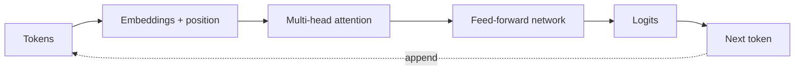

# Transformers and LLMs

## Why You're Learning This

Transformer internals drive memory, latency, batching, context, and evaluation choices. Platform design must follow workload mechanics.

## Historical Context

**Before → Problem → Innovation → New abstraction → New problems → Modern connection:** sequence models processed tokens recurrently → long dependencies and serial training limited scale → attention and Transformers enabled parallel training and contextual representations → next-token models became general language interfaces → huge compute, hallucination, context cost, and safety issues emerged → LLM platforms manage serving and evaluation.

## Problem This Solves

Transformers model relationships across sequences efficiently at training scale. **Capability → Complexity → Abstraction → Adoption → New Complexity → Next Abstraction:** accelerators enabled large matrix operations; recurrent bottlenecks grew; attention abstracted global interaction; scaling drove adoption; serving cost and behavioral risk grew; inference engines and agent systems followed.

## Mental Model

An LLM repeatedly maps token context to a probability distribution for the next token; generation samples or selects, appends, and repeats.

## Core Concepts

Tokenization, embedding, self-attention, query/key/value, positional information, feed-forward layer, pretraining, fine-tuning, context window, KV cache, decoding.

## How It Actually Works

Tokens become vectors; attention scores relate queries to keys and combine values; stacked blocks transform representations; a final projection yields token logits. Training processes sequences in parallel; autoregressive inference is sequential and caches prior keys/values.

## Deep Dive

Attention training cost grows roughly quadratically with sequence length in standard form. KV cache grows with concurrent tokens and layers. Temperature reshapes probabilities but does not add knowledge. Alignment changes behavior, not factual guarantees.

## Visual Model



## Code / Commands

```python
while len(tokens) < limit:
    logits, kv_cache = model(tokens[-1:], kv_cache=kv_cache)
    next_token = sample(logits / temperature)
    tokens.append(next_token)
```

## Practical Example

Increasing context length can reduce throughput and concurrency because attention work and KV-cache memory rise even when model weights are unchanged.

## Where This Appears in Production

Chat, code generation, retrieval augmentation, embeddings, moderation, summarization, tool selection, fine-tuning, quantization, and speculative decoding.

## Common Failure Modes

Hallucination, prompt injection, context truncation, tokenizer mismatch, cache exhaustion, nondeterminism, evaluation contamination, and unsafe trust in confidence-like wording.

## Debugging Approach

Freeze model/version, tokenizer, prompt, decoding settings, and seed where possible. Inspect tokens, context boundaries, retrieval evidence, logits/finish reason, resource metrics, and evaluation slices.

## Hands-On Lab

Tokenize several inputs, compare token counts, vary temperature and context, and measure first-token versus per-token latency.

## Build Exercise

Implement a miniature single-head attention calculation and verify tensor shapes and probability normalization.

## Break It Exercise

Overflow context, mismatch tokenizer, exhaust KV cache, and inject conflicting instructions. Add explicit handling and evaluation.

## No-AI Challenge

Draw one generation step, including tensors and cache, from a prompt to the next token.

## Knowledge Check

1. Why is training more parallel than generation?
2. What does KV cache trade?
3. Why does temperature not ensure truth?

## Interview Questions

- Explain prefill versus decode.
- Diagnose falling throughput at long context.
- Design evaluation for a model upgrade.

## Explain It Yourself

Use both historical chains from recurrence to LLM APIs, connecting architecture to infrastructure complexity.

## Key Takeaways

LLMs predict tokens; attention enables scale but costs memory/compute; inference has distinct prefill/decode phases; behavior requires evaluation, not assumptions.

## Vocabulary

Token, embedding, attention, query, key, value, logit, prefill, decode, KV cache, context window, temperature.

## References

- **[REQUIRED] “Attention Is All You Need” — Vaswani et al.** [arXiv](https://arxiv.org/abs/1706.03762). Introduces the Transformer architecture.
- **[RECOMMENDED] “Language Models are Few-Shot Learners” — Brown et al.** [arXiv](https://arxiv.org/abs/2005.14165). Documents scale-driven in-context behavior.
- **[DEEP DIVE] “FlashAttention” — Dao et al.** [arXiv](https://arxiv.org/abs/2205.14135). Shows how I/O-aware algorithms change attention performance.

## Next Lesson

[AI Infrastructure](./18-ai-infrastructure.md) maps these workloads onto accelerators, networks, storage, and schedulers.
