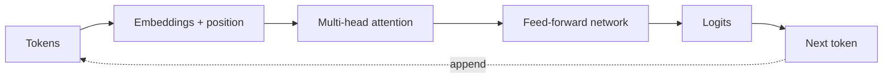

# Transformers and LLMs

## In One Sentence

Transformers learn relationships among tokens at scale, enabling models that predict and generate language.

## Why This Exists

**Prerequisite:** [Machine Learning](./16-machine-learning.md).

Transformers model relationships across sequences efficiently at training scale. **Capability → Complexity → Abstraction → Adoption → New Complexity → Next Abstraction:** accelerators enabled large matrix operations; recurrent bottlenecks grew; attention abstracted global interaction; scaling drove adoption; serving cost and behavioral risk grew; inference engines and agent systems followed.

The historical pressure was not “invent a new term.” It was to remove a concrete limit:

**Before → Problem → Innovation → New abstraction → New problems → Modern connection:** sequence models processed tokens recurrently → long dependencies and serial training limited scale → attention and Transformers enabled parallel training and contextual representations → next-token models became general language interfaces → huge compute, hallucination, context cost, and safety issues emerged → LLM platforms manage serving and evaluation.

## Picture This

When reading a sentence, you connect each word with other relevant words, even when they are far apart. Attention gives a model a learnable way to form those connections; repeated at scale, it supports language prediction.

The analogy is a starting point, not the mechanism. Now we can name the engineering idea precisely.

## The Real Definition

An LLM repeatedly maps token context to a probability distribution for the next token; generation samples or selects, appends, and repeats.

Tokenization, embedding, self-attention, query/key/value, positional information, feed-forward layer, pretraining, fine-tuning, context window, KV cache, decoding.

## Mental Model



Narrate the arrows aloud. At each arrow, ask: **what new capability appeared, and what new complexity came with it?**

## How It Actually Works

Tokens become vectors; attention scores relate queries to keys and combine values; stacked blocks transform representations; a final projection yields token logits. Training processes sequences in parallel; autoregressive inference is sequential and caches prior keys/values.

Attention training cost grows roughly quadratically with sequence length in standard form. KV cache grows with concurrent tokens and layers. Temperature reshapes probabilities but does not add knowledge. Alignment changes behavior, not factual guarantees.

## Tiny Proof

```python
while len(tokens) < limit:
    logits, kv_cache = model(tokens[-1:], kv_cache=kv_cache)
    next_token = sample(logits / temperature)
    tokens.append(next_token)
```

Before running it, predict the result. Afterward, explain which part of the definition the observation proves—and which parts it does not.

## In Production

Increasing context length can reduce throughput and concurrency because attention work and KV-cache memory rise even when model weights are unchanged.

Chat, code generation, retrieval augmentation, embeddings, moderation, summarization, tool selection, fine-tuning, quantization, and speculative decoding.

## How It Breaks

Hallucination, prompt injection, context truncation, tokenizer mismatch, cache exhaustion, nondeterminism, evaluation contamination, and unsafe trust in confidence-like wording.

## Debug It

Freeze model/version, tokenizer, prompt, decoding settings, and seed where possible. Inspect tokens, context boundaries, retrieval evidence, logits/finish reason, resource metrics, and evaluation slices.

Use the same discipline throughout this curriculum: state the symptom precisely, locate the last proven boundary, form a falsifiable hypothesis, gather the smallest useful evidence, and change one variable.

## Build / Break Exercises

### Guided proof

Tokenize several inputs, compare token counts, vary temperature and context, and measure first-token versus per-token latency.

### Build

Implement a miniature single-head attention calculation and verify tensor shapes and probability normalization.

### Break

Overflow context, mismatch tokenizer, exhaust KV cache, and inject conflicting instructions. Add explicit handling and evaluation.

### No-AI challenge

Draw one generation step, including tensors and cache, from a prompt to the next token.

**Success criteria:** Predict before acting, capture the observable result, explain the mechanism that produced it, and state one limit of your explanation.

## Explain It to Anybody

### 1. To a smart non-engineer

A large language model learns patterns for predicting the next piece of text, using attention to connect relevant pieces of context.

### 2. To a junior engineer

A transformer maps token sequences through embeddings, attention, and feed-forward transformations; an LLM trains this architecture at scale on sequence-prediction objectives.

### 3. In an interview (60–90 seconds)

Transformers parallelize training and model long-range token interactions, but inference remains sequential and resource-intensive. Context, KV cache, batching, evaluation, grounding, and uncertainty shape production behavior.

Do not memorize these scripts. Close the file and rebuild each explanation in your own words.

## Knowledge Check

1. Why is training more parallel than generation?
2. What does KV cache trade?
3. Why does temperature not ensure truth?

### Interview stretch

- Explain prefill versus decode.
- Diagnose falling throughput at long context.
- Design evaluation for a model upgrade.

## Vocabulary

- **Token:** A discrete unit used to encode model input and output text.
- **Embedding:** A learned numeric vector representation.
- **Attention:** A mechanism that mixes representations using learned relevance weights.
- **Query:** The vector used to score which other positions are relevant.
- **Key:** The vector compared with a query to produce attention scores.
- **Value:** The vector mixed according to attention weights.
- **Logit:** An unnormalized score before conversion to probabilities.
- **Prefill:** Processing prompt tokens to initialize inference state.
- **Decode:** Generating subsequent tokens, usually one step at a time.
- **KV cache:** Stored attention keys and values reused during autoregressive decoding.
- **Context window:** The bounded token sequence available to the model for one computation.
- **Temperature:** A parameter that rescales logits before sampling.

Use each term only after you can explain the underlying idea without it. See the curriculum-wide [Glossary](../GLOSSARY.md) for plain and precise definitions.

## References

- **REQUIRED** — “Attention Is All You Need” — Vaswani et al. [arXiv](https://arxiv.org/abs/1706.03762). Introduces the Transformer architecture.
- **RECOMMENDED** — “Language Models are Few-Shot Learners” — Brown et al. [arXiv](https://arxiv.org/abs/2005.14165). Documents scale-driven in-context behavior.
- **DEEP DIVE** — “FlashAttention” — Dao et al. [arXiv](https://arxiv.org/abs/2205.14135). Shows how I/O-aware algorithms change attention performance.

## Next

[AI Infrastructure](./18-ai-infrastructure.md) maps these workloads onto accelerators, networks, storage, and schedulers.
