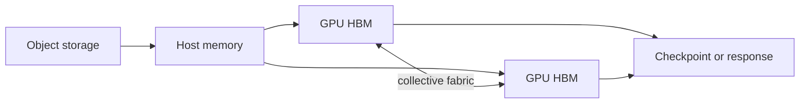

# AI Infrastructure

## Why You're Learning This
Training and serving convert model math into accelerator, network, storage, and scheduling demands. Efficient infrastructure requires joint reasoning across all four.

## Historical Context
**Before → Problem → Innovation → New abstraction → New problems → Modern connection:** ML ran on general CPUs and single devices → model/data growth exceeded one processor → GPUs, distributed training, high-speed fabrics, optimized kernels, and serving engines emerged → clusters became AI supercomputers and model endpoints → scarce capacity, topology, utilization, and cost dominated → AI infrastructure now specializes the cloud stack.

## Problem This Solves
AI infrastructure supplies scalable compute and data movement. **Capability → Complexity → Abstraction → Adoption → New Complexity → Next Abstraction:** accelerators enabled throughput; multi-device coordination grew; collective libraries and schedulers hid mechanics; adoption created GPU fleets; fragmentation and cost grew; AI platforms followed.

## Mental Model
Useful throughput is the minimum rate allowed by compute, accelerator memory, interconnect, storage, software efficiency, and workload shape.

## Core Concepts
GPU, HBM, kernel, collective, data/model parallelism, checkpoint, topology, occupancy, batch, quantization, throughput, utilization.

## How It Actually Works
Frameworks launch kernels over tensors; device memory feeds compute units; collectives synchronize gradients or activations; checkpoints stream to storage; schedulers allocate topology-compatible devices; serving engines batch requests and manage KV cache.

## Deep Dive
Data parallelism replicates weights and synchronizes gradients; tensor/pipeline parallelism partitions work but adds communication and bubbles. High GPU utilization can still mean poor useful throughput if work is padding or stalled downstream.

## Visual Model


## Code / Commands
```bash
nvidia-smi
nvidia-smi topo -m
nvidia-smi dmon -s pucvmet
python -m torch.distributed.run --nproc_per_node=4 train.py
```

## Practical Example
Eight GPUs underperform because they span a slow topology boundary. Allocating fewer well-connected devices can improve job completion time and cost.

## Where This Appears in Production
Training clusters, inference fleets, GPU operators, RDMA networks, distributed filesystems, object stores, checkpointing, capacity queues, and quota.

## Common Failure Modes
OOM, fragmentation, stragglers, collective hangs, topology mismatch, data starvation, checkpoint storms, driver/runtime incompatibility, and misleading utilization.

## Debugging Approach
Confirm artifact/software identity and topology. Split time into data load, compute, communication, synchronization, and checkpointing; inspect per-device memory, thermals, errors, and stragglers.

## Hands-On Lab
Profile a matrix workload across batch sizes; record memory and throughput; identify the saturation and OOM boundaries.

## Build Exercise
Create a capacity model estimating memory, compute, network, and storage for a distributed training or serving workload.

## Break It Exercise
Introduce one slow worker, undersized batches, and checkpoint contention. Detect each from correlated metrics.

## No-AI Challenge
Explain why adding GPUs can make a workload slower and identify three measurable causes.

## Knowledge Check
1. What limits scaling efficiency?
2. Why does topology matter?
3. What can GPU utilization hide?

## Interview Questions
- Diagnose a hanging collective.
- Capacity-plan LLM serving.
- Compare training and inference bottlenecks.

## Explain It Yourself
Apply both causal cycles from CPUs to AI clusters, ending with why specialized platforms become necessary.

## Key Takeaways
AI performance is a systems property; movement often dominates math; distributed scaling adds synchronization; topology and useful work matter more than device count.

## Vocabulary
GPU, HBM, kernel, collective, all-reduce, data parallelism, tensor parallelism, topology, occupancy, checkpoint, quantization.

## References
- **[REQUIRED] “CUDA C++ Programming Guide” — NVIDIA.** [Official documentation](https://docs.nvidia.com/cuda/cuda-c-programming-guide/). Canonical GPU execution and memory model.
- **[RECOMMENDED] “PyTorch Distributed Overview” — PyTorch Foundation.** [Official docs](https://pytorch.org/tutorials/beginner/dist_overview.html). Maps training patterns to distributed primitives.
- **[DEEP DIVE] “Megatron-LM” — Shoeybi et al.** [arXiv](https://arxiv.org/abs/1909.08053). Demonstrates large-model parallel training.

## Next Lesson
[AI Platform Engineering](./19-ai-platform-engineering.md) productizes these scarce, complex capabilities for safe use.
