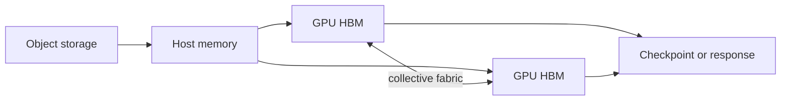

# AI Infrastructure

## In One Sentence

AI infrastructure supplies the compute, data movement, scheduling, and operations needed to train and serve models reliably.

## Why This Exists

**Prerequisite:** [Transformers and LLMs](./17-transformers-and-llms.md).

AI infrastructure supplies scalable compute and data movement. **Capability → Complexity → Abstraction → Adoption → New Complexity → Next Abstraction:** accelerators enabled throughput; multi-device coordination grew; collective libraries and schedulers hid mechanics; adoption created GPU fleets; fragmentation and cost grew; AI platforms followed.

The historical pressure was not “invent a new term.” It was to remove a concrete limit:

**Before → Problem → Innovation → New abstraction → New problems → Modern connection:** ML ran on general CPUs and single devices → model/data growth exceeded one processor → GPUs, distributed training, high-speed fabrics, optimized kernels, and serving engines emerged → clusters became AI supercomputers and model endpoints → scarce capacity, topology, utilization, and cost dominated → AI infrastructure now specializes the cloud stack.

## Picture This

Training a model resembles supplying a vast factory: specialized machines, enormous material flows, coordinated workers, checkpoints, and quality measurements must arrive together. A fast machine alone does not make a productive factory.

The analogy is a starting point, not the mechanism. Now we can name the engineering idea precisely.

## The Real Definition

Useful throughput is the minimum rate allowed by compute, accelerator memory, interconnect, storage, software efficiency, and workload shape.

GPU, HBM, kernel, collective, data/model parallelism, checkpoint, topology, occupancy, batch, quantization, throughput, utilization.

## Mental Model



Narrate the arrows aloud. At each arrow, ask: **what new capability appeared, and what new complexity came with it?**

## How It Actually Works

Frameworks launch kernels over tensors; device memory feeds compute units; collectives synchronize gradients or activations; checkpoints stream to storage; schedulers allocate topology-compatible devices; serving engines batch requests and manage KV cache.

Data parallelism replicates weights and synchronizes gradients; tensor/pipeline parallelism partitions work but adds communication and bubbles. High GPU utilization can still mean poor useful throughput if work is padding or stalled downstream.

## Tiny Proof

```bash
nvidia-smi
nvidia-smi topo -m
nvidia-smi dmon -s pucvmet
python -m torch.distributed.run --nproc_per_node=4 train.py
```

Before running it, predict the result. Afterward, explain which part of the definition the observation proves—and which parts it does not.

## In Production

Eight GPUs underperform because they span a slow topology boundary. Allocating fewer well-connected devices can improve job completion time and cost.

Training clusters, inference fleets, GPU operators, RDMA networks, distributed filesystems, object stores, checkpointing, capacity queues, and quota.

## How It Breaks

OOM, fragmentation, stragglers, collective hangs, topology mismatch, data starvation, checkpoint storms, driver/runtime incompatibility, and misleading utilization.

## Debug It

Confirm artifact/software identity and topology. Split time into data load, compute, communication, synchronization, and checkpointing; inspect per-device memory, thermals, errors, and stragglers.

Use the same discipline throughout this curriculum: state the symptom precisely, locate the last proven boundary, form a falsifiable hypothesis, gather the smallest useful evidence, and change one variable.

## Build / Break Exercises

### Guided proof

Profile a matrix workload across batch sizes; record memory and throughput; identify the saturation and OOM boundaries.

### Build

Create a capacity model estimating memory, compute, network, and storage for a distributed training or serving workload.

### Break

Introduce one slow worker, undersized batches, and checkpoint contention. Detect each from correlated metrics.

### No-AI challenge

Explain why adding GPUs can make a workload slower and identify three measurable causes.

**Success criteria:** Predict before acting, capture the observable result, explain the mechanism that produced it, and state one limit of your explanation.

## Explain It to Anybody

### 1. To a smart non-engineer

AI infrastructure coordinates specialized computers and data so models can be trained and served predictably.

### 2. To a junior engineer

AI infrastructure is the compute, storage, network, scheduling, runtime, artifact, and observability substrate for model training and inference.

### 3. In an interview (60–90 seconds)

Accelerators create unusual memory, topology, utilization, and failure constraints. I trace work across control plane, scheduler, node, driver, framework, data path, and model while balancing throughput, latency, reliability, and cost.

Do not memorize these scripts. Close the file and rebuild each explanation in your own words.

## Knowledge Check

1. What limits scaling efficiency?
2. Why does topology matter?
3. What can GPU utilization hide?

### Interview stretch

- Diagnose a hanging collective.
- Capacity-plan LLM serving.
- Compare training and inference bottlenecks.

## Vocabulary

- **GPU:** A processor optimized for high-throughput parallel operations.
- **HBM:** High-bandwidth memory located close to an accelerator.
- **Kernel:** A function executed in parallel on an accelerator; distinct from an OS kernel.
- **Collective:** A coordinated communication operation across multiple workers.
- **All-reduce:** A collective that combines values and returns the result to every participant.
- **Data parallelism:** Replicating a model while partitioning input data across workers.
- **Tensor parallelism:** Partitioning tensor operations across devices.
- **Topology:** The physical and logical arrangement of compute and communication links.
- **Occupancy:** The share of accelerator execution capacity available to active work.
- **Checkpoint:** Persisted model/training state used for recovery or continuation.
- **Quantization:** Representing values with lower precision or fewer bits.

Use each term only after you can explain the underlying idea without it. See the curriculum-wide [Glossary](../GLOSSARY.md) for plain and precise definitions.

## References

- **REQUIRED** — “CUDA C++ Programming Guide” — NVIDIA. [Official documentation](https://docs.nvidia.com/cuda/cuda-c-programming-guide/). Canonical GPU execution and memory model.
- **RECOMMENDED** — “PyTorch Distributed Overview” — PyTorch Foundation. [Official docs](https://pytorch.org/tutorials/beginner/dist_overview.html). Maps training patterns to distributed primitives.
- **DEEP DIVE** — “Megatron-LM” — Shoeybi et al. [arXiv](https://arxiv.org/abs/1909.08053). Demonstrates large-model parallel training.

## Next

[AI Platform Engineering](./19-ai-platform-engineering.md) productizes these scarce, complex capabilities for safe use.
