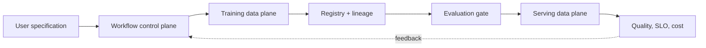

# AI Platform Engineering

## Why You're Learning This

AI Platform Engineering unifies developer experience, ML lifecycle, accelerator operations, governance, evaluation, and reliability into usable internal capabilities.

## Historical Context

**Before → Problem → Innovation → New abstraction → New problems → Modern connection:** ML teams stitched notebooks, clusters, data, and deployment by hand → reproducibility, capacity, governance, and handoffs blocked production → MLOps systems, model registries, feature stores, serving engines, and platform products emerged → model lifecycle became self-service workflows → platform lock-in, evaluation gaps, and GPU economics appeared → staff engineers design evolvable AI capability planes.

## Problem This Solves

AI platforms make model work repeatable, governed, and operable. **Capability → Complexity → Abstraction → Adoption → New Complexity → Next Abstraction:** AI infrastructure enabled scale; lifecycle decisions multiplied; platform contracts encoded them; adoption broadened AI use; behavioral and agent complexity grew; agentic engineering follows.

## Mental Model

An AI platform is a control plane for lineage and policy plus data planes for training and inference, connected by immutable artifacts and evaluation evidence.

## Core Concepts

Workspace, pipeline, lineage, registry, feature/data contract, evaluation gate, model serving, accelerator tenancy, policy, cost attribution, control/data plane.

## How It Actually Works

Users submit versioned specifications; workflows resolve data/code/environment; schedulers allocate compute; artifacts and lineage are registered; evaluation gates promotion; serving controllers deploy; telemetry and feedback inform governance and retraining.

## Deep Dive

Model identity must include weights, architecture, tokenizer, runtime, prompt policy, and dependencies. Evaluation is a release primitive, not a dashboard afterthought. Multi-tenancy combines fairness, security, topology, quota, and economic policy.

## Visual Model



## Code / Commands

```yaml
kind: ModelRelease
spec:
  artifactDigest: sha256:...
  tokenizerDigest: sha256:...
  evaluationSuite: safety-quality-v4
  servingProfile: gpu-latency
  rollout: { canaryPercent: 5 }
```

## Practical Example

A self-service fine-tuning workflow reserves GPUs, verifies data classification, records lineage, evaluates output, signs artifacts, canaries serving, and attributes cost.

## Where This Appears in Production

Notebook/workspace services, training pipelines, registries, evaluation systems, prompt stores, inference gateways, GPU schedulers, policy engines, and FinOps.

## Common Failure Modes

Unversioned prompts, irreproducible artifacts, weak tenancy, quota hoarding, offline/online skew, ungoverned data, evaluation blind spots, opaque status, and platform-first product design.

## Debugging Approach

Trace a correlation ID across specification, workflow, allocation, artifact, evaluation, deployment, and request. Verify immutable identities and separate platform, workload, provider, and behavioral failures.

## Hands-On Lab

Map a model release with inputs, outputs, owners, evidence, failure states, rollback, and retention requirements.

## Build Exercise

Specify an AI platform API for training-to-serving promotion with lineage, policy, evaluation, SLOs, cost, and status conditions.

## Break It Exercise

Change tokenizer without weights, exhaust quota, fail evaluation, and lose lineage. Ensure promotion fails safely and diagnostically.

## No-AI Challenge

Define the minimum immutable identity for a reproducible LLM endpoint and defend every field.

## Knowledge Check

1. Why separate control and data planes?
2. What must promotion evidence contain?
3. Why is evaluation a platform primitive?

## Interview Questions

- Design a multi-tenant AI platform.
- Allocate scarce GPUs fairly.
- Make a model release reproducible and reversible.

## Explain It Yourself

Use both causal sequences from notebooks and scripts to governed AI self-service, then identify the next complexity.

## Key Takeaways

AI platforms productize lifecycle and scarce infrastructure; lineage and evaluation are first-class; immutable identity enables rollback; usability and governance must reinforce each other.

## Vocabulary

MLOps, lineage, model registry, evaluation gate, inference gateway, accelerator tenancy, quota, control plane, data plane, promotion.

## References

- **[REQUIRED] “Hidden Technical Debt in Machine Learning Systems” — Sculley et al., Google.** [Google Research](https://research.google/pubs/hidden-technical-debt-in-machine-learning-systems/). Defines the systems pressures an AI platform must absorb.
- **[RECOMMENDED] “Machine Learning: The High Interest Credit Card of Technical Debt” — D. Sculley et al.** [Google Research PDF](https://research.google/pubs/pub43146/). Connects ML experimentation to long-term operational cost.
- **[DEEP DIVE] “vLLM: Easy, Fast, and Cheap LLM Serving with PagedAttention” — Kwon et al.** [arXiv](https://arxiv.org/abs/2309.06180). Shows how serving internals shape platform capability.

## Next Lesson

[Agentic Engineering](./20-agentic-engineering.md) extends the platform from model calls to stateful tool-using execution.
