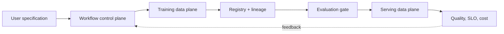

# AI Platform Engineering

## In One Sentence

AI platform engineering turns model infrastructure and governance into safe, reusable capabilities for many teams.

## Why This Exists

**Prerequisite:** [AI Infrastructure](./18-ai-infrastructure.md).

AI platforms make model work repeatable, governed, and operable. **Capability → Complexity → Abstraction → Adoption → New Complexity → Next Abstraction:** AI infrastructure enabled scale; lifecycle decisions multiplied; platform contracts encoded them; adoption broadened AI use; behavioral and agent complexity grew; agentic engineering follows.

The historical pressure was not “invent a new term.” It was to remove a concrete limit:

**Before → Problem → Innovation → New abstraction → New problems → Modern connection:** ML teams stitched notebooks, clusters, data, and deployment by hand → reproducibility, capacity, governance, and handoffs blocked production → MLOps systems, model registries, feature stores, serving engines, and platform products emerged → model lifecycle became self-service workflows → platform lock-in, evaluation gaps, and GPU economics appeared → staff engineers design evolvable AI capability planes.

## Picture This

One model team can assemble its own workshop. Ten teams need shared loading docks, safety rules, catalogs, meters, and support. The platform makes the common path repeatable while preserving accountable exceptions.

The analogy is a starting point, not the mechanism. Now we can name the engineering idea precisely.

## The Real Definition

An AI platform is a control plane for lineage and policy plus data planes for training and inference, connected by immutable artifacts and evaluation evidence.

Workspace, pipeline, lineage, registry, feature/data contract, evaluation gate, model serving, accelerator tenancy, policy, cost attribution, control/data plane.

## Mental Model



Narrate the arrows aloud. At each arrow, ask: **what new capability appeared, and what new complexity came with it?**

## How It Actually Works

Users submit versioned specifications; workflows resolve data/code/environment; schedulers allocate compute; artifacts and lineage are registered; evaluation gates promotion; serving controllers deploy; telemetry and feedback inform governance and retraining.

Model identity must include weights, architecture, tokenizer, runtime, prompt policy, and dependencies. Evaluation is a release primitive, not a dashboard afterthought. Multi-tenancy combines fairness, security, topology, quota, and economic policy.

## Tiny Proof

```yaml
kind: ModelRelease
spec:
  artifactDigest: sha256:...
  tokenizerDigest: sha256:...
  evaluationSuite: safety-quality-v4
  servingProfile: gpu-latency
  rollout: { canaryPercent: 5 }
```

Before running it, predict the result. Afterward, explain which part of the definition the observation proves—and which parts it does not.

## In Production

A self-service fine-tuning workflow reserves GPUs, verifies data classification, records lineage, evaluates output, signs artifacts, canaries serving, and attributes cost.

Notebook/workspace services, training pipelines, registries, evaluation systems, prompt stores, inference gateways, GPU schedulers, policy engines, and FinOps.

## How It Breaks

Unversioned prompts, irreproducible artifacts, weak tenancy, quota hoarding, offline/online skew, ungoverned data, evaluation blind spots, opaque status, and platform-first product design.

## Debug It

Trace a correlation ID across specification, workflow, allocation, artifact, evaluation, deployment, and request. Verify immutable identities and separate platform, workload, provider, and behavioral failures.

Use the same discipline throughout this curriculum: state the symptom precisely, locate the last proven boundary, form a falsifiable hypothesis, gather the smallest useful evidence, and change one variable.

## Build / Break Exercises

### Guided proof

Map a model release with inputs, outputs, owners, evidence, failure states, rollback, and retention requirements.

### Build

Specify an AI platform API for training-to-serving promotion with lineage, policy, evaluation, SLOs, cost, and status conditions.

### Break

Change tokenizer without weights, exhaust quota, fail evaluation, and lose lineage. Ensure promotion fails safely and diagnostically.

### No-AI challenge

Define the minimum immutable identity for a reproducible LLM endpoint and defend every field.

**Success criteria:** Predict before acting, capture the observable result, explain the mechanism that produced it, and state one limit of your explanation.

## Explain It to Anybody

### 1. To a smart non-engineer

An AI platform gives many teams a safe, repeatable way to build, evaluate, deploy, and operate models.

### 2. To a junior engineer

AI platform engineering productizes model lifecycle and inference capabilities with self-service APIs, policy, identity, lineage, evaluation, tenancy, and operations.

### 3. In an interview (60–90 seconds)

The platform joins developer experience with governed control planes. I define lifecycle contracts, tenancy and quotas, evaluation gates, rollout and rollback, status, auditability, and outcome measures before choosing implementation products.

Do not memorize these scripts. Close the file and rebuild each explanation in your own words.

## Knowledge Check

1. Why separate control and data planes?
2. What must promotion evidence contain?
3. Why is evaluation a platform primitive?

### Interview stretch

- Design a multi-tenant AI platform.
- Allocate scarce GPUs fairly.
- Make a model release reproducible and reversible.

## Vocabulary

- **MLOps:** Engineering practices and systems for repeatable model development and operation.
- **Lineage:** Traceable relationships among data, code, configuration, model, and deployment artifacts.
- **Model registry:** A managed catalog of model versions, metadata, and lifecycle state.
- **Evaluation gate:** A required quality or safety check before promotion.
- **Inference gateway:** A policy and routing boundary in front of model-serving backends.
- **Accelerator tenancy:** Rules for sharing and isolating accelerator resources among users.
- **Quota:** An enforced resource or usage limit.
- **Control plane:** APIs and controllers that manage desired platform state.
- **Data plane:** Runtime components that perform training or inference work.
- **Promotion:** Advancing a verified artifact into a later lifecycle stage or environment.

Use each term only after you can explain the underlying idea without it. See the curriculum-wide [Glossary](../GLOSSARY.md) for plain and precise definitions.

## References

- **REQUIRED** — “Hidden Technical Debt in Machine Learning Systems” — Sculley et al., Google. [Google Research](https://research.google/pubs/hidden-technical-debt-in-machine-learning-systems/). Defines the systems pressures an AI platform must absorb.
- **RECOMMENDED** — “Machine Learning: The High Interest Credit Card of Technical Debt” — D. Sculley et al. [Google Research PDF](https://research.google/pubs/pub43146/). Connects ML experimentation to long-term operational cost.
- **DEEP DIVE** — “vLLM: Easy, Fast, and Cheap LLM Serving with PagedAttention” — Kwon et al. [arXiv](https://arxiv.org/abs/2309.06180). Shows how serving internals shape platform capability.

## Next

[Agentic Engineering](./20-agentic-engineering.md) extends the platform from model calls to stateful tool-using execution.
