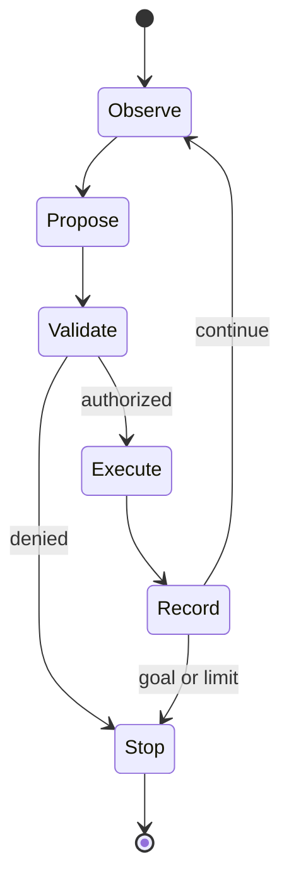

# Agentic Engineering

## Why You're Learning This
Agents turn probabilistic model outputs into actions over tools and systems. This multiplies capability and risk, requiring explicit state, permissions, verification, and operational controls.

## Historical Context
**Before → Problem → Innovation → New abstraction → New problems → Modern connection:** software workflows followed fixed branches and models returned text → open-ended tasks required adaptive planning and external data/actions → tool calling, retrieval, memory, planners, and feedback loops emerged → agents became goal-directed orchestrators → nondeterminism, prompt injection, runaway cost, and unsafe side effects appeared → agent platforms now need durable, least-privilege execution.

## Problem This Solves
Agents coordinate uncertain multi-step work when paths cannot be fully enumerated. **Capability → Complexity → Abstraction → Adoption → New Complexity → Next Abstraction:** LLM APIs enabled reasoning interfaces; tool workflows grew; agent runtimes abstracted loops; adoption expanded autonomy; security and reliability complexity surged; governed agent platforms are the next abstraction.

## Mental Model
An agent is a bounded state machine whose transition proposal may come from a model; deterministic code validates, authorizes, executes, records, and evaluates each transition.

## Core Concepts
Goal, plan, tool, observation, memory, state, guardrail, capability, approval, idempotency, sandbox, evaluation, durable execution.

## How It Actually Works
The runtime assembles trusted instructions and scoped context; the model proposes a tool call; schemas validate arguments; policy authorizes identity and resource; execution occurs with time/cost limits; results append to state; termination rules stop the loop.

## Deep Dive
Prompt text is not an authorization boundary. Retrieved content is untrusted data. Exactly-once effects remain unavailable across arbitrary failures, so operations need idempotency keys, reconciliation, or human confirmation. Evaluation must test trajectories and side effects, not final prose alone.

## Visual Model


## Code / Commands
```python
while budget.remaining() and not state.done:
    proposal = model.propose(state.redacted_view())
    call = schema.validate(proposal)
    policy.authorize(actor, call.capability, call.resource)
    result = tools.execute(call, idempotency_key=state.step_id)
    state.append(call, result)
```

## Practical Example
A deployment agent may inspect CI and propose rollback, but production mutation uses a narrow credential, change token, idempotency key, policy check, approval threshold, and audit record.

## Where This Appears in Production
Coding agents, support automation, incident assistants, research workflows, data operations, deployment remediation, security triage, and enterprise copilots.

## Common Failure Modes
Prompt injection, confused deputy, excessive permissions, secret leakage, repeated side effects, infinite loops, stale memory, context poisoning, unverifiable claims, hidden cost, and automation bias.

## Debugging Approach
Replay from immutable inputs where permitted. Inspect instruction provenance, model/version, tool schema, policy decision, identity, arguments, observations, budget, state transitions, and external effects. Separate proposal error from execution/control error.

## Hands-On Lab
Design a read-only incident agent with three typed tools. Threat-model untrusted logs, define budgets and stop conditions, and record an auditable trace.

## Build Exercise
Implement a deterministic agent loop simulator with schema validation, capability checks, idempotency, approval, timeout, and trajectory evaluation.

## Break It Exercise
Inject malicious retrieved text, duplicate a tool response, withhold a result, and request a forbidden action. Verify bounded, explainable failure.

## No-AI Challenge
Threat-model an agent that can deploy software: assets, actors, trust boundaries, abuse cases, controls, and residual risk.

## Knowledge Check
1. Why is a prompt not authorization?
2. What makes an agent loop durably resumable?
3. Why evaluate trajectories?

## Interview Questions
- Design least-privilege tool access.
- Prevent duplicate side effects after timeout.
- Operate an agent with measurable reliability.

## Explain It Yourself
Use both required causal chains from fixed workflows to governed agents. Explain why every new capability creates complexity that demands another explicit abstraction.

## Key Takeaways
Agents are controlled execution systems, not autonomous magic; models propose while code enforces; side effects require identity and idempotency; security, evaluation, and observability are architectural.

## Vocabulary
Agent, tool call, trajectory, capability, guardrail, prompt injection, confused deputy, sandbox, durable execution, idempotency, approval, provenance.

## References
- **[REQUIRED] “Artificial Intelligence Risk Management Framework (AI RMF 1.0)” — NIST.** [NIST AI 100-1](https://doi.org/10.6028/NIST.AI.100-1). Provides a governance framework for trustworthy AI systems.
- **[RECOMMENDED] “ReAct: Synergizing Reasoning and Acting in Language Models” — Yao et al.** [arXiv](https://arxiv.org/abs/2210.03629). Establishes an influential observation/action trajectory pattern.
- **[DEEP DIVE] “Toolformer” — Schick et al.** [arXiv](https://arxiv.org/abs/2302.04761). Studies learned tool-use decisions and their limitations.

## Next Lesson
Return to the [History module orientation](./README.md), perform the Explain Back across all twenty layers, then continue to the curriculum’s next module.
