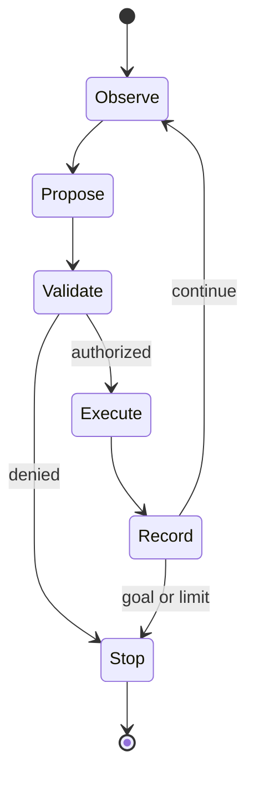

# Agentic Engineering

## In One Sentence

Agentic engineering builds bounded software loops that choose actions, use tools, and recover while pursuing a goal.

## Why This Exists

**Prerequisite:** [AI Platform Engineering](./19-ai-platform-engineering.md).

Agents coordinate uncertain multi-step work when paths cannot be fully enumerated. **Capability → Complexity → Abstraction → Adoption → New Complexity → Next Abstraction:** LLM APIs enabled reasoning interfaces; tool workflows grew; agent runtimes abstracted loops; adoption expanded autonomy; security and reliability complexity surged; governed agent platforms are the next abstraction.

The historical pressure was not “invent a new term.” It was to remove a concrete limit:

**Before → Problem → Innovation → New abstraction → New problems → Modern connection:** software workflows followed fixed branches and models returned text → open-ended tasks required adaptive planning and external data/actions → tool calling, retrieval, memory, planners, and feedback loops emerged → agents became goal-directed orchestrators → nondeterminism, prompt injection, runaway cost, and unsafe side effects appeared → agent platforms now need durable, least-privilege execution.

## Picture This

A careful assistant receives a goal, checks the current situation, chooses one permitted action, records the result, and decides what to do next. The useful loop comes with boundaries: permissions, budgets, approvals, and a way to stop.

The analogy is a starting point, not the mechanism. Now we can name the engineering idea precisely.

## The Real Definition

An agent is a bounded state machine whose transition proposal may come from a model; deterministic code validates, authorizes, executes, records, and evaluates each transition.

Goal, plan, tool, observation, memory, state, guardrail, capability, approval, idempotency, sandbox, evaluation, durable execution.

## Mental Model



Narrate the arrows aloud. At each arrow, ask: **what new capability appeared, and what new complexity came with it?**

## How It Actually Works

The runtime assembles trusted instructions and scoped context; the model proposes a tool call; schemas validate arguments; policy authorizes identity and resource; execution occurs with time/cost limits; results append to state; termination rules stop the loop.

Prompt text is not an authorization boundary. Retrieved content is untrusted data. Exactly-once effects remain unavailable across arbitrary failures, so operations need idempotency keys, reconciliation, or human confirmation. Evaluation must test trajectories and side effects, not final prose alone.

## Tiny Proof

```python
while budget.remaining() and not state.done:
    proposal = model.propose(state.redacted_view())
    call = schema.validate(proposal)
    policy.authorize(actor, call.capability, call.resource)
    result = tools.execute(call, idempotency_key=state.step_id)
    state.append(call, result)
```

Before running it, predict the result. Afterward, explain which part of the definition the observation proves—and which parts it does not.

## In Production

A deployment agent may inspect CI and propose rollback, but production mutation uses a narrow credential, change token, idempotency key, policy check, approval threshold, and audit record.

Coding agents, support automation, incident assistants, research workflows, data operations, deployment remediation, security triage, and enterprise copilots.

## How It Breaks

Prompt injection, confused deputy, excessive permissions, secret leakage, repeated side effects, infinite loops, stale memory, context poisoning, unverifiable claims, hidden cost, and automation bias.

## Debug It

Replay from immutable inputs where permitted. Inspect instruction provenance, model/version, tool schema, policy decision, identity, arguments, observations, budget, state transitions, and external effects. Separate proposal error from execution/control error.

Use the same discipline throughout this curriculum: state the symptom precisely, locate the last proven boundary, form a falsifiable hypothesis, gather the smallest useful evidence, and change one variable.

## Build / Break Exercises

### Guided proof

Design a read-only incident agent with three typed tools. Threat-model untrusted logs, define budgets and stop conditions, and record an auditable trace.

### Build

Implement a deterministic agent loop simulator with schema validation, capability checks, idempotency, approval, timeout, and trajectory evaluation.

### Break

Inject malicious retrieved text, duplicate a tool response, withhold a result, and request a forbidden action. Verify bounded, explainable failure.

### No-AI challenge

Threat-model an agent that can deploy software: assets, actors, trust boundaries, abuse cases, controls, and residual risk.

**Success criteria:** Predict before acting, capture the observable result, explain the mechanism that produced it, and state one limit of your explanation.

## Explain It to Anybody

### 1. To a smart non-engineer

An agent repeatedly observes, chooses a permitted action, checks the result, and stops when the goal or a boundary is reached.

### 2. To a junior engineer

An agentic system is a policy- and resource-bounded execution loop combining model decisions, tools, state, control flow, evaluation, and human approval.

### 3. In an interview (60–90 seconds)

Agent loops turn probabilistic output into side effects, so they need scoped identity, typed tool contracts, sandboxing, durable state, idempotency, budgets, approvals, audit, replay, and independent evaluation.

Do not memorize these scripts. Close the file and rebuild each explanation in your own words.

## Knowledge Check

1. Why is a prompt not authorization?
2. What makes an agent loop durably resumable?
3. Why evaluate trajectories?

### Interview stretch

- Design least-privilege tool access.
- Prevent duplicate side effects after timeout.
- Operate an agent with measurable reliability.

## Vocabulary

- **Agent:** A bounded loop that observes, proposes actions, uses tools, and updates state toward a goal.
- **Tool call:** A structured request for an external capability.
- **Trajectory:** The sequence of states, decisions, actions, and observations in a run.
- **Capability:** A specifically authorized operation on a defined resource scope.
- **Guardrail:** A control intended to detect, constrain, or block unsafe behavior.
- **Prompt injection:** Untrusted content attempting to alter model instructions or tool behavior.
- **Confused deputy:** A component tricked into misusing its authority for another party.
- **Sandbox:** An isolated environment that constrains code or tool execution.
- **Durable execution:** Persisted workflow progress that can resume after interruption.
- **Idempotency:** Safe repetition of an operation without duplicate intended effects.
- **Approval:** An explicit authorization checkpoint before a sensitive action.
- **Provenance:** Evidence of where data, instructions, decisions, or artifacts originated.

Use each term only after you can explain the underlying idea without it. See the curriculum-wide [Glossary](../GLOSSARY.md) for plain and precise definitions.

## References

- **REQUIRED** — “Artificial Intelligence Risk Management Framework (AI RMF 1.0)” — NIST. [NIST AI 100-1](https://doi.org/10.6028/NIST.AI.100-1). Provides a governance framework for trustworthy AI systems.
- **RECOMMENDED** — “ReAct: Synergizing Reasoning and Acting in Language Models” — Yao et al. [arXiv](https://arxiv.org/abs/2210.03629). Establishes an influential observation/action trajectory pattern.
- **DEEP DIVE** — “Toolformer” — Schick et al. [arXiv](https://arxiv.org/abs/2302.04761). Studies learned tool-use decisions and their limitations.

## Next

Return to the [History module orientation](./README.md), perform the Explain Back across all twenty layers, then continue to the curriculum’s next module.
