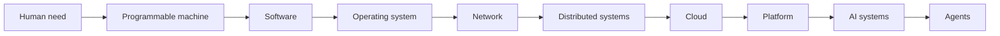

# 00 — History: Why the Stack Exists

> **Status:** Complete in the current scope · **Start with:** [Origins of Computing](./01-origins-of-computing.md)

## 5-Minute Orientation

### What is this?

A causal tour of the modern computing stack. This is not a timeline quiz. Each lesson asks: **What painful limit existed, what abstraction removed it, and what new complexity did that abstraction create?**

### Why does it matter?

Tools stop looking arbitrary when you know the pressure that created them. A staff engineer must recognize what an abstraction hides, where it leaks, and which older layer can explain a new failure.

### Where does it fit?

This is Module 00: the map before the terrain. It gives you hooks for every later module, from processes and networks to Kubernetes, GPUs, model serving, and agent control.

### What do I need first?

Nothing beyond curiosity and the ability to run short Python or shell examples. Every specialized term is introduced after its underlying idea.

### What will I be able to explain afterward?

- why a modern computer, operating system, network, database, cloud, container, and orchestrator exist;
- why each abstraction solved one problem while creating another;
- how today’s AI platform inherits constraints from hardware, operating systems, networks, and distributed coordination;
- where to look when a high-level abstraction leaks during failure.

## Competency Tiers

### Minimum Competency

For every lesson, state the **before-state → problem → abstraction → new capability → new complexity** without notes. Run each Tiny Proof and answer the Knowledge Check.

### Strong Engineer

Complete the build/break exercises, connect failures across at least two layers, and explain each concept accurately to both a non-engineer and an engineer.

### Deep Dive

Read the DEEP DIVE sources, reproduce selected mechanisms, and use historical tradeoffs to evaluate a modern platform design.

Minimum Competency is enough on a first pass. Go deeper when the concept blocks your current build, recurs in incidents, or sits under a design decision you own.

## AI Learning Policy

### AI Tutor

Ask for questions, counterexamples, or a second analogy. Verify factual claims against the lesson’s canonical references.

### AI Pair

Write your prediction and plan first. Review every generated command and remain responsible for safety and evidence.

### AI Review

Ask AI to challenge your causal model: “Which boundary leaks?” and “What evidence would disprove this explanation?”

### No-AI Challenge

Complete the named challenge using your notes, local tools, and primary documentation—without chat, autocomplete, or generated summaries.

### Explain Back

Close the file and explain the concept aloud at three levels. If you need the lesson’s wording, retrieval is not yet strong enough.

## The Teaching Spine

### Part I — Make behavior programmable

1. [Origins of Computing](./01-origins-of-computing.md)
2. [Why Software Exists](./02-why-software-exists.md)
3. [Machine Code to Assembly to High-Level Languages](./03-machine-code-assembly-high-level-languages.md)
4. [Evolution of Programming Languages](./04-evolution-of-programming-languages.md)

### Part II — Share and connect machines

5. [Evolution of Operating Systems](./05-evolution-of-operating-systems.md)
6. [Unix, C, and Linux](./06-unix-c-linux.md)
7. [Networking and the Internet](./07-networking-and-the-internet.md)
8. [Databases](./08-databases.md)
9. [Distributed Systems](./09-distributed-systems.md)

### Part III — Turn infrastructure into an on-demand system

10. [Virtualization and Cloud](./10-virtualization-and-cloud.md)
11. [DevOps](./11-devops.md)
12. [Containers](./12-containers.md)
13. [Kubernetes](./13-kubernetes.md)
14. [SRE and Observability](./14-sre-and-observability.md)
15. [Platform Engineering](./15-platform-engineering.md)

### Part IV — Turn data and compute into AI capabilities

16. [Machine Learning](./16-machine-learning.md)
17. [Transformers and LLMs](./17-transformers-and-llms.md)
18. [AI Infrastructure](./18-ai-infrastructure.md)
19. [AI Platform Engineering](./19-ai-platform-engineering.md)
20. [Agentic Engineering](./20-agentic-engineering.md)

## How to Study This Module

For a first pass, read **In One Sentence → Picture This → Mental Model → Tiny Proof → Explain It to Anybody**. Then return for mechanism, production, failure, and design depth.

After lesson 20, draw the entire stack from memory. For each arrow, say what problem forced the next layer into existence.

## Next

Start now with [00-history/01-origins-of-computing.md](./01-origins-of-computing.md). After the module, continue to [How Software Actually Executes](../01-software-foundations/01-how-software-actually-executes.md).
