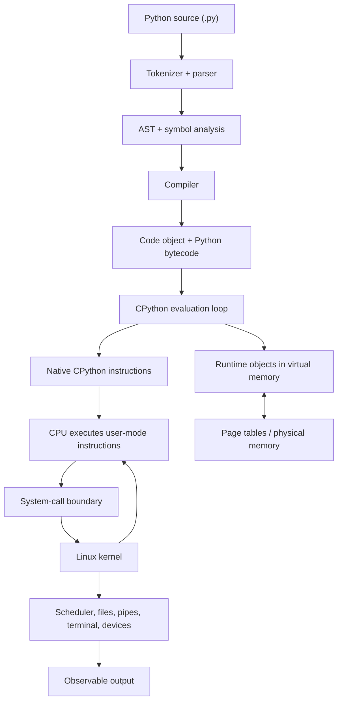

# How Software Actually Executes

## Why You're Learning This

“Run this Python file” sounds like one action, but it crosses several systems. CPython parses source, produces executable runtime objects, and interprets Python bytecode. The operating system creates and schedules a process, maps virtual memory, and mediates access to files and devices. A physical CPU executes native machine instructions from the interpreter and kernel. Output finally reaches a terminal, file, pipe, or network endpoint.

This model helps you answer practical questions:

- Why is a program using memory before it handles any data?
- Why can a process exist but do no useful work?
- Why does printed output sometimes appear late or not at all?
- Why can valid source code fail before its first statement runs?
- Which evidence belongs to Python, the OS, or the hardware?

## Historical Context

Early computers were programmed directly in machine instructions and often ran one job at a time. Assemblers made symbolic instructions possible; compilers then translated higher-level languages into machine code. Time-sharing operating systems introduced protected processes, virtual memory, scheduling, and standardized I/O so multiple programs could safely share hardware.

Python, first released in 1991, chose a high-level, dynamic language model. Its reference implementation, CPython, normally compiles source into an intermediate bytecode and executes that bytecode in a virtual machine. That design sits on top of decades of compiler and OS work. Modern CPython also specializes frequently executed bytecode, while the underlying C implementation is itself compiled to native code.

## Problem This Solves

Without a layered execution model, “the code is slow” or “Python did not print” is too vague to debug. The source may be waiting on an import, the process may be sleeping, the scheduler may not be giving it CPU time, memory pages may be faulting in, a syscall may be blocked, or output may still be in a user-space buffer.

The model in this lesson turns a symptom into testable questions:

1. Did source become a valid code object?
2. Is the expected process alive and in the expected state?
3. Is its address space mapped and resident as expected?
4. Is it running on a CPU, runnable, sleeping, or blocked?
5. Did it request an OS operation, and what happened?
6. Where is output directed, and has buffering delayed it?

## Mental Model

Use this causal chain:

**Source Code → Interpreter/Compiler → OS → Process → Memory → CPU → Output**

The arrows are not a one-time conveyor belt. Execution moves back and forth:

- CPython asks the OS for memory, files, clocks, and I/O.
- The OS schedules and pauses the process many times.
- The CPU alternates between user-mode interpreter instructions and kernel-mode instructions.
- A read, page fault, timer, signal, or device event can change what happens next.

The most important distinction is between an abstraction and its implementation. “Compiled” and “interpreted” describe useful execution strategies, not mutually exclusive language identities. Python source is commonly compiled to Python bytecode; CPython interprets that bytecode; CPython itself is compiled native code; and alternative Python implementations may use just-in-time or ahead-of-time compilation.

## Core Concepts

### Program, executable, and process

A **program** is code and data stored somewhere. An **executable** is a file format the OS loader can map and start directly, such as an ELF binary on Linux. A **process** is a running OS-managed instance with an identity, virtual address space, threads, file descriptors, credentials, and execution state.

A `.py` file is usually data consumed by the Python executable; Linux does not directly execute Python syntax. With a shebang such as `#!/usr/bin/env python3`, the kernel uses the named interpreter to run the script.

### Compiler and interpreter

A **compiler** translates one representation into another before or during execution. An **interpreter** directly implements the semantics of an input representation. CPython uses both ideas:

1. tokenize and parse source;
2. build an abstract syntax tree (AST);
3. compile the AST to a code object containing Python bytecode;
4. evaluate bytecode instructions in the CPython interpreter loop.

Cached `.pyc` files may avoid recompiling unchanged imported modules, but they are not native machine-code executables.

### Kernel and system calls

The OS **kernel** controls protected resources. User code cannot directly ask a disk controller to write bytes or arbitrarily map physical memory. It requests services through **system calls** such as `read`, `write`, `mmap`, and `execve`. Python APIs often pass through CPython C code and the C library before reaching a syscall.

### Virtual memory and pages

Each process sees a private **virtual address space** divided into pages. Page tables map virtual pages to physical memory or other backing, with permissions such as readable, writable, and executable. Mappings can represent the Python executable, shared libraries, heap, thread stacks, anonymous memory, and files.

A mapping does not mean every byte is currently in RAM. Access can trigger a **page fault**, allowing the kernel to establish a mapping, load file-backed data, allocate a zero-filled page, or reject invalid access.

### Scheduling and CPU execution

Threads are the units Linux schedules. A runnable thread waits in a run queue until the scheduler selects it for a logical CPU. The CPU then executes native instructions, updates registers and caches, and may be interrupted or preempted.

For ordinary CPython, the CPU is executing machine instructions from the CPython binary and its libraries—not Python bytecode directly. Those native interpreter instructions inspect the next Python opcode and implement its semantics. Native extension modules can execute their own machine code.

### File descriptors, streams, and output

Linux processes conventionally begin with file descriptors `0`, `1`, and `2` for standard input, output, and error. They may point to a terminal, regular file, pipe, socket, or other object. Python’s `print` writes through a buffered text stream. That stream eventually causes one or more OS writes. A successful write means the kernel accepted bytes; it does not always mean a physical device or remote consumer has durably processed them.

## How It Actually Works

Consider:

```python
message = "hello"
print(message.upper())
```

### 1. The shell starts Python

After the shell resolves `python3` using its command-search rules, it typically creates a child and invokes an `exec`-family operation. On Linux, `execve` replaces the calling process image with the Python executable. The kernel validates the executable format, creates memory mappings, prepares arguments and environment data, and transfers control through the program loader.

This is the OS executing the **Python executable**, not parsing the `.py` file.

### 2. CPython initializes

Startup code initializes the runtime, memory allocators, built-in types, import machinery, standard streams, and interpreter state. Shared libraries and modules may be mapped or loaded. This explains why even a tiny program has significant startup time and memory use.

### 3. CPython reads and parses source

CPython obtains source bytes through file operations, determines source encoding, tokenizes the text, applies the Python grammar, and creates an AST. Syntax errors occur here, before the module body begins executing.

### 4. CPython compiles to bytecode

The compiler validates and transforms the AST, builds symbol-table information, and emits a **code object**. The code object contains bytecode plus constants, names, variable metadata, and source-position information. `dis.dis()` exposes a human-readable view of bytecode, but exact opcodes vary by Python version.

### 5. The evaluation loop executes the code object

CPython creates a frame holding execution state such as local variables, references, and the instruction position. Its evaluation machinery dispatches bytecode operations. In recent CPython versions, adaptive specialization may replace general operations with forms optimized for observed types. This is still an implementation detail; source semantics remain defined by the language reference.

For `message.upper()`, CPython resolves a name, looks up an attribute, performs a call, and creates or retrieves Python objects. Reference counting handles most object-lifetime updates in CPython, while cyclic garbage collection handles certain reference cycles.

### 6. Memory accesses resolve through virtual memory

The frame, string objects, interpreter state, native stacks, executable code, and shared-library code occupy virtual addresses. CPU memory accesses are translated using page tables, usually accelerated by a translation lookaside buffer. Missing translations or unavailable pages can fault into the kernel.

### 7. Linux schedules the executing thread

The Python thread alternates among running, runnable, and sleeping states. It can be preempted after a scheduling interval or block while waiting for I/O. CPython’s global interpreter lock also affects when multiple Python threads may execute Python bytecode in a standard build, although version and build configuration matter.

### 8. The CPU executes native instructions

The CPU fetches and retires machine instructions belonging to CPython, libraries, extension modules, and—during kernel entry—the OS. Python bytecode such as a call instruction is data interpreted by those native instructions. It is not the CPU’s instruction set.

### 9. Output crosses the syscall boundary

`print` converts values to text and writes to `sys.stdout`. The text layer encodes characters into bytes and buffering may retain them. When flushed, CPython eventually requests a write to file descriptor `1`. The kernel routes those bytes to whatever fd `1` references. If that is a terminal, a terminal subsystem and emulator render the visible characters.

### 10. The process exits

On normal completion, Python flushes standard streams, runs defined shutdown machinery, and returns an exit status. The kernel releases process resources and retains a small exit record until the parent collects it. Open file descriptors are closed; memory mappings do not survive the process.

## Deep Dive

### `exec` does not create a new process

This common shortcut is inaccurate. On POSIX systems, `execve` replaces the current process image while preserving the process identity across the transition. A shell commonly uses `fork` or a related creation mechanism first, then the child performs `execve`. The combination appears to “start a new program.”

### Bytecode caches

Imported Python modules may produce cache files under `__pycache__`. CPython checks cache metadata or hashes before reusing them. A cache improves module loading but does not remove runtime interpretation. The main script is not generally cached in the same way as imported modules.

### Virtual memory measurements

Tools report different quantities:

- **VSZ/VmSize:** virtual address space reserved or mapped.
- **RSS/VmRSS:** pages currently resident in physical memory, with caveats around sharing.
- **PSS:** shared pages divided proportionally among mapping processes.
- **Heap:** one region used for dynamic allocation; Python can also allocate through anonymous mappings.

Therefore “the process has 500 MB of virtual memory” does not imply it owns 500 MB of physical RAM.

### Syscalls are observable boundaries

Many Python operations are entirely in user space. Integer operations, attribute lookup, and most bytecode dispatch do not make a syscall each time. Opening a file, waiting on a socket, or writing flushed output eventually crosses into the kernel. On Linux, `strace` can observe many of these boundaries, though tracing changes timing and carries overhead.

### Buffering changes visibility

When stdout is connected to an interactive terminal it is commonly line-buffered; when redirected to a pipe or file it is commonly block-buffered. `print(..., flush=True)` or `python3 -u` requests more immediate stream behavior. Buffering explains why logs can appear promptly in a terminal but arrive late in a container pipeline.

## Visual Model



The diagram separates language-level bytecode from native CPU instructions and shows that the kernel participates at controlled boundaries rather than executing every Python operation.

## Code / Commands

Inspect source compilation without executing the resulting code object:

```bash
python3 - <<'PY'
import ast
import dis

source = 'message = "hello"\nprint(message.upper())\n'
tree = ast.parse(source)
code = compile(tree, "<demo>", "exec")

print(ast.dump(tree, indent=2))
dis.dis(code)
PY
```

Inspect the current shell and a short-lived Python process:

```bash
python3 -c 'import os, time; print(f"pid={os.getpid()}", flush=True); time.sleep(10)' &
pid=$!
ps -o pid,ppid,stat,vsz,rss,comm,args -p "$pid"
readlink "/proc/$pid/exe"
sed -n '1,20p' "/proc/$pid/status"
wait "$pid"
```

Observe standard-output buffering:

```bash
python3 -c 'import time; print("buffered"); time.sleep(2)' | sed -n '1p'
python3 -u -c 'import time; print("unbuffered"); time.sleep(2)' | sed -n '1p'
```

Exact timing can differ by environment. Containers may restrict `/proc`, tracing, or process visibility.

## Practical Example

Suppose a worker logs `starting batch`, performs work, and logs `done`, but a dashboard shows neither line for a minute.

1. `ps` shows the worker process exists, so startup reached the OS process layer.
2. Its state is `S`, indicating interruptible sleep rather than current CPU execution.
3. `/proc/<pid>/fd/1` points to a pipe, not a terminal.
4. The worker’s stdout is block-buffered because it is redirected.
5. Running with `python3 -u` or using configured, flushed logging makes records visible promptly.

The source was executing correctly; output visibility was delayed between Python’s stream layer and the pipe. Adding random retries would not address the cause.

## Where This Appears in Production

- **Containers:** PID namespaces change which processes are visible, while cgroups constrain CPU and memory. A container is not a process model replacement.
- **Web servers:** worker count, thread scheduling, socket syscalls, and buffering shape latency and throughput.
- **Serverless functions:** runtime startup, module imports, page population, and connection setup contribute to cold starts.
- **Data and AI jobs:** virtual mappings, resident pages, native numerical libraries, CPU scheduling, and accelerator transfers all affect performance.
- **Observability:** profiles sample user-space execution; syscall traces show kernel boundaries; process metrics summarize scheduling and memory state.
- **Incident response:** exit codes, signals, OOM termination, blocked I/O, and file-descriptor destinations provide evidence beyond application logs.

## Common Failure Modes

| Symptom | Likely layer | Useful evidence |
|---|---|---|
| `SyntaxError` before any expected output | Parser/compiler | traceback and source location |
| `ModuleNotFoundError` | Runtime/import environment | `sys.path`, active interpreter, environment |
| Process exists but CPU stays near zero | Scheduler wait or blocked I/O | `ps` state, wait channel, syscall trace |
| Process uses high CPU with little output | User-space runtime/native code | profiler, thread/process CPU metrics |
| Memory value looks unexpectedly large | Virtual-memory interpretation | compare VSZ, RSS, mappings, PSS |
| Output appears late after redirection | Stream buffering | fd target, `flush=True`, `-u` experiment |
| `PermissionError` opening a file | OS policy/filesystem | credentials, path permissions, syscall error |
| Exit status `137` in common shells | Usually signal 9 (`128 + 9`) | orchestrator events, kernel/cgroup OOM evidence |

Do not infer an OOM kill from `137` alone; an administrator or orchestrator can also send `SIGKILL`.

## Debugging Approach

1. **State the symptom precisely.** Include time, command, exit status, missing or present output, and environment.
2. **Locate the last proven layer.** A syntax traceback proves parsing began; a PID proves process creation; an fd target proves output routing.
3. **Form one falsifiable hypothesis.** Example: “stdout is buffered because fd 1 is a pipe.”
4. **Choose minimally invasive evidence.** Start with `ps`, `/proc`, Python introspection, logs, and exit status.
5. **Run a controlled comparison.** Change one variable, such as adding `-u`, while preserving the workload.
6. **Account for observation effects.** Tracing and profiling add overhead; debuggers can change scheduling.
7. **Explain the full causal chain.** Record why the evidence supports the conclusion and what alternatives remain.

## Hands-On Lab

Complete [Inspect a Python Process on Linux](../labs/01-software-execution/README.md). You will run a bounded Python workload, inspect its PID and parent, read selected `/proc` interfaces, map file descriptors, compare virtual and resident memory, and explain the evidence.

The supplied scripts inspect only the PID you provide and the workload exits on its own. Read every command before running it.

## Build Exercise

Create `execution_story.py` that:

1. prints its PID, parent PID, and Python executable;
2. prints whether stdout is attached to a terminal;
3. allocates a configurable amount of memory;
4. sleeps briefly so another shell can inspect it;
5. writes one message to stdout and one to stderr with explicit flushing.

Then produce a one-page evidence note connecting each observation to **Source Code → Interpreter/Compiler → OS → Process → Memory → CPU → Output**. Include at least one claim you initially made but revised after inspecting evidence.

## Break It Exercise

Make one controlled change at a time:

- introduce a syntax error and identify why no module statement runs;
- redirect stdout and remove explicit flushing to observe buffering;
- request a nonexistent file and record the exception plus OS error;
- allocate additional memory gradually and compare VSZ with RSS.

Do not intentionally exhaust machine memory, create an unbounded loop, inspect unrelated users’ processes, or send signals to processes you did not start.

## No-AI Challenge

Without an AI assistant:

1. Write a Python program that prints its PID and sleeps for 30 seconds.
2. Use only `python3`, `ps`, `/proc`, and shell built-ins to identify its parent PID, executable path, process state, stdout destination, virtual memory, and resident memory.
3. Draw the execution chain from source to output.
4. Explain in 150 words why Python bytecode is not CPU machine code.
5. Predict what changes when stdout is redirected to a file, then test the prediction.

Documentation and local manual pages are allowed. Save commands and outputs as evidence.

## Knowledge Check

1. Does Linux execute Python bytecode directly?
2. Why can Python reasonably be described as both compiled and interpreted?
3. What does `execve` do to the calling process?
4. What is the difference between virtual size and resident set size?
5. Why might a runnable process not execute immediately?
6. Which layer translates a Python `print` into bytes before an OS write?
7. Why can redirected output appear later than terminal output?
8. Does a page fault always indicate a bug?
9. What evidence would distinguish a blocked process from a CPU-bound one?
10. Why is exit status `137` insufficient by itself to prove an OOM kill?

<details>
<summary>Answer guide</summary>

1. No. A CPU executes native instructions from CPython; CPython interprets Python bytecode.
2. CPython compiles source to bytecode and then interprets that bytecode.
3. It replaces the current process image with a new program image; it does not itself create a new PID.
4. Virtual size measures mapped/reserved address space; RSS estimates currently resident physical pages.
5. Other runnable threads may be selected, CPU quota may constrain it, or scheduler policy and priority may delay it.
6. Python’s text I/O and encoding layers, implemented by CPython, produce bytes; buffering may precede the syscall.
7. Stream buffering policy commonly changes when stdout is not a terminal.
8. No. Demand paging routinely uses page faults to establish valid mappings.
9. Process state, CPU-time change, wait channel, stack/profile samples, and syscall tracing.
10. Signal 9 produces that conventional shell status regardless of who or what sent it.

</details>

## Interview Questions

1. Walk from `python3 app.py` to the first line appearing in a terminal.
2. What is the difference between a program and a process?
3. If Python is interpreted, why does `dis` show bytecode?
4. What does the CPU execute while a CPython function runs?
5. Explain virtual memory to an engineer who thinks it is “disk pretending to be RAM.”
6. A Python service has high VSZ but stable RSS. What would you investigate before calling it a leak?
7. A worker is alive, has near-zero CPU, and produces no logs. How do you narrow the cause?
8. Why might `print` behavior differ between local execution and a container log collector?
9. Where do syscalls fit into Python execution, and why is not every bytecode operation a syscall?
10. How would you prove that a production process was killed by a memory limit rather than merely observing status `137`?

Strong answers distinguish model from implementation, name evidence, and state what cannot be concluded from one metric.

## Explain It Yourself

Close this lesson and explain the chain aloud using one `print("hello")` program. Your explanation must correctly use these terms: source, parser, AST, code object, bytecode, interpreter loop, process, virtual address, page, scheduler, native instruction, syscall, file descriptor, buffer, and exit status.

Then answer:

- Which transitions happen once at startup, and which repeat?
- At which points can execution wait?
- Which part is Python-specific, which is OS-specific, and which is hardware-specific?

If you cannot draw the chain and predict an observable consequence at each layer, repeat the lab.

## Key Takeaways

- CPython commonly parses Python source, compiles it to bytecode, and interprets that bytecode.
- “Compiled” and “interpreted” are implementation strategies, not exclusive language labels.
- The OS runs a Python executable in a process; the `.py` file is input to that runtime.
- A process owns a virtual address space, while pages may or may not currently be resident in physical memory.
- Linux schedules threads; the CPU executes native interpreter, library, extension, and kernel instructions.
- Python output crosses encoding and buffering layers before a syscall routes bytes through a file descriptor.
- Good debugging moves across layers using evidence rather than treating every symptom as a source-code defect.

## Vocabulary

- **AST:** Tree representation of parsed source structure.
- **Bytecode:** Intermediate instructions for a language virtual machine, not generally native CPU instructions.
- **Code object:** CPython runtime object containing bytecode and execution metadata.
- **Compiler:** System that translates one code representation into another.
- **File descriptor:** Per-process integer handle referring to an open kernel-managed object.
- **Interpreter:** System that directly implements the semantics of an input representation.
- **Kernel:** Privileged OS component managing hardware and protected resources.
- **Page:** Fixed-size unit used in virtual-memory mapping.
- **Page fault:** CPU exception raised when a memory translation needs kernel handling or is invalid.
- **Process:** OS-managed execution context with an identity and resources.
- **Resident set size (RSS):** Estimate of a process’s currently resident physical pages.
- **Scheduler:** Kernel subsystem that selects runnable threads for CPUs.
- **System call:** Controlled request from user space to the kernel.
- **Virtual address space:** Process-visible address range translated through page tables.
- **VSZ:** Total virtual memory size reported for a process.

## References

- [Python Language Reference — Execution model](https://docs.python.org/3/reference/executionmodel.html)
- [Python Library Reference — `ast`](https://docs.python.org/3/library/ast.html)
- [Python Library Reference — `dis`](https://docs.python.org/3/library/dis.html)
- [Python Library Reference — `sys`](https://docs.python.org/3/library/sys.html)
- [Python C API — Code objects](https://docs.python.org/3/c-api/code.html)
- [CPython Developer Guide — Compiler design](https://devguide.python.org/internals/compiler/)
- [CPython source — bytecodes definition](https://github.com/python/cpython/blob/main/Python/bytecodes.c)
- [Linux man-pages — `execve(2)`](https://man7.org/linux/man-pages/man2/execve.2.html)
- [Linux man-pages — `proc(5)`](https://man7.org/linux/man-pages/man5/proc.5.html)
- [Linux man-pages — `proc_pid_status(5)`](https://man7.org/linux/man-pages/man5/proc_pid_status.5.html)
- [Linux man-pages — `write(2)`](https://man7.org/linux/man-pages/man2/write.2.html)
- [Linux kernel documentation — Process addresses](https://docs.kernel.org/mm/process_addrs.html)
- [Linux kernel documentation — Scheduler](https://docs.kernel.org/scheduler/index.html)

## Next Lesson

**Operating Systems, Processes, and Threads** will extend this execution model into process lifecycle, thread semantics, scheduling, signals, permissions, namespaces, and resource isolation. It remains on the module roadmap and has not been published yet.
