# Curriculum: Modules 00–35

This is the ordered module spine. Use [START-HERE.md](START-HERE.md) for the first day and [ROADMAP.md](ROADMAP.md) for capability gates. Do not treat this catalog as a completion checklist.

## Publication State

- **Complete** — every lesson promised by the module’s current scope is teachable and linked.
- **In progress** — at least one complete lesson exists; unpublished scope is named honestly.
- **Scaffolded** — a five-minute orientation, prerequisites, competency tiers, and explain outcomes exist; detailed lessons intentionally do not.

Scaffolded does **not** mean “learned” or “low priority.” It means the curriculum refuses to substitute empty generated files for teaching.

## The Through-Line

```mermaid
flowchart LR
    Physical["Physical computation"] --> Programmable["Programmable behavior"]
    Programmable --> Shared["Shared machines"]
    Shared --> Connected["Connected systems"]
    Connected --> Automated["Automated infrastructure"]
    Automated --> Platforms["Self-service platforms"]
    Platforms --> AI["AI workloads"]
    AI --> Governed["Governed AI + agents"]
    Governed --> Leadership["System design + leadership"]
```

## Active Learning Surface

1. [Module 00: History](00-history/README.md) — complete causal teaching spine.
2. [Module 01: Software Foundations](01-software-foundations/README.md) — model technical lesson plus Linux lab.
3. Modules 02–35 — upgraded orientation scaffolds awaiting full lesson authoring.

## Module Catalog

### 00 — [History](00-history/README.md) · Complete
Trace computing as a sequence of constraints, capabilities, abstractions, adoption, and newly exposed complexity. This module explains why modern systems exist—from programmable machines through agentic infrastructure—so later tools are understood as responses to real problems rather than arbitrary vocabulary.

### 01 — [Software Foundations](01-software-foundations/README.md) · In progress
Follow software from source text through language implementation, operating system, process, memory, CPU, and observable output. Establish the execution model needed to reason about performance, concurrency, failure, debugging, and every higher-level runtime.

### 02 — [Python](02-python/README.md) · Scaffolded
Develop production-grade Python fluency: language semantics, data model, typing, packaging, testing, concurrency, profiling, and runtime behavior. Python becomes both an implementation language and an instrument for investigating systems and AI workloads.

### 03 — [Computer Systems](03-computer-systems/README.md) · Scaffolded
Study representation, instruction execution, CPU caches, memory hierarchy, I/O, interrupts, concurrency, and performance. Connect source-level behavior to hardware costs and failure signatures.

### 04 — [Linux](04-linux/README.md) · Scaffolded
Build an operator’s model of processes, scheduling, memory, filesystems, permissions, namespaces, cgroups, signals, system calls, and service management. Emphasize evidence-driven diagnosis at the host boundary.

### 05 — [Git](05-git/README.md) · Scaffolded
Understand Git’s object model, references, graph operations, collaboration workflows, conflict resolution, recovery, and repository integrity. Treat version control as an engineering coordination system, not a command list.

### 06 — [Data Structures and Algorithms](06-data-structures-algorithms/README.md) · Scaffolded
Use complexity analysis and core data structures to make implementation tradeoffs explicit. Practice deriving algorithms, testing invariants, and recognizing when system constraints dominate asymptotic analysis.

### 07 — [Networking](07-networking/README.md) · Scaffolded
Trace traffic through addressing, routing, DNS, TCP, UDP, TLS, HTTP, proxies, load balancers, and service networks. Build the packet-to-application mental model required for production debugging.

### 08 — [Databases](08-databases/README.md) · Scaffolded
Study storage engines, indexes, query planning, transactions, isolation, durability, replication, and distributed data tradeoffs. Connect logical data models to physical work and operational failure.

### 09 — [Backend Engineering](09-backend-engineering/README.md) · Scaffolded
Build service interfaces, authentication, state transitions, asynchronous work, testing strategies, and operational controls. Treat an API as a production contract with failure, evolution, and ownership.

### 10 — [Go](10-go/README.md) · Scaffolded
Learn Go through its runtime, interfaces, error model, tooling, concurrency primitives, memory behavior, and service patterns. Use it to build compact infrastructure and control-plane components.

### 11 — [Software Architecture](11-software-architecture/README.md) · Scaffolded
Make boundaries, coupling, cohesion, contracts, data ownership, and evolutionary tradeoffs explicit. Practice architecture as a decision process grounded in quality attributes and evidence.

### 12 — [AWS](12-aws/README.md) · Scaffolded
Model cloud identity, networking, compute, storage, databases, messaging, observability, and cost as interacting control and data planes. Prefer transferable mechanisms while learning AWS’s concrete contracts.

### 13 — [DevOps](13-devops/README.md) · Scaffolded
Study feedback loops, continuous delivery, automation, environment parity, change safety, and shared operational ownership. Separate the sociotechnical principles from any particular CI product.

### 14 — [Terraform](14-terraform/README.md) · Scaffolded
Understand declarative infrastructure, state, dependency graphs, providers, modules, plans, drift, and safe lifecycle management. Practice reviewing infrastructure changes as production code.

### 15 — [Containers](15-containers/README.md) · Scaffolded
Derive containers from Linux isolation and resource controls, then study images, registries, runtimes, networking, storage, and supply-chain security. Debug across image, runtime, process, and host boundaries.

### 16 — [Kubernetes](16-kubernetes/README.md) · Scaffolded
Understand API-driven desired state, reconciliation, scheduling, workload controllers, networking, storage, policy, and extension. Learn to trace intent through control-plane decisions into node-level reality.

### 17 — [Distributed Systems](17-distributed-systems/README.md) · Scaffolded
Reason about partial failure, clocks, ordering, coordination, replication, consensus, partitions, backpressure, and idempotency. Replace single-machine assumptions with explicit models of uncertainty.

### 18 — [Observability](18-observability/README.md) · Scaffolded
Design telemetry that supports questions rather than dashboards that merely display data. Connect metrics, logs, traces, profiles, context propagation, cardinality, sampling, and cost to debugging decisions.

### 19 — [Site Reliability Engineering](19-sre/README.md) · Scaffolded
Use service-level objectives, error budgets, toil reduction, capacity planning, incident response, and automation to govern reliability. Treat reliability as a product property and an investment decision.

### 20 — [Security](20-security/README.md) · Scaffolded
Apply threat modeling, least privilege, identity, cryptography, secret management, isolation, secure delivery, and response practices across the stack. Make trust boundaries and abuse cases visible in design.

### 21 — [Platform Engineering](21-platform-engineering/README.md) · Scaffolded
Build internal platforms as products that reduce cognitive load through reliable, secure self-service capabilities. Focus on user discovery, paved roads, contracts, adoption, governance, and measurable outcomes.

### 22 — [Developer Platforms](22-developer-platforms/README.md) · Scaffolded
Design portals, templates, service catalogs, workflows, golden paths, and feedback systems without confusing interface aggregation for platform value. Integrate ownership and lifecycle into developer experience.

### 23 — [Control Planes](23-control-planes/README.md) · Scaffolded
Study declarative APIs, reconciliation, controllers, state machines, work queues, idempotency, convergence, and multi-tenant policy. Build the core architectural pattern behind modern infrastructure platforms.

### 24 — [AI Foundations](24-ai-foundations/README.md) · Scaffolded
Establish probability, linear algebra, optimization, representation, data, evaluation, and uncertainty concepts needed to reason about AI systems. Distinguish measured capability from persuasive output.

### 25 — [Machine Learning and Deep Learning](25-ml-deep-learning/README.md) · Scaffolded
Understand training objectives, generalization, feature learning, neural networks, optimization, regularization, evaluation, and experiment design. Connect model behavior to data and compute.

### 26 — [Transformers and LLMs](26-transformers-llms/README.md) · Scaffolded
Study tokenization, embeddings, attention, transformer blocks, training stages, inference, context, and scaling. Develop a mechanistic model sufficient to reason about serving behavior and limitations.

### 27 — [LLM Engineering](27-llm-engineering/README.md) · Scaffolded
Build evaluated applications using prompting, retrieval, tools, structured output, safety boundaries, and model routing. Treat quality, latency, cost, and nondeterminism as testable system properties.

### 28 — [MLOps](28-mlops/README.md) · Scaffolded
Engineer reproducible data, training, registry, evaluation, deployment, monitoring, and governance workflows. Track lineage and promotion decisions across code, data, model, configuration, and environment.

### 29 — [GPU Systems](29-gpu-systems/README.md) · Scaffolded
Study GPU architecture, kernels, memory hierarchy, execution scheduling, interconnects, collectives, profiling, and resource partitioning. Relate model operations to utilization, throughput, latency, and cost.

### 30 — [AI Infrastructure](30-ai-infrastructure/README.md) · Scaffolded
Design compute, storage, networking, scheduling, images, data paths, quotas, and observability for training and inference fleets. Debug across cloud, cluster, node, accelerator, framework, and workload layers.

### 31 — [Model Serving](31-model-serving/README.md) · Scaffolded
Analyze model loading, batching, KV cache, parallelism, routing, autoscaling, admission control, rollout, and quality monitoring. Build serving systems against explicit latency, throughput, availability, and cost objectives.

### 32 — [AI Platform Engineering](32-ai-platform-engineering/README.md) · Scaffolded
Unify model lifecycle, inference, evaluation, policy, lineage, identity, quotas, and developer workflows into an internal platform. Design for multi-tenancy, governance, operability, adoption, and safe evolution.

### 33 — [Agentic Infrastructure](33-agentic-infrastructure/README.md) · Scaffolded
Operate tool-using systems with durable state, bounded permissions, approval points, sandboxing, audit trails, evaluation, and budget controls. Treat agent loops as distributed workflows with adversarial inputs.

### 34 — [System Design](34-system-design/README.md) · Scaffolded
Practice requirements discovery, estimation, API and data design, scaling, failure isolation, reliability, security, observability, and evolution. Produce decisions that can be challenged and validated.

### 35 — [Senior and Staff Engineering](35-senior-staff-engineering/README.md) · Scaffolded
Develop technical leadership through strategy, influence, decision quality, written communication, mentoring, organizational design, and cross-team execution. Measure impact through durable systems and improved engineering capability.

## How to Use the Catalog

For a first pass, earn **Minimum Competency** in dependency order. Pause for Strong Engineer or Deep Dive work when a module underpins your job, current build, recurring incident, or owned design decision. Every module README states the evidence required and points only to published files.
