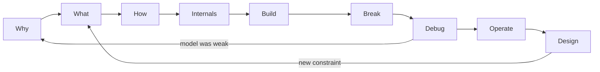

# How to Learn Here

This curriculum is a practice system, not a reading list. A lesson is successful when you can use its model to predict behavior, inspect a failure, and explain the result in your own words.

## The Learning Loop

Use the same sequence for every important concept:

### 1. WHY — find the pressure

Ask: What did people do before this existed? What became painful, unsafe, slow, or impossible?

**Evidence:** You can describe the problem without naming the solution.

### 2. WHAT — name the abstraction

Learn the real engineering term only after the problem is clear. State what the abstraction promises and what it intentionally hides.

**Evidence:** You can give a plain definition and a precise definition without contradicting yourself.

### 3. HOW — narrate the mechanism

Follow state and causality: what enters, which component acts, what changes, and what leaves.

**Evidence:** You can narrate the lesson’s Mermaid diagram arrow by arrow.

### 4. INTERNALS — look below the contract

Inspect the implementation details that affect correctness, performance, security, or failure. Do not collect internals with no decision attached.

**Evidence:** You can name one hidden detail that leaks and its observable symptom.

### 5. BUILD — produce the smallest working version

Build from a blank file after reading the worked proof. Keep the system small enough that every important behavior is visible.

**Evidence:** The result is reproducible and you can explain every line or command.

### 6. BREAK — violate one assumption

Predict the symptom, introduce one bounded fault, and preserve the evidence. Never use an unbounded loop, allocation, fork, billable resource, or destructive production target as a learning exercise.

**Evidence:** You can connect the fault to the symptom through the mechanism.

### 7. DEBUG — reduce uncertainty

Use:

**precise symptom → last proven boundary → hypothesis → smallest useful evidence → controlled comparison → correction → prevention**

**Evidence:** Your conclusion states both what the evidence supports and what it does not prove.

### 8. OPERATE — keep it useful under change

Define health from the user’s perspective. Add signals, limits, recovery, upgrades, rollback, security, and cost awareness.

**Evidence:** Someone else could detect and recover from a known failure using your runbook and signals.

### 9. DESIGN — choose under constraints

State users, workload, quality attributes, failure assumptions, and non-goals before selecting technology. Compare alternatives and record why one tradeoff fits.

**Evidence:** Your decision can survive a changed constraint and a skeptical review.

## One Study Session

For a 30–60 minute session:

1. Read **In One Sentence**, **Why This Exists**, and **Picture This**.
2. Close the file and predict the Mental Model.
3. Read **The Real Definition** and narrate the diagram.
4. Run the **Tiny Proof** only after writing the expected result.
5. Choose one build/break task.
6. Explain the concept without notes.
7. Record the weakest point in [PROGRESS.md](PROGRESS.md).

If you have ten minutes, do steps 1–4 and one explain-back. Do not pretend that this earns production competency.

## Explain-Back Rules

Use the three audiences in [TEACH-BACK.md](TEACH-BACK.md):

- **Curious friend:** concrete problem, everyday language, one analogy, no unexplained jargon.
- **Junior engineer:** precise term, components, mechanism, one production example, one failure.
- **Interviewer:** concise definition, causal model, tradeoff, evidence-led debugging, and limits.

An explanation passes only when:

1. it begins with the problem rather than the product name;
2. every specialized term is defined or unnecessary;
3. the listener can redraw the model;
4. you can answer “what breaks?” and “how would you know?”;
5. you can shorten it without making it false.

## No-AI Challenge Rules

No-AI work is retrieval and judgment practice, not punishment.

Allowed:

- the lesson after your first closed-book attempt;
- official documentation, standards, local manual pages, and source code;
- local tools and your own prior notes;
- asking a human to listen to your explanation.

Not allowed:

- chat assistants or generated search summaries;
- autocomplete that writes the solution;
- copying the Tiny Proof and changing names;
- asking AI to grade an answer before you commit to your own.

After the challenge, AI may review your evidence. Preserve your original answer so you can see which part of your model changed.

## Minimum Competency or Deep Dive?

Choose **Minimum Competency** when the topic is a prerequisite but not currently on your project’s critical path. You still need the mental model, Tiny Proof, one failure mode, and explain-back.

Choose **Strong Engineer** when you use the domain at work, it appears in your current build, or you may need to debug it independently.

Choose **Deep Dive** when:

- the abstraction repeatedly leaks in incidents;
- you own a platform or design decision built on it;
- performance, security, or cost depends on internals;
- competing explanations cannot be resolved at the surface;
- you need to teach or review others in the domain.

Depth is demand-driven, but foundations are not optional. Skip trivia; do not skip mechanisms.

## What Counts as Competent?

Reading creates familiarity. Competency requires evidence across five dimensions:

| Dimension | Test |
|---|---|
| Explain | Can you teach it accurately at three levels without notes? |
| Build | Can you produce a small working system from a blank start? |
| Debug | Can you find a controlled failure from evidence rather than hints? |
| Operate | Can you define health, limits, recovery, and safe change? |
| Design | Can you defend a choice under explicit tradeoffs and changed constraints? |

Advance when the relevant evidence exists. Revisit an earlier module whenever reality exposes a weak model.
