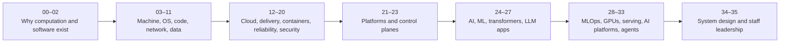
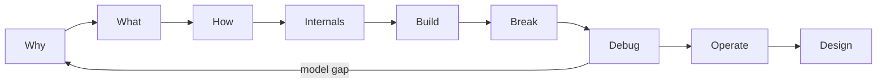

# AI Platform Engineer — Learn the Stack from First Principles

This is a GitHub-native curriculum for learning why modern systems exist, how they work, how they fail, and how to design them. It begins with a single instruction changing machine state and ends with governed AI and agent platforms.

The goal is not to finish files. The goal is to **explain, build, break, debug, operate, and design**.

## Start Here in 10 Minutes

1. Open [START-HERE.md](START-HERE.md).
2. Learn the study loop in [HOW-TO-LEARN.md](HOW-TO-LEARN.md).
3. Read [Origins of Computing](00-history/01-origins-of-computing.md) through **Tiny Proof**.
4. Predict the output, run it, and explain what changed.

At minute 10, you should be able to say: **a computer repeatedly follows encoded instructions to transform stored state; every higher layer organizes that physical work.**

## The Journey

This is a dependency path, not a race. Experienced engineers may test out of a tier only with evidence, not vocabulary recognition.

## Current Stage / Next Lesson

| Curriculum state | Path |
|---|---|
| Gold-standard teaching spine | [Module 00: History](00-history/README.md) — all 20 lessons |
| Model technical lesson | [How Software Actually Executes](01-software-foundations/01-how-software-actually-executes.md) |
| First hands-on proof | [Inspect a Python Process on Linux](labs/01-software-execution/README.md) |
| Modules 02–35 | Honest orientation scaffolds; detailed lessons intentionally unpublished |
| Your next file | **[Origins of Computing](00-history/01-origins-of-computing.md)** |

## How to Study

For every concept:

1. begin with the human problem and an analogy;
2. earn the precise vocabulary;
3. narrate the causal diagram;
4. predict and run the Tiny Proof;
5. build and break one bounded version;
6. debug from the last proven boundary;
7. explain it to a friend, a junior engineer, and an interviewer.

[How to Learn](HOW-TO-LEARN.md) defines the complete method, No-AI rules, and when Minimum Competency is enough.

## How You Know You Are Competent

| Dimension | Evidence |
|---|---|
| Explain | You can teach the idea accurately at three depths without notes. |
| Build | You can produce a small working version from a blank start. |
| Debug | You can isolate a controlled failure from evidence, not hints. |
| Operate | You can define health, limits, recovery, and safe change. |
| Design | You can defend tradeoffs when requirements change. |

Reading is evidence of exposure, not competency. Track proof in [PROGRESS.md](PROGRESS.md) and use the [Teach-Back rubric](TEACH-BACK.md).

## Find Your Way

- [START-HERE.md](START-HERE.md) — exact first five files and Day 1 finish line
- [CONCEPT-INDEX.md](CONCEPT-INDEX.md) — any major term → gentlest entry → deeper path
- [CURRICULUM.md](CURRICULUM.md) — numbered modules 00–35 and publication state
- [ROADMAP.md](ROADMAP.md) — capability gates and stage dependencies
- [GLOSSARY.md](GLOSSARY.md) — plain definition, precise definition, first lesson, one-breath explanation
- [REFERENCES.md](REFERENCES.md) — canonical documentation, standards, and primary papers
- [INTERVIEW-MAP.md](INTERVIEW-MAP.md) — convert built competence into interview answers
- [PROJECTS.md](PROJECTS.md) — portfolio systems and graduation evidence

Serious learning can be warm and clear. No tribal knowledge is assumed; no hard mechanism is hidden.
