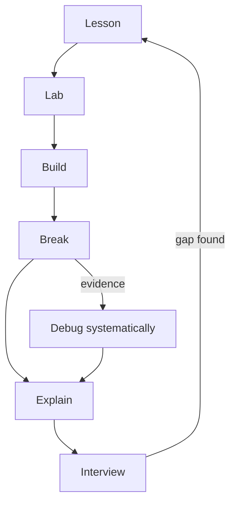

# AI Platform Engineer — Zero to Staff

A long-horizon engineering curriculum for developing deep competency from software foundations through AI Platform Engineering. This repository is a study system—not a web application and not a collection of tool tutorials. It connects history, internals, implementation, failure analysis, operations, and design so that each abstraction can be understood from the layers beneath it.

The target is not “familiar with Kubernetes” or “has called an LLM API.” The target is an engineer who can explain why a system exists, build a small version, break it intentionally, debug it from evidence, operate it under constraints, and design the next version with explicit tradeoffs.

## Progression

This is a dependency graph, not a race. Use prior experience to test out of material only when you can demonstrate the competency—not merely recognize the vocabulary.

## Current Position

| Signal | Current value |
|---|---|
| Current stage | **History — In progress** |
| Current lesson | [Origins of Computing](00-history/01-origins-of-computing.md) |
| Projects completed | **0 / 15** |
| Labs completed | **0** |
| Major skills | Establishing historical causality and systems vocabulary |
| Next recommended lesson | [Software Foundations 01: How Software Actually Executes](01-software-foundations/01-how-software-actually-executes.md) after completing Module 00 |

Update this snapshot only at meaningful milestones. Use [PROGRESS.md](PROGRESS.md) for evidence-backed competency tracking.

## How to Use This Repository

Use the same loop for every domain:

1. **Lesson** — read actively; redraw the mental model and follow primary references.
2. **Lab** — predict each observation before running a command.
3. **Build** — create a small working system without copying the lesson.
4. **Break** — introduce a controlled failure and record symptoms.
5. **Explain** — teach the mechanism and failure chain without notes.
6. **Interview** — answer design and debugging questions under constraints.

Do not mark a domain competent because its reading is complete. Store lab evidence, incident analysis, design decisions, and explain-back notes in your own working branch or linked project repository.

## Start Here

1. Read the [Roadmap](ROADMAP.md) to understand stage dependencies.
2. Begin [Module 00: History](00-history/README.md); focus on why each abstraction became necessary.
3. Continue to [How Software Actually Executes](01-software-foundations/01-how-software-actually-executes.md).
4. Complete the [software execution lab](labs/01-software-execution/README.md).
5. Record demonstrated skills in [PROGRESS.md](PROGRESS.md).

## Repository Guides

- [ROADMAP.md](ROADMAP.md) — career progression, stages, prerequisites, and exit evidence
- [CURRICULUM.md](CURRICULUM.md) — complete numbered module catalog and status
- [PROGRESS.md](PROGRESS.md) — Explain / Build / Debug / Operate / Design competency matrix
- [GLOSSARY.md](GLOSSARY.md) — concise vocabulary with first-use and deeper-reading links
- [REFERENCES.md](REFERENCES.md) — authoritative documentation, standards, and papers
- [INTERVIEW-MAP.md](INTERVIEW-MAP.md) — domain-to-interview-theme mapping
- [PROJECTS.md](PROJECTS.md) — fifteen portfolio targets and graduation criteria
- [CONTRIBUTING.md](CONTRIBUTING.md) — GitHub-native study and contribution workflow

## Operating Principles

- Prefer mechanisms over product memorization.
- Prefer primary sources, standards, official documentation, and seminal papers.
- Treat debugging as hypothesis → evidence → isolation → correction → prevention.
- Make reliability, security, cost, and operability part of design—not cleanup work.
- Use AI to accelerate feedback, never to outsource understanding.
- Keep unfinished modules honest: a clear scaffold is better than shallow generated lessons.
