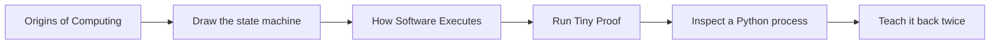

# Start Here

You do not need a computer science degree or infrastructure experience. You need a browser, enough time to think before running commands, and Linux only when you reach the first lab.

## Your First Five Files

Open these in order:

1. **[START-HERE.md](START-HERE.md)** — the page you are reading; commit to the first path.
2. **[README.md](README.md)** — see the whole journey and the current lesson.
3. **[HOW-TO-LEARN.md](HOW-TO-LEARN.md)** — learn the WHY → DESIGN loop and evidence rules.
4. **[00-history/01-origins-of-computing.md](00-history/01-origins-of-computing.md)** — understand a computer as a state-transition machine.
5. **[01-software-foundations/01-how-software-actually-executes.md](01-software-foundations/01-how-software-actually-executes.md)** — connect source code to visible output.

Then open **[labs/01-software-execution/README.md](labs/01-software-execution/README.md)** and make the second lesson observable.

Do not read the entire curriculum before beginning. The first two lessons and one lab supply the mental hooks the rest of the repository will use.

## The First 10 Minutes

### Minute 0–2: see the destination

Read the top of [README.md](README.md) and narrate its journey map. The path moves from physical computation to software, shared machines, distributed infrastructure, platforms, and AI systems.

### Minute 2–5: learn the loop

Read only [The Learning Loop](HOW-TO-LEARN.md#the-learning-loop). Remember:

**Why → What → How → Build → Break → Debug → Operate → Design**

### Minute 5–10: prove the first idea

Open [Origins of Computing](00-history/01-origins-of-computing.md). Read through **Tiny Proof**, predict its output, and run it with Python 3.

At minute 10, say aloud:

> A computer repeatedly applies encoded instructions to stored state. Software changes the instructions; it does not remove the physical limits of memory, computation, and data movement.

If you can reconstruct that idea in your own words, continue. If not, reread **Picture This** and narrate the diagram.

## Day 1 Path

1. Complete the Minimum Competency path in [Origins of Computing](00-history/01-origins-of-computing.md).
2. On paper, draw **instruction + current state → changed state**.
3. Read [How Software Actually Executes](01-software-foundations/01-how-software-actually-executes.md).
4. Draw **Source → Runtime/Compiler → OS → Process → Memory → CPU → Output** from memory.
5. Complete the beginner path in the [software execution lab](labs/01-software-execution/README.md).
6. Use [TEACH-BACK.md](TEACH-BACK.md) to explain both concepts to a friend and a junior engineer.
7. Record evidence and one remaining gap in [PROGRESS.md](PROGRESS.md).

## Done with Day 1 Means

You can demonstrate all of these without reading a script:

- [ ] Explain why a stored program made one machine useful for many jobs.
- [ ] Distinguish source code, the Python executable, and a running process.
- [ ] Draw the seven-link software execution chain in order.
- [ ] Explain why the CPU executes native CPython instructions, not Python source text.
- [ ] Use a PID to inspect the process you started.
- [ ] Distinguish mapped virtual memory from resident memory without calling either “the program’s RAM.”
- [ ] Identify where stdout points and explain one reason output can be delayed.
- [ ] Name one prediction the lab corrected.
- [ ] Give a plain-language explanation and a precise engineering explanation.

Completion is not “I read the files.” It is “I predicted, observed, corrected my model, and can teach it.”

## If You Get Stuck

| Situation | Next move |
|---|---|
| A term appears too early | Look it up in [CONCEPT-INDEX.md](CONCEPT-INDEX.md), then enter at the first lesson. |
| The analogy makes sense but the mechanism does not | Narrate the Mermaid diagram one arrow at a time. |
| A command fails | Read the lab checkpoint and troubleshooting note; preserve the exact error. |
| You can follow but not explain | Use the curious-friend rubric in [TEACH-BACK.md](TEACH-BACK.md). |
| You already know the topic | Attempt the Knowledge Check and build/break exercise without notes; advance only with evidence. |
| You do not have Linux | Read the lesson now; run the lab later in a Linux VM, container, or Codespace-like environment with `/proc`. |

## After Day 1

Return to [Module 00](00-history/README.md) and follow its complete causal spine. Then continue through [CURRICULUM.md](CURRICULUM.md) at the depth your work requires.
