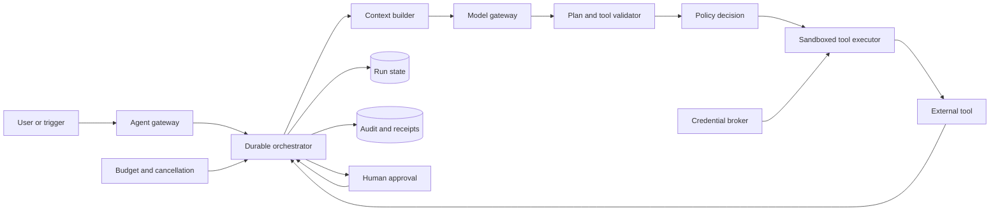

# Agent Runtime

## Purpose

Execute goal-directed, model-assisted work across multiple turns and tools while
keeping authority, state, cost, and side effects bounded. The runtime is a
durable coordinator around an untrusted probabilistic planner, not merely a
model API wrapper.

## Invariants

- A run has a tenant, initiating principal, explicit authority set, budget,
  deadline, and cancellation state.
- Model output is untrusted input. Tool arguments are schema-validated and
  authorized immediately before execution.
- Read and write capabilities are distinct; consequential or irreversible
  actions require policy-defined confirmation.
- Tool credentials are short-lived and scoped to one run or invocation. They
  are never inserted into prompts, transcripts, or model-visible errors.
- Durable state records model, prompt, policy, tool version, decisions, and
  side-effect receipts sufficient for replay analysis.
- Retries use invocation keys and tool-specific idempotency semantics.

## Components and execution loop

- **Gateway and orchestrator:** run admission, durable steps, scheduling,
  cancellation, retries, and terminal outcomes.
- **Context builder and model gateway:** retrieval, token budgeting, model
  routing, content boundaries, and response constraints.
- **Validator and policy decision:** structural validation, capability checks,
  data classification, and approval requirements.
- **Tool executor and credential broker:** process or network isolation,
  resource limits, ephemeral credentials, and normalized results.
- **State and audit:** checkpoints, provenance, tool receipts, cost, and
  redacted diagnostics.

## Failure boundaries

- Prompt injection can cross retrieved content into tool intent. Data must not
  grant authority; policy derives from trusted run context.
- Orchestrator retry after an uncertain tool timeout can duplicate a side
  effect. Reconcile by invocation key or inspect outcome before retry.
- A compromised tool endpoint can return adversarial content or exfiltrate
  context. Minimize arguments, restrict destinations, and isolate subsequent
  interpretation.
- Runaway loops consume money and service quotas. Bound turns, tokens, wall
  time, tool calls, and repeated equivalent actions.
- Cancellation races with an in-flight side effect. Record whether cancellation
  is requested, accepted, or too late, and return an explicit uncertain state.

## Design review questions

1. What authority can the agent exercise without approval, and how does it
   differ by tenant, trigger, tool, and data class?
2. Which tool operations are idempotent, compensatable, irreversible, or
   outcome-ambiguous?
3. How are untrusted instructions separated from system policy and trusted user
   intent?
4. What state is required to resume safely after process, region, or dependency
   failure?
5. How are model, retrieval, policy, and tool changes evaluated before rollout?
6. Can an investigator reconstruct why an action occurred without exposing
   secrets or unnecessarily retaining customer content?

## Tradeoffs

- More autonomy reduces user friction but expands the blast radius of model and
  policy errors.
- Full transcripts aid debugging but increase privacy, retention, and prompt
  injection persistence risks.
- Strong sandboxing improves containment but limits tool compatibility and adds
  startup latency.
- Durable execution improves recovery but requires deterministic step
  boundaries and careful treatment of nondeterministic model calls.

## Authoritative references

- [NIST AI Risk Management Framework](https://www.nist.gov/itl/ai-risk-management-framework)
- [OWASP Top 10 for LLM Applications](https://owasp.org/www-project-top-10-for-large-language-model-applications/)
- [NIST SP 800-207: Zero Trust Architecture](https://csrc.nist.gov/pubs/sp/800/207/final)
- [OAuth 2.0 Security Best Current Practice](https://www.rfc-editor.org/rfc/rfc9700)
- [OpenTelemetry generative AI semantic conventions](https://opentelemetry.io/docs/specs/semconv/gen-ai/)
- [CloudEvents specification](https://cloudevents.io/)
