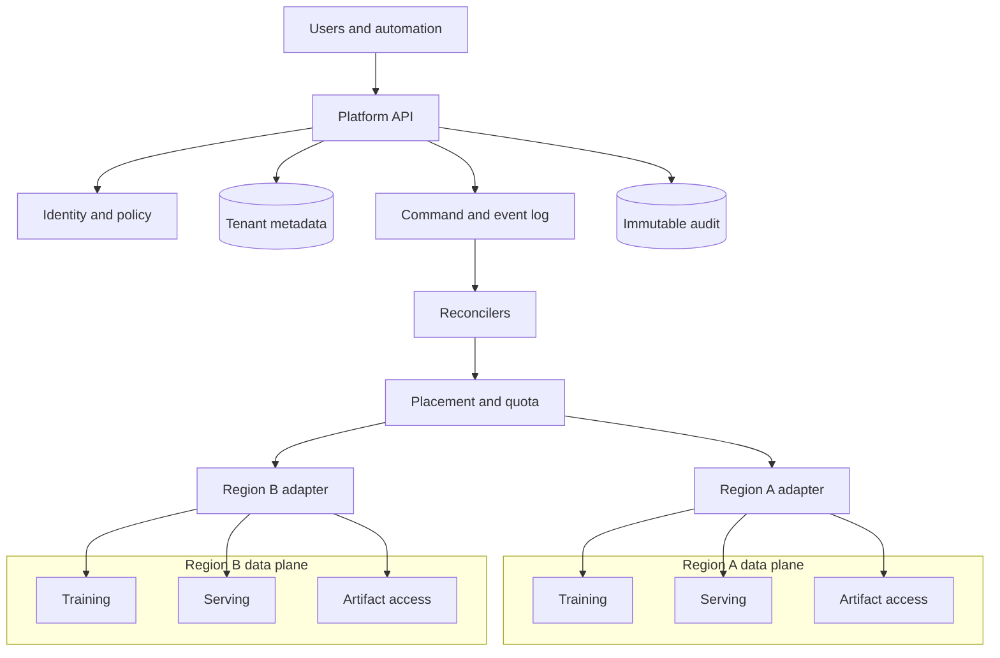

# AI Platform Control Plane

## Purpose

Manage the lifecycle, policy, identity, placement, and audit of AI resources
without carrying bulk training data or online inference payloads. It translates
tenant intent into versioned desired state and coordinates independent data
planes.

## Invariants

- Control-plane records are tenant-scoped, authorized on every access, and
  attributable to a principal.
- Desired state is durable and versioned; reconciliation is idempotent and
  resumable.
- Data-plane credentials are short-lived, workload-bound, and narrower than the
  requesting user's authority.
- Policy decisions record policy version, relevant inputs, decision, and actor.
- Regional data planes can continue serving within a declared lease during a
  control-plane outage.
- Secrets, model payloads, customer datasets, and prompt bodies do not transit
  general control-plane event streams.

## Components and boundaries

- **Platform API:** stable resource contracts, idempotency, validation, and
  tenant context.
- **Identity and policy:** human and workload authorization, approvals, and
  credential exchange.
- **Metadata and event log:** desired state, operation status, lineage pointers,
  and replayable commands.
- **Reconcilers, quota, and placement:** convergence, regional selection,
  reservations, and lifecycle transitions.
- **Regional adapters:** narrow interfaces that isolate provider and data-plane
  implementation details.

## Failure boundaries

- Global metadata or identity failure can block all mutations. Keep regional
  serving independent and define lease-expiry behavior.
- Duplicate or reordered commands can create resources twice unless every
  adapter exposes idempotent operation keys and observed state.
- A faulty reconciler can affect many tenants rapidly. Partition work queues,
  rate-limit changes, and support global and tenant-scoped pause controls.
- Policy service unavailability needs operation-specific fail-open or
  fail-closed decisions; privileged mutation normally fails closed.
- Cross-region metadata replication can violate residency unless fields and
  storage locations are classified.

## Design review questions

1. Which resources are global, regional, zonal, or tenant-local, and where is
   each source of truth?
2. What operations remain available when identity, metadata, eventing, or one
   regional adapter is unavailable?
3. How are API compatibility, long-running operations, cancellation, and
   partial completion represented?
4. How are quota reservations made atomic with provisioning and released after
   failures?
5. What limits reconcile blast radius by tenant, resource type, region, and
   software version?
6. Can every privileged action and artifact promotion be reconstructed from
   immutable evidence?

## Tradeoffs

- A global control plane simplifies inventory and policy but increases
  common-mode risk and residency complexity.
- Regional control planes improve autonomy but require conflict-free ownership
  and cross-region discovery.
- Generic resource APIs accelerate extension but can hide workload-specific
  safety constraints; specialized APIs improve correctness at greater surface
  area.
- Event-driven reconciliation scales well but introduces eventual consistency
  and operational debugging across multiple state stores.

## Authoritative references

- [Kubernetes API conventions](https://github.com/kubernetes/community/blob/master/contributors/devel/sig-architecture/api-conventions.md)
- [NIST SP 800-207: Zero Trust Architecture](https://csrc.nist.gov/pubs/sp/800/207/final)
- [SPIFFE specifications](https://spiffe.io/docs/latest/spiffe-about/overview/)
- [Open Policy Agent documentation](https://www.openpolicyagent.org/docs/latest/)
- [CloudEvents specification](https://cloudevents.io/)
- [SLSA specification](https://slsa.dev/spec/)
