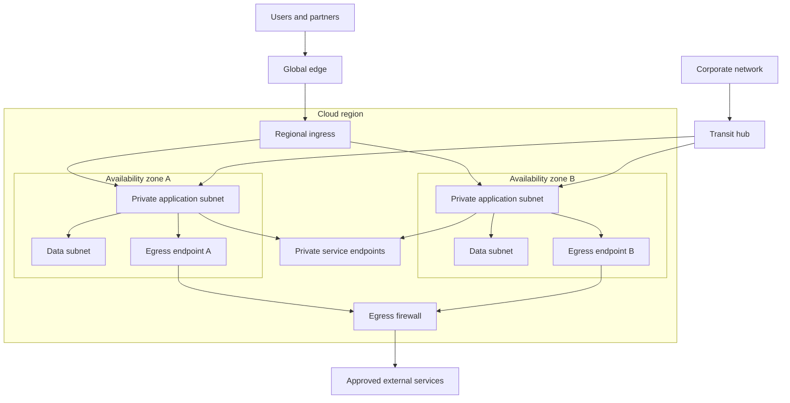

# Cloud Network

## Purpose

Provide private, observable connectivity among users, workloads, managed
services, and external dependencies while containing faults and unauthorized
movement. Network topology supports security policy; it does not replace
workload identity or application authorization.

## Invariants

- Address ranges do not overlap with connected networks and retain planned
  growth space.
- Routes are explicit, least-reachability, and owned; no critical path depends
  on accidental transitive routing.
- Internet ingress and egress cross controlled inspection and accounting
  points. Private workloads have no implicit public exposure.
- Availability zones are independent failure domains. A highly available path
  does not rely on one zonal appliance.
- DNS, time synchronization, certificate validation, and control-plane
  endpoints remain reachable during intended isolation modes.
- Flow records and configuration changes are retained without logging payloads
  or secrets.

## Components and topology

- **Global edge and ingress:** DDoS controls, public certificates, filtering,
  and regional traffic distribution.
- **Private application subnets:** routable workload space without direct
  public addressing.
- **Data subnets and private endpoints:** narrowed paths to stateful and managed
  services.
- **Transit hub:** explicit inter-network and hybrid connectivity.
- **Egress endpoints and firewall:** zonally resilient source translation,
  destination policy, and audit.

## Failure boundaries

- A shared transit hub, resolver, firewall fleet, or route table can become a
  regional common-mode failure despite zonal workloads.
- Stateful middleboxes can break asymmetric return paths and fail during route
  convergence.
- Exhausted IPv4 addresses, source ports, connection tracking, or DNS quotas
  appear as intermittent application failures.
- Broad security-group references and default routes expand blast radius
  silently as networks are attached.
- Private endpoint or provider control-plane outages need a documented fallback
  that does not bypass policy.

## Design review questions

1. Which flows are required, who owns each one, and can the matrix be generated
   from policy?
2. What fails if one zone, resolver, NAT device, transit attachment, or
   inspection tier is removed?
3. How are route changes reviewed, tested, rolled back, and detected for drift?
4. Where can traffic leave the network, and how are domain-based exceptions
   reconciled with changing IP addresses?
5. How are IPv6, service discovery, MTU, and cross-zone data charges handled?
6. Can incident responders isolate a tenant or workload without losing the
   management path?

## Tradeoffs

- Central inspection improves consistent governance but adds latency,
  throughput limits, cost, and shared failure risk.
- Many small networks improve ownership and containment but increase peering,
  routing, DNS, and address-management complexity.
- Private endpoints avoid public routing but consume addresses and create
  provider-specific DNS and policy behavior.
- Cross-zone routing improves availability but can increase cost and hide
  unhealthy zonal capacity.

## Authoritative references

- [NIST SP 800-207: Zero Trust Architecture](https://csrc.nist.gov/pubs/sp/800/207/final)
- [AWS VPC documentation](https://docs.aws.amazon.com/vpc/latest/userguide/what-is-amazon-vpc.html)
- [Azure virtual network documentation](https://learn.microsoft.com/azure/virtual-network/virtual-networks-overview)
- [Google Cloud VPC documentation](https://cloud.google.com/vpc/docs/overview)
- [RFC 1918: Address Allocation for Private Internets](https://www.rfc-editor.org/rfc/rfc1918)
- [RFC 8200: IPv6 Specification](https://www.rfc-editor.org/rfc/rfc8200)
