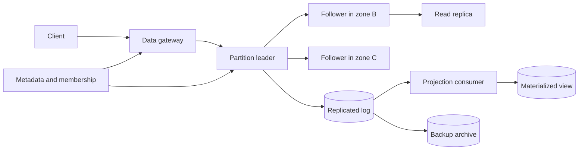

# Distributed Data and Consistency

## Purpose

Preserve application-level facts across replicas, partitions, retries, and
failures while making the visible consistency contract explicit. Replication is
not a guarantee by itself; clients need defined read, write, conflict, and
recovery semantics.

## Invariants

- A single logical fact has an identified authority or a deterministic conflict
  rule.
- Every acknowledged durability level states how many and which failure domains
  contain the write.
- Client retries cannot create duplicate logical mutations.
- Ordering assumptions are scoped to a key, partition, session, or transaction;
  no global order is implied accidentally.
- Schema and protocol versions remain compatible during rolling deployment and
  replay.
- Backups are independent of the replication fault domain and are restore
  tested.

## Components and data path

- **Gateway and metadata:** partition selection, topology, session tokens, and
  request fencing.
- **Leader or coordinator:** serializes writes for its scope and determines
  acknowledgement.
- **Replicas and log:** copy ordered mutations across failure domains.
- **Projection consumers:** build query-specific state with replayable offsets.
- **Backup archive:** supports recovery from operator error, corruption, and
  faults replicated to every live copy.

## Failure boundaries

- A network partition creates an availability-versus-consistency decision for
  each operation. The contract must define which side may accept writes.
- Leader failover can expose stale reads or duplicate accepted requests unless
  terms, fencing tokens, and idempotency are enforced.
- Consumer lag makes materialized views stale; freshness must be observable and
  included in API semantics.
- Poison events and schema incompatibility can halt an entire partition.
  Quarantine must preserve order and auditability where order matters.
- Replication rapidly copies accidental deletes and corruption. Point-in-time
  recovery needs separate immutable history.

## Design review questions

1. Which anomalies are acceptable: stale reads, lost updates, write skew,
   non-repeatable reads, or temporary conflict?
2. What does a successful response guarantee after one node, one zone, or one
   region fails immediately afterward?
3. How are idempotency keys scoped, retained, and garbage-collected?
4. How are split brain, stale leaders, and delayed messages fenced?
5. What are recovery point and recovery time objectives, and when was restore
   last verified?
6. How are rebalancing, hot keys, tombstones, and unbounded lag controlled?

## Tradeoffs

- Strong consistency simplifies invariants but may increase coordination
  latency and reduce availability during partitions.
- Eventual consistency improves locality and availability but transfers
  conflict and freshness complexity to applications and users.
- Synchronous multi-zone replication improves durability but raises write
  latency; asynchronous replication lowers latency but permits acknowledged
  data loss.
- Event logs enable replay and audit but require versioned events, projection
  repair, and careful deletion semantics.

## Authoritative references

- [Designing Data-Intensive Applications references](https://dataintensive.net/)
- [The Raft consensus algorithm](https://raft.github.io/raft.pdf)
- [Paxos Made Simple](https://lamport.azurewebsites.net/pubs/paxos-simple.pdf)
- [RFC 2119: Requirement language](https://www.rfc-editor.org/rfc/rfc2119)
- [Jepsen consistency models](https://jepsen.io/consistency)
- [Amazon Dynamo paper](https://www.allthingsdistributed.com/files/amazon-dynamo-sosp2007.pdf)
