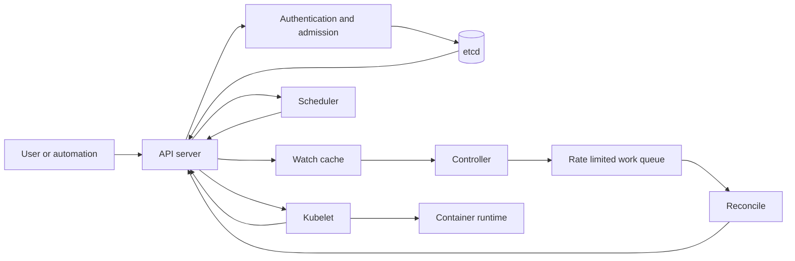

# Kubernetes Control Loop

## Purpose

Continuously reconcile declared intent with observed cluster state. Kubernetes
is an eventually convergent control system: API acceptance does not mean the
requested workload is running, and a controller must tolerate repeated,
delayed, and out-of-order observations.

## Invariants

- The API server is the authoritative interface for desired and observed
  objects; controllers do not coordinate through private side channels.
- Reconciliation is idempotent and level-based. Reprocessing the same object
  produces no harmful duplicate effects.
- Each field has a clear manager, and status reports observation rather than
  desired state.
- Controllers use resource versions, finalizers, and owner references according
  to API semantics; they do not assume watch delivery is complete.
- Work queues apply bounded exponential backoff and rate limits.
- Admission rejects invalid or forbidden desired state before persistence.

## Components and loop

- **API server and admission:** validation, defaulting, authorization, mutation,
  and optimistic concurrency.
- **etcd:** durable cluster-state store; backup and restore procedures are part
  of the control-plane design.
- **Controllers:** compare desired and observed state, then create, patch, or
  delete toward convergence.
- **Scheduler:** binds pending Pods to feasible nodes.
- **Kubelet and runtime:** converge node-local Pod state and report status.

## Failure boundaries

- API server or etcd loss stops new convergence while already running
  containers may continue. This is degraded control, not necessarily data-plane
  outage.
- A hot reconciliation loop can overload the API server. Backoff must cover
  both errors and unchanged unsatisfied conditions.
- A stuck finalizer prevents deletion. Finalizer owners need abandonment and
  repair procedures.
- Conflicting field managers can oscillate desired state. Server-side apply
  conflicts should be surfaced, not force-overwritten blindly.
- A partitioned kubelet may keep workloads running while the control plane
  replaces them, creating duplicate execution risks for non-fenced jobs.

## Design review questions

1. What exact condition indicates convergence, and how is `observedGeneration`
   used?
2. Which external side effects occur, and how are they deduplicated and cleaned
   up after crashes?
3. What are the API request, queue depth, reconciliation latency, and error
   budgets?
4. Who owns each spec and status field, and what is the conflict policy?
5. How does deletion proceed if an external API or controller is permanently
   unavailable?
6. How are leader election, version skew, CRD conversion, and rollback tested?

## Tradeoffs

- Frequent reconciliation reduces drift time but consumes API and external
  service capacity.
- Finalizers enable ordered cleanup but can turn controller failure into
  undeletable resources.
- Admission webhooks centralize policy but add latency and can block all writes;
  failure policy must reflect risk.
- Custom resources provide native declarative APIs but commit operators to
  compatibility, conversion, and lifecycle obligations.

## Authoritative references

- [Kubernetes controllers](https://kubernetes.io/docs/concepts/architecture/controller/)
- [Kubernetes API conventions](https://github.com/kubernetes/community/blob/master/contributors/devel/sig-architecture/api-conventions.md)
- [Kubernetes API concepts](https://kubernetes.io/docs/reference/using-api/api-concepts/)
- [Server-side apply](https://kubernetes.io/docs/reference/using-api/server-side-apply/)
- [etcd disaster recovery](https://etcd.io/docs/latest/op-guide/recovery/)
- [Kubernetes component version skew policy](https://kubernetes.io/releases/version-skew-policy/)
